# 1. Introduction

## 1.1 Executive Summary

### 1.1.1 Brief Overview Of The Project

Frankie Goes to Code Review is a Terminal User Interface (TUI) application
built in Rust that leverages the Model-View-Update pattern to provide an
efficient, keyboard-driven interface for managing agentic GitHub code reviews.
The application serves as a comprehensive code review management system that
bridges the gap between traditional code review workflows and modern
AI-assisted development practices.

### 1.1.2 Core Business Problem Being Solved

The application addresses the fragmented nature of modern code review processes
where developers must context-switch between multiple tools, interfaces, and AI
assistants to effectively manage pull request reviews. Current workflows often
involve:

- Manual navigation between GitHub's web interface and local development
  environments
- Disconnected AI coding assistance that lacks context about specific
  code review comments
- Time-consuming processes for applying AI-generated solutions to review
  feedback
- Inefficient management of review comments across multiple files and
  reviewers

### 1.1.3 Key Stakeholders And Users

| Stakeholder Group      | Primary Interests                                              | Usage Patterns                                  |
| ---------------------- | -------------------------------------------------------------- | ----------------------------------------------- |
| Software Developers    | Efficient code review workflow, AI-assisted problem resolution | Daily interactive usage for PR management       |
| Development Team Leads | Team productivity, code quality oversight                      | Periodic review of team PR metrics and patterns |
| DevOps Engineers       | Integration with existing CI/CD pipelines                      | Configuration and automation setup              |

### 1.1.4 Expected Business Impact And Value Proposition

The application delivers measurable value through:

- **Productivity Enhancement**: Reduces context-switching overhead by
  consolidating code review management into a single, keyboard-driven interface
- **AI Integration Efficiency**: Enables seamless integration with
  OpenAI Codex CLI for automated code review resolution and workflow automation
- **Developer Experience Improvement**: Provides terminal-native
  workflow that aligns with developer preferences for command-line tools
- **Time Savings**: Streamlines the review-to-resolution cycle through
  direct integration with AI coding assistants

## 1.2 System Overview

### 1.2.1 Project Context

#### Business Context And Market Positioning

The application leverages bubbletea-rs, a Rust implementation of the popular
Bubble Tea TUI framework, positioning it within the growing ecosystem of
terminal-based development tools. This approach aligns with the industry trend
toward developer-centric tooling that prioritizes efficiency and
keyboard-driven workflows.

#### Current System Limitations

Traditional code review workflows suffer from:

- Web-based interfaces that interrupt terminal-focused development
  workflows
- Limited integration between review comments and AI coding assistants
- Manual processes for applying suggested changes from code review
  feedback
- Fragmented context when working across multiple pull requests and
  repositories

#### Integration With Existing Enterprise Landscape

The system integrates with established development infrastructure through:

- **GitHub API Integration**: Utilizes octocrab, a modern GitHub API
  client for Rust, providing strongly typed semantic API access and extensible
  HTTP methods
- **Git Repository Management**: Direct integration with local Git
  repositories using git2 library
- **AI Coding Assistant Integration**: Seamless connection to OpenAI
  Codex CLI, an open-source coding agent built in Rust for speed and efficiency
- **Database Persistence**: SQLite-based storage using Diesel ORM for
  local data management

### 1.2.2 High-level Description

#### Primary System Capabilities

The application provides comprehensive code review management through:

1. **Multi-Modal Repository Access**: Support for PR URL input,
    owner/repo specification, and automatic repository discovery
2. **Intelligent Review Management**: Filtering and organization of
    code reviews by resolution status, files, reviewers, and commit
    ranges
3. **AI-Assisted Resolution**: Integration with OpenAI Codex exec
    command for non-interactive code review resolution and automated
    workflow execution
4. **Contextual Code Navigation**: Full-screen change context display
    with time-travel capabilities for tracking code evolution
5. **Template-Based Communication**: Automated comment generation and
    PR-level discussion management

#### Major System Components

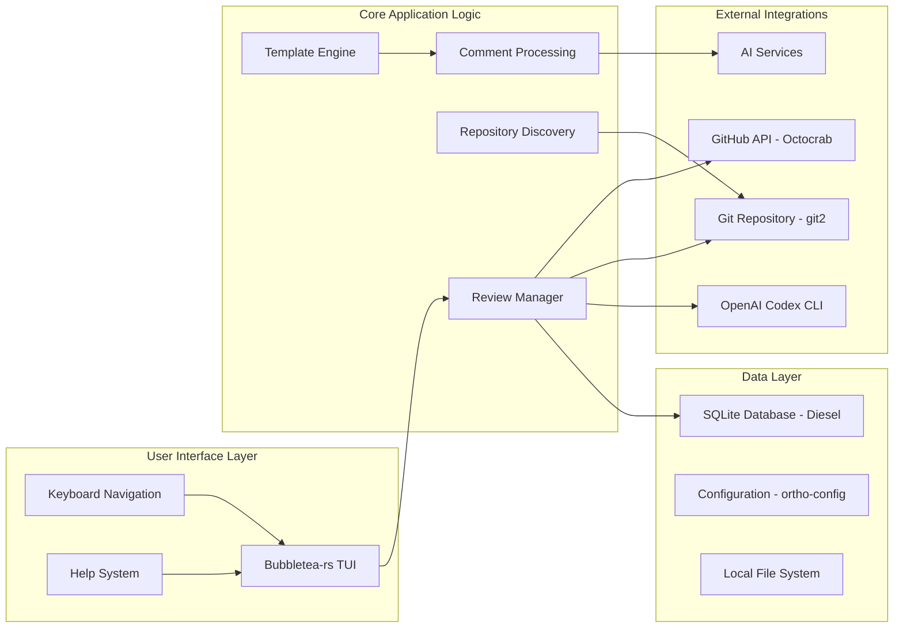
```mermaid
flowchart LR
    subgraph "User Interface Layer"
        B["Keyboard Navigation"]
        C["Help System"]
        A["Bubbletea-rs TUI"]
    end

    subgraph "Core Application Logic"
        G["Template Engine"]
        D["Review Manager"]
        E["Repository Discovery"]
        F["Comment Processing"]
    end

    subgraph "Data Layer"
        L["SQLite Database - Diesel"]
        M["Configuration - ortho-config"]
        N["Local File System"]
    end

    subgraph "External Integrations"
        H["GitHub API - Octocrab"]
        I["Git Repository - git2"]
        J["OpenAI Codex CLI"]
        K["AI Services"]
    end

    A --> D
    D --> H
    D --> I
    D --> J
    F --> K
    D --> L
    B --> A
    C --> A
    E --> I
    G --> F
```

#### Core Technical Approach

The application employs the Model-View-Update (MVU) architecture pattern with
async command support, providing clean separation of state, logic, and
rendering while maintaining responsive user interactions. The technical stack
emphasizes:

- **Type Safety**: Rust's ownership system ensures memory safety and
  prevents common runtime errors
- **Async Operations**: Non-blocking GitHub API calls and AI service
  integrations
- **Modular Design**: Clear separation between UI components, business
  logic, and external service integrations

### 1.2.3 Success Criteria

#### Measurable Objectives

| Objective                 | Target Metric                            | Measurement Method                                 |
| ------------------------- | ---------------------------------------- | -------------------------------------------------- |
| User Productivity         | 40% reduction in code review cycle time  | Time tracking from review assignment to resolution |
| AI Integration Efficiency | 80% successful automated resolution rate | Success rate of Codex-generated solutions          |
| User Adoption             | 90% developer satisfaction score         | User feedback surveys and usage analytics          |

#### Critical Success Factors

1. **Performance**: Sub-second response times for GitHub API operations
    and local repository access
2. **Reliability**: 99.5% uptime for core functionality with graceful
    degradation for external service failures
3. **Usability**: Intuitive keyboard-driven interface requiring minimal
    learning curve for terminal-experienced developers
4. **Integration Quality**: Seamless workflow between code review
    identification and AI-assisted resolution

#### Key Performance Indicators (kpis)

- **Daily Active Users**: Number of developers using the application for
  code review management
- **Review Resolution Rate**: Percentage of code review comments
  successfully addressed using AI assistance
- **Context Switch Reduction**: Measured decrease in tool transitions
  during code review workflows
- **Error Rate**: Frequency of failed GitHub API calls or AI service
  integrations

### 1.2.4 GitHub intake implementation (December 2025)

- Pull request intake uses Octocrab with the base URI derived from the PR URL.
  Requests against `github.com` are routed to `https://api.github.com`; all
  other hosts use `<host>/api/v3` so GitHub Enterprise and wiremock stubs share
  the same code path.
- A thin `PullRequestGateway` trait wraps Octocrab and is mocked in unit tests.
  Behavioural coverage uses `wiremock` plus `rstest-bdd` scenarios to verify
  success and authentication failure paths without calling the live API.
- Authentication errors are normalized: HTTP 401/403 responses surface as a
  dedicated `Authentication` error with the GitHub message preserved. Other API
  or transport failures are mapped into user-readable variants so the CLI can
  print a precise failure reason.
- Intake requests fetch pull request metadata and the associated issue comments
  via the REST API. Only the minimal fields needed by the CLI (title, state,
  author login, comment bodies) are parsed to keep fixtures small and
  deterministic.

#### GitHub intake class diagram


```mermaid
classDiagram
    class RepositoryOwner {
        -value: String
        +new(value: &str) Result_RepositoryOwner_IntakeError
        +as_str() &str
    }

    class RepositoryName {
        -value: String
        +new(value: &str) Result_RepositoryName_IntakeError
        +as_str() &str
    }

    class PullRequestNumber {
        -value: u64
        +new(value: u64) Result_PullRequestNumber_IntakeError
        +get() u64
    }

    class PersonalAccessToken {
        -value: String
        +new(token: impl AsRef) Result_PersonalAccessToken_IntakeError
        +value() &str
    }

    class PullRequestLocator {
        -api_base: Url
        -owner: RepositoryOwner
        -repository: RepositoryName
        -number: PullRequestNumber
        +parse(input: &str) Result_PullRequestLocator_IntakeError
        +api_base() &Url
        +owner() &RepositoryOwner
        +repository() &RepositoryName
        +number() PullRequestNumber
        +pull_request_path() String
        +comments_path() String
    }

    class PullRequestMetadata {
        +number: u64
        +title: Option_String
        +state: Option_String
        +html_url: Option_String
        +author: Option_String
    }

    class PullRequestComment {
        +id: u64
        +body: Option_String
        +author: Option_String
    }

    class PullRequestDetails {
        +metadata: PullRequestMetadata
        +comments: Vec_PullRequestComment
    }

    class ApiUser {
        +login: Option_String
    }

    class ApiPullRequest {
        +number: u64
        +title: Option_String
        +state: Option_String
        +html_url: Option_String
        +user: Option_ApiUser
    }

    class ApiComment {
        +id: u64
        +body: Option_String
        +user: Option_ApiUser
    }

    class PullRequestGateway {
        <<interface>>
        +pull_request(locator: &PullRequestLocator) Result_PullRequestMetadata_IntakeError
        +pull_request_comments(locator: &PullRequestLocator) Result_Vec_PullRequestComment_IntakeError
    }

    class OctocrabGateway {
        -client: Octocrab
        +new(client: Octocrab) OctocrabGateway
        +for_token(token: &PersonalAccessToken, locator: &PullRequestLocator) Result_OctocrabGateway_IntakeError
        +pull_request(locator: &PullRequestLocator) Result_PullRequestMetadata_IntakeError
        +pull_request_comments(locator: &PullRequestLocator) Result_Vec_PullRequestComment_IntakeError
    }

    class PullRequestIntake~G: PullRequestGateway~ {
        -client: &G
        +new(client: &G) PullRequestIntake~G~
        +load(locator: &PullRequestLocator) Result~PullRequestDetails, IntakeError~
    }

    class IntakeError {
        <<enum>>
        +MissingPullRequestUrl
        +InvalidArgument
        +InvalidUrl
        +MissingPathSegments
        +InvalidPullRequestNumber
        +MissingToken
        +Authentication
        +Api
        +Network
        +Io
    }

    class FrankieLibFacade {
        +PullRequestLocator
        +PullRequestIntake
        +OctocrabGateway
        +PersonalAccessToken
        +PullRequestDetails
        +IntakeError
    }

    ApiPullRequest --> ApiUser
    ApiComment --> ApiUser
    ApiPullRequest ..> PullRequestMetadata : converts_to
    ApiComment ..> PullRequestComment : converts_to

    PullRequestLocator --> RepositoryOwner
    PullRequestLocator --> RepositoryName
    PullRequestLocator --> PullRequestNumber

    OctocrabGateway ..|> PullRequestGateway

    PullRequestIntake --> PullRequestGateway : uses
    PullRequestIntake --> PullRequestDetails

    FrankieLibFacade ..> PullRequestLocator
    FrankieLibFacade ..> PullRequestIntake
    FrankieLibFacade ..> OctocrabGateway
    FrankieLibFacade ..> PersonalAccessToken
    FrankieLibFacade ..> PullRequestDetails
    FrankieLibFacade ..> IntakeError
```

**Reference:** The types and relationships above are implemented in:

- `src/github/error.rs` — `IntakeError` enum variants
- `src/github/locator.rs` — `RepositoryOwner`, `RepositoryName`,
  `PullRequestNumber`, `PersonalAccessToken`, `PullRequestLocator`
- `src/github/gateway.rs` — `PullRequestGateway` trait, `OctocrabGateway`
- `src/github/intake.rs` — `PullRequestIntake`
- `src/github/models.rs` — `PullRequestMetadata`, `PullRequestComment`,
  `PullRequestDetails`
- `src/lib.rs` — public re-exports forming the `FrankieLibFacade`

### 1.2.5 Local repository discovery implementation (December 2025)

- Local discovery uses git2 to detect the Git repository from the current
  working directory and extract GitHub remote information.
- The `discover_repository` function walks up from the current path to find the
  `.git` directory, then inspects the configured remote URL (default: `origin`).
- Supported URL formats:
  - SSH SCP-style: `git@github.com:owner/repo.git`
  - SSH URL-style: `ssh://git@github.com/owner/repo.git`
  - HTTPS: `https://github.com/owner/repo.git`
  - GitHub Enterprise SSH: `git@ghe.example.com:org/project.git`
  - GitHub Enterprise HTTPS: `https://ghe.example.com/org/project.git`
- The `GitHubOrigin` enum distinguishes `github.com` origins from Enterprise
  hosts, allowing correct API base URL derivation.
- Discovery errors map to `LocalDiscoveryError` variants: `NotARepository`,
  `NoRemotes`, `RemoteNotFound`, `InvalidRemoteUrl`, and `Git`.
- The `RepositoryLocator::from_github_origin` method bridges local discovery to
  the existing intake infrastructure.
- Integration with `FrankieConfig` uses the `no_local_discovery` flag to allow
  users to disable automatic discovery when explicit arguments are preferred.

#### Local discovery class diagram

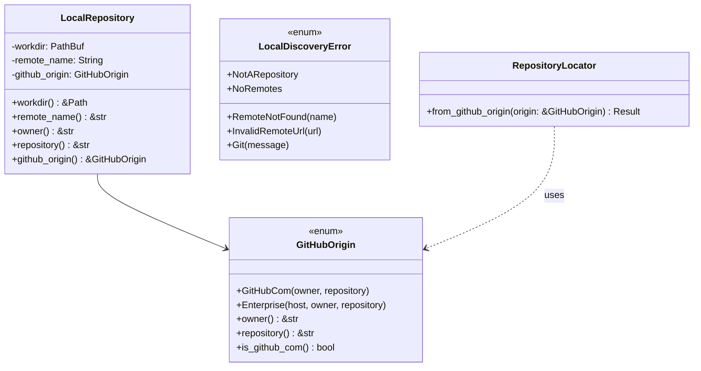
```mermaid
classDiagram
    class GitHubOrigin {
        <<enum>>
        +GitHubCom(owner, repository)
        +Enterprise(host, owner, repository)
        +owner() &str
        +repository() &str
        +is_github_com() bool
    }

    class LocalRepository {
        -workdir: PathBuf
        -remote_name: String
        -github_origin: GitHubOrigin
        +workdir() &Path
        +remote_name() &str
        +owner() &str
        +repository() &str
        +github_origin() &GitHubOrigin
    }

    class LocalDiscoveryError {
        <<enum>>
        +NotARepository
        +NoRemotes
        +RemoteNotFound(name)
        +InvalidRemoteUrl(url)
        +Git(message)
    }

    class RepositoryLocator {
        +from_github_origin(origin: &GitHubOrigin) Result
    }

    LocalRepository --> GitHubOrigin
    RepositoryLocator ..> GitHubOrigin : uses
```

**Reference:** The types and relationships above are implemented in:

- `src/local/mod.rs` — module exports
- `src/local/error.rs` — `LocalDiscoveryError` enum
- `src/local/remote.rs` — `GitHubOrigin` enum and `parse_github_remote`
- `src/local/discovery.rs` — `LocalRepository`, `discover_repository`
- `src/github/locator.rs` — `RepositoryLocator::from_github_origin`

## 1.3 Scope

### 1.3.1 In-scope

#### Core Features And Functionalities

**MVP Features:**

- GitHub pull request access via URL, owner/repo specification, or
  automatic repository discovery
- Comprehensive code review listing with filtering capabilities (all,
  unresolved, by file, by reviewer, by commit range)
- Structured comment export in standardized format with location, code
  context, and issue descriptions
- Integration with OpenAI Codex CLI for automated code review resolution
  through exec command
- Full-screen change context display with time-travel navigation
- Template-based comment reply system
- Comprehensive keyboard shortcut help system

**Day 2 Features:**

- CodeRabbit and Sourcery review banner parsing and conversion
- AI-powered comment expansion, rewording, and explanation
- Automated comment resolution verification
- Comment amalgamation and summarization capabilities

#### Primary User Workflows

1. **Review Discovery**: Repository access → PR listing → Review
    filtering
2. **Review Analysis**: Comment examination → Context viewing →
    Time-travel navigation
3. **AI-Assisted Resolution**: Comment export → Codex integration →
    Solution application
4. **Communication Management**: Template-based replies → PR-level
    comment generation

#### Essential Integrations

- **GitHub API**: Complete pull request and review comment access
- **Git Repository**: Local repository discovery and change tracking
- **OpenAI Codex**: Automated code review resolution and AI assistance
- **SQLite Database**: Local data persistence and caching

#### Key Technical Requirements

- **Performance**: Real-time GitHub API synchronization with local
  caching
- **Reliability**: Offline capability with graceful degradation
- **Security**: Secure token management and API authentication
- **Extensibility**: Plugin architecture for additional AI services and
  review platforms

### 1.3.2 Implementation Boundaries

#### System Boundaries

The application operates within the following technical boundaries:

- **Local Execution**: Terminal-based application running on developer
  workstations
- **GitHub Integration**: Limited to GitHub.com and GitHub Enterprise
  instances
- **Repository Support**: Git repositories with GitHub remote origins
- **AI Services**: Primary integration with OpenAI Codex CLI, extensible
  to other services

#### User Groups Covered

- Individual software developers working with GitHub repositories
- Development teams using GitHub for code review workflows
- Organizations with existing GitHub Enterprise installations

#### Geographic/market Coverage

- Global deployment with no geographic restrictions
- Support for GitHub.com and GitHub Enterprise instances
- Multi-language repository support through Unicode handling

#### Data Domains Included

- GitHub pull request metadata and review comments
- Local Git repository information and change history
- User configuration and preferences
- AI service interaction logs and results

### 1.3.3 Out-of-scope

#### Explicitly Excluded Features/capabilities

- **Alternative Version Control Systems**: GitLab, Bitbucket, or other
  non-GitHub platforms
- **Web-Based Interface**: No browser-based or GUI components
- **Real-Time Collaboration**: No multi-user simultaneous editing or
  chat features
- **Code Execution Environment**: No integrated development environment
  or code compilation
- **Repository Hosting**: No Git repository hosting or management
  capabilities

#### Future Phase Considerations

**Phase 2 Enhancements:**

- GitLab and Bitbucket platform support
- Advanced AI model integration (Claude, Gemini)
- Team collaboration features and shared configurations
- Advanced analytics and reporting capabilities

**Phase 3 Expansions:**

- IDE plugin development for VS Code, Vim, and Emacs
- Web-based dashboard for team management
- Enterprise SSO and advanced authentication methods
- Custom AI model training on organization-specific codebases

#### Integration Points Not Covered

- **CI/CD Pipeline Integration**: No direct integration with Jenkins,
  GitHub Actions, or other CI systems
- **Issue Tracking Systems**: No integration with Jira, Linear, or other
  project management tools
- **Communication Platforms**: No direct integration with Slack,
  Microsoft Teams, or Discord
- **Code Quality Tools**: No integration with SonarQube, CodeClimate, or
  similar analysis platforms

#### Unsupported Use Cases

- **Large-Scale Repository Management**: Not designed for managing
  hundreds of repositories simultaneously
- **Enterprise Audit and Compliance**: No built-in compliance reporting
  or audit trail features
- **Multi-Platform Development**: No support for non-Git version control
  workflows
- **Offline AI Processing**: Requires internet connectivity for AI
  service integration

## 2. Product Requirements

## 2.1 Feature Catalog

### 2.1.1 Core Repository Access Features

| Feature ID | Feature Name               | Category          | Priority | Status   |
| ---------- | -------------------------- | ----------------- | -------- | -------- |
| F-001      | PR URL Access              | Repository Access | Critical | Proposed |
| F-002      | Owner/Repo Discovery       | Repository Access | Critical | Proposed |
| F-003      | Local Repository Discovery | Repository Access | High     | Proposed |

#### F-001: Pr Url Access

**Description:**

- **Overview**: Direct access to GitHub pull requests via URL input
  using bubbletea-rs TUI framework
- **Business Value**: Enables immediate access to specific pull requests
  without navigation overhead
- **User Benefits**: Streamlined workflow for developers working with
  specific PR links
- **Technical Context**: Utilizes octocrab 0.44.1 GitHub API client for
  strongly typed semantic API access

**Dependencies:**

- **System Dependencies**: bubbletea-rs 0.0.9, bubbletea-widgets 0.1.12
- **External Dependencies**: octocrab 0.44.1 for GitHub API integration
- **Integration Requirements**: GitHub API authentication and rate
  limiting

#### F-002: Owner/repo Discovery

**Description:**

- **Overview**: Repository access through owner/repository specification
  with PR listing capabilities
- **Business Value**: Provides comprehensive view of all pull requests
  within a repository
- **User Benefits**: Enables repository-wide code review management and
  filtering
- **Technical Context**: Strong typing around GitHub's API with models
  mapping to GitHub's types

**Dependencies:**

- **Prerequisite Features**: F-001 (PR URL Access)
- **System Dependencies**: GitHub API rate limiting and pagination
  support
- **External Dependencies**: octocrab semantic API modules for pull
  requests and issues

#### F-003: Local Repository Discovery

**Description:**

- **Overview**: Automatic discovery of GitHub repository information
  from local Git directory
- **Business Value**: Reduces manual input requirements for developers
  working in local repositories
- **User Benefits**: Seamless integration with existing development
  workflows
- **Technical Context**: Integration with git2 library for local
  repository metadata extraction

**Dependencies:**

- **Prerequisite Features**: F-002 (Owner/Repo Discovery)
- **System Dependencies**: git2 library for Git repository access
- **Integration Requirements**: Local Git repository with GitHub remote
  origin

### 2.1.2 Code Review Management Features

| Feature ID | Feature Name                 | Category          | Priority | Status   |
| ---------- | ---------------------------- | ----------------- | -------- | -------- |
| F-004      | Review Listing and Filtering | Review Management | Critical | Proposed |
| F-005      | Comment Export System        | Review Management | Critical | Proposed |
| F-006      | Full-Screen Context Display  | Review Management | High     | Proposed |
| F-007      | Time-Travel Navigation       | Review Management | Medium   | Proposed |

#### F-004: Review Listing And Filtering

**Description:**

- **Overview**: Comprehensive code review listing with multiple
  filtering options (all, unresolved, by file, by reviewer, by commit range)
- **Business Value**: Enables efficient triage and prioritization of
  code review tasks
- **User Benefits**: Reduces time spent searching for relevant review
  comments
- **Technical Context**: Builder pattern implementation for optional
  parameters with pagination support

**Dependencies:**

- **Prerequisite Features**: F-001, F-002, F-003 (Repository Access)
- **System Dependencies**: SQLite database for local caching and
  filtering
- **External Dependencies**: octocrab pull request and review comment
  APIs

#### F-005: Comment Export System

**Description:**

- **Overview**: Structured export of code review comments in
  standardized format with location, code context, and issue descriptions
- **Business Value**: Enables integration with AI coding assistants and
  external tools
- **User Benefits**: Facilitates automated resolution of review feedback
- **Technical Context**: Template-based export system with markdown
  rendering support

**Dependencies:**

- **Prerequisite Features**: F-004 (Review Listing and Filtering)
- **System Dependencies**: syntect library for syntax highlighting and
  code context
- **Integration Requirements**: OpenAI Codex CLI exec command
  integration for automated workflows

#### F-006: Full-screen Context Display

**Description:**

- **Overview**: Comprehensive display of code changes with full context
  at time of review
- **Business Value**: Improves review quality through better context
  understanding
- **User Benefits**: Reduces context switching between different views
- **Technical Context**: Model-View-Update pattern with async command
  support

**Dependencies:**

- **Prerequisite Features**: F-005 (Comment Export System)
- **System Dependencies**: Terminal rendering capabilities with syntax
  highlighting
- **Integration Requirements**: Git repository access for change context

#### F-007: Time-travel Navigation

**Description:**

- **Overview**: Navigation through PR branch history to track code
  evolution and locate current change positions
- **Business Value**: Enables tracking of how code has evolved in
  response to review feedback
- **User Benefits**: Provides historical context for understanding
  review resolution
- **Technical Context**: Git history traversal with diff matching
  algorithms

**Dependencies:**

- **Prerequisite Features**: F-006 (Full-Screen Context Display)
- **System Dependencies**: git2 library for commit history access
- **Integration Requirements**: Local Git repository with complete
  history

### 2.1.3 Ai Integration Features

| Feature ID | Feature Name            | Category       | Priority | Status   |
| ---------- | ----------------------- | -------------- | -------- | -------- |
| F-008      | Codex Integration       | AI Integration | Critical | Proposed |
| F-009      | Comment Template System | AI Integration | High     | Proposed |
| F-010      | AI Comment Processing   | AI Integration | Medium   | Proposed |

#### F-008: Codex Integration

**Description:**

- **Overview**: Integration with OpenAI Codex CLI exec command for
  automated code review resolution
- **Business Value**: Enables automated resolution of code review
  feedback
- **User Benefits**: Reduces manual effort in addressing review comments
- **Technical Context**: Non-interactive execution mode with streaming
  progress and JSON output

**Dependencies:**

- **Prerequisite Features**: F-005 (Comment Export System)
- **External Dependencies**: OpenAI Codex CLI 0.64.0 installation and
  authentication
- **Integration Requirements**: Git repository requirement for safe
  operation

#### F-009: Comment Template System

**Description:**

- **Overview**: Template-based comment reply system with PR-level
  discussion management
- **Business Value**: Standardizes communication patterns and improves
  response quality
- **User Benefits**: Reduces time spent crafting responses to common
  review scenarios
- **Technical Context**: Template engine with variable substitution and
  markdown support

**Dependencies:**

- **Prerequisite Features**: F-004 (Review Listing and Filtering)
- **System Dependencies**: Template processing engine with configuration
  management
- **Integration Requirements**: GitHub API comment creation and update
  capabilities

#### F-010: Ai Comment Processing

**Description:**

- **Overview**: AI-powered comment expansion, rewording, explanation,
  and resolution verification
- **Business Value**: Enhances communication quality and automates
  verification tasks
- **User Benefits**: Improves clarity of review feedback and reduces
  verification overhead
- **Technical Context**: Integration with multiple AI services for text
  processing

**Dependencies:**

- **Prerequisite Features**: F-008 (Codex Integration), F-009 (Comment
  Template System)
- **External Dependencies**: AI service APIs for text processing
- **Integration Requirements**: API authentication and rate limiting
  management

### 2.1.4 User Interface Features

| Feature ID | Feature Name             | Category       | Priority | Status   |
| ---------- | ------------------------ | -------------- | -------- | -------- |
| F-011      | Keyboard Navigation      | User Interface | Critical | Proposed |
| F-012      | Help System              | User Interface | High     | Proposed |
| F-013      | Configuration Management | User Interface | High     | Proposed |

#### F-011: Keyboard Navigation

**Description:**

- **Overview**: Comprehensive keyboard-driven interface using
  Model-View-Update pattern
- **Business Value**: Maintains developer workflow efficiency within
  terminal environment
- **User Benefits**: Eliminates mouse dependency and reduces context
  switching
- **Technical Context**: Key binding management with help text
  generation and matching utilities

**Dependencies:**

- **System Dependencies**: bubbletea-rs event handling and crossterm
  integration
- **Integration Requirements**: Terminal capability detection and key
  mapping

#### F-012: Help System

**Description:**

- **Overview**: Comprehensive keyboard shortcut help system with
  auto-generation from key bindings
- **Business Value**: Reduces learning curve and improves user adoption
- **User Benefits**: Provides contextual assistance without leaving the
  application
- **Technical Context**: Horizontal mini help view with single and
  multi-line modes

**Dependencies:**

- **Prerequisite Features**: F-011 (Keyboard Navigation)
- **System Dependencies**: KeyMap trait implementation for
  component-specific help

#### F-013: Configuration Management

**Description:**

- **Overview**: Comprehensive configuration system using ortho-config
  for user preferences and system settings
- **Business Value**: Enables customization and adaptation to different
  development environments
- **User Benefits**: Allows personalization of workflow and integration
  settings
- **Technical Context**: TOML-based configuration with validation and
  migration support

**Dependencies:**

- **System Dependencies**: ortho-config library for configuration
  management
- **Integration Requirements**: File system access for configuration
  persistence

## 2.2 Functional Requirements

### 2.2.1 Repository Access Requirements

| Requirement ID | Description               | Acceptance Criteria                                               | Priority  | Complexity |
| -------------- | ------------------------- | ----------------------------------------------------------------- | --------- | ---------- |
| F-001-RQ-001   | Parse GitHub PR URLs      | System extracts owner, repo, and PR number from valid GitHub URLs | Must-Have | Low        |
| F-001-RQ-002   | Validate PR accessibility | System verifies PR exists and user has read access                | Must-Have | Medium     |
| F-001-RQ-003   | Handle authentication     | System manages GitHub API authentication tokens securely          | Must-Have | High       |

**Technical Specifications:**

- **Input Parameters**: GitHub PR URL string, authentication token
- **Output/Response**: Pull request object with metadata and review
  information
- **Performance Criteria**: \<1 second response time for PR metadata
  retrieval
- **Data Requirements**: GitHub API rate limit compliance

**Validation Rules:**

- **Business Rules**: Only GitHub.com and GitHub Enterprise URLs
  accepted
- **Data Validation**: URL format validation and PR number range
  checking
- **Security Requirements**: Secure token storage and transmission
- **Compliance Requirements**: GitHub API terms of service adherence

| Requirement ID | Description          | Acceptance Criteria                                            | Priority    | Complexity |
| -------------- | -------------------- | -------------------------------------------------------------- | ----------- | ---------- |
| F-002-RQ-001   | List repository PRs  | System retrieves and displays all PRs for specified repository | Must-Have   | Medium     |
| F-002-RQ-002   | Implement pagination | System handles large PR lists with efficient pagination        | Should-Have | Medium     |
| F-002-RQ-003   | Cache PR metadata    | System caches PR information locally for offline access        | Should-Have | High       |

**Technical Specifications:**

- **Input Parameters**: Repository owner, repository name, pagination
  parameters
- **Output/Response**: Paginated list of pull requests with optional
  filtering parameters
- **Performance Criteria**: \<2 seconds for initial PR list retrieval
- **Data Requirements**: SQLite database for local caching

**Validation Rules:**

- **Business Rules**: Repository must be accessible to authenticated
  user
- **Data Validation**: Owner and repository name format validation
- **Security Requirements**: Access control verification
- **Compliance Requirements**: GitHub API rate limiting compliance

| Requirement ID | Description             | Acceptance Criteria                                                    | Priority   | Complexity |
| -------------- | ----------------------- | ---------------------------------------------------------------------- | ---------- | ---------- |
| F-003-RQ-001   | Detect Git repository   | System identifies local Git repository and extracts remote information | Must-Have  | Medium     |
| F-003-RQ-002   | Parse GitHub remotes    | System extracts owner/repo from GitHub remote URLs                     | Must-Have  | Low        |
| F-003-RQ-003   | Handle multiple remotes | System prioritizes origin remote or allows user selection              | Could-Have | Medium     |

**Technical Specifications:**

- **Input Parameters**: Current working directory path
- **Output/Response**: Repository owner, name, and remote URL
  information
- **Performance Criteria**: \<500ms for local repository detection
- **Data Requirements**: git2 library for repository metadata access

**Validation Rules:**

- **Business Rules**: Directory must contain valid Git repository
- **Data Validation**: Remote URL format validation for GitHub origins
- **Security Requirements**: Local file system access permissions
- **Compliance Requirements**: Git repository integrity verification

### 2.2.2 Review Management Requirements

| Requirement ID | Description                 | Acceptance Criteria                                          | Priority    | Complexity |
| -------------- | --------------------------- | ------------------------------------------------------------ | ----------- | ---------- |
| F-004-RQ-001   | Filter by resolution status | System displays all, resolved, or unresolved review comments | Must-Have   | Medium     |
| F-004-RQ-002   | Filter by file path         | System filters comments by specific files or file patterns   | Must-Have   | Medium     |
| F-004-RQ-003   | Filter by reviewer          | System filters comments by specific reviewers                | Should-Have | Low        |
| F-004-RQ-004   | Filter by commit range      | System filters comments by commit hash or date range         | Could-Have  | High       |

**Technical Specifications:**

- **Input Parameters**: Filter criteria (status, files, reviewers,
  commits)
- **Output/Response**: Filtered list of review comments with metadata
- **Performance Criteria**: \<1 second for filter application
- **Data Requirements**: Indexed comment database for efficient
  filtering

**Validation Rules:**

- **Business Rules**: Filter combinations must be logically consistent
- **Data Validation**: Commit hash and date range format validation
- **Security Requirements**: User access verification for filtered
  content
- **Compliance Requirements**: GitHub API data consistency requirements

| Requirement ID | Description              | Acceptance Criteria                                  | Priority    | Complexity |
| -------------- | ------------------------ | ---------------------------------------------------- | ----------- | ---------- |
| F-005-RQ-001   | Export structured format | System exports comments in specified template format | Must-Have   | Medium     |
| F-005-RQ-002   | Include code context     | System includes diff context and line numbers        | Must-Have   | High       |
| F-005-RQ-003   | Render markdown content  | System processes markdown in comment text            | Should-Have | Medium     |
| F-005-RQ-004   | Handle binary files      | System gracefully handles non-text file changes      | Could-Have  | Medium     |

**Technical Specifications:**

- **Input Parameters**: Comment selection criteria, export format
  options
- **Output/Response**: Structured text format with location, context,
  and issue data
- **Performance Criteria**: \<5 seconds for complete comment export
- **Data Requirements**: syntect library for syntax highlighting

**Validation Rules:**

- **Business Rules**: Export format must be compatible with target AI
  systems
- **Data Validation**: Markdown syntax validation and sanitization
- **Security Requirements**: Content sanitization for external system
  integration
- **Compliance Requirements**: Intellectual property protection in
  exports

**Export format specification**: Comment exports must follow a stable XML
export structure to preserve location, context, and comment metadata. The diff
context is embedded as fenced Markdown inside a CDATA block as a unified diff
hunk; the example lines "+line added", "-line removed", and "line unchanged"
are illustrative markers, ensuring diff markers stay intact while remaining
valid XML:

```xml
<comment index="1">
  <location>path/to/file.py:168</location>
  <code-context><![CDATA[
```diff
+line added -line removed line unchanged
```]]></code-context>
  <contributor>someuser</contributor>
  <comment-url>https://github.com/owner/repo/pull/400#discussion_r2592557280
  </comment-url>
  <issue-to-address>
    Comment text (rendered in markdown with details tags collapsed).
  </issue-to-address>
</comment>
```

### 2.2.3 Ai Integration Requirements

| Requirement ID | Description              | Acceptance Criteria                                      | Priority    | Complexity |
| -------------- | ------------------------ | -------------------------------------------------------- | ----------- | ---------- |
| F-008-RQ-001   | Execute Codex commands   | System invokes codex exec with exported comment data     | Must-Have   | High       |
| F-008-RQ-002   | Handle command output    | System processes streaming output and JSON responses     | Must-Have   | Medium     |
| F-008-RQ-003   | Manage execution context | System ensures Git repository context for safe execution | Must-Have   | High       |
| F-008-RQ-004   | Resume sessions          | System supports resuming previous Codex sessions         | Should-Have | Medium     |

**Technical Specifications:**

- **Input Parameters**: Comment export data, execution parameters
- **Output/Response**: JSON Lines streaming output with execution
  results
- **Performance Criteria**: Real-time streaming of AI execution progress
- **Data Requirements**: OpenAI Codex CLI 0.64.0 installation

**Validation Rules:**

- **Business Rules**: Execution requires Git repository for safety
- **Data Validation**: Command parameter sanitization and validation
- **Security Requirements**: Sandbox policy enforcement and approval
  bypass protection
- **Compliance Requirements**: AI service terms of service compliance

## 2.3 Feature Relationships

### 2.3.1 Feature Dependencies Map

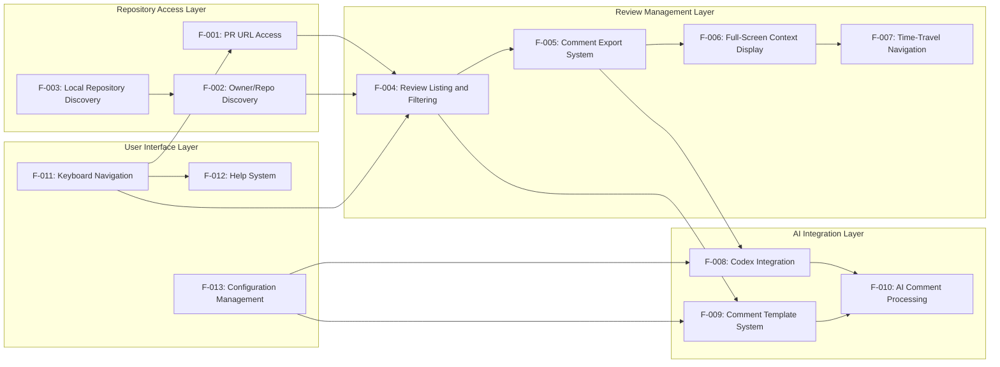
```mermaid
flowchart LR
    subgraph "Repository Access Layer"
        F003["F-003: Local Repository Discovery"]
        F001["F-001: PR URL Access"]
        F002["F-002: Owner/Repo Discovery"]
    end

    subgraph "User Interface Layer"
        F011["F-011: Keyboard Navigation"]
        F012["F-012: Help System"]
        F013["F-013: Configuration Management"]
    end

    subgraph "Review Management Layer"
        F004["F-004: Review Listing and Filtering"]
        F005["F-005: Comment Export System"]
        F006["F-006: Full-Screen Context Display"]
        F007["F-007: Time-Travel Navigation"]
    end

    subgraph "AI Integration Layer"
        F008["F-008: Codex Integration"]
        F009["F-009: Comment Template System"]
        F010["F-010: AI Comment Processing"]
    end

    F001 --> F004
    F002 --> F004
    F003 --> F002
    F004 --> F005
    F005 --> F006
    F006 --> F007
    F005 --> F008
    F004 --> F009
    F008 --> F010
    F009 --> F010
    F011 --> F012
    F011 --> F001
    F011 --> F004
    F013 --> F008
    F013 --> F009
```

### 2.3.2 Integration Points

| Integration Point      | Features Involved          | Shared Components       | Common Services                        |
| ---------------------- | -------------------------- | ----------------------- | -------------------------------------- |
| GitHub API Access      | F-001, F-002, F-004, F-009 | octocrab 0.44.1 client  | Authentication, Rate limiting          |
| Local Git Operations   | F-003, F-006, F-007, F-008 | git2 library            | Repository metadata, History access    |
| TUI Framework          | F-011, F-012, F-001, F-004 | bubbletea-rs 0.0.9      | Event handling, Rendering              |
| AI Service Integration | F-008, F-009, F-010        | OpenAI Codex CLI 0.64.0 | Command execution, Response processing |

### 2.3.3 Shared Components

| Component              | Purpose                               | Used By Features           | Technical Details                 |
| ---------------------- | ------------------------------------- | -------------------------- | --------------------------------- |
| GitHub API Client      | Strongly typed GitHub API access      | F-001, F-002, F-004, F-009 | octocrab 0.44.1 with semantic API |
| Git Repository Handler | Local repository operations           | F-003, F-006, F-007, F-008 | git2 library integration          |
| Comment Processor      | Review comment parsing and formatting | F-004, F-005, F-009, F-010 | Markdown rendering with syntect   |
| Configuration Manager  | Application settings and preferences  | F-008, F-009, F-013        | ortho-config TOML processing      |

## 2.4 Implementation Considerations

### 2.4.1 Technical Constraints

| Feature             | Constraints                                    | Mitigation Strategy                                     |
| ------------------- | ---------------------------------------------- | ------------------------------------------------------- |
| F-001, F-002, F-004 | GitHub API rate limiting                       | Local caching with SQLite, intelligent request batching |
| F-008               | Git repository requirement for Codex execution | Repository validation before AI integration             |
| F-006, F-007        | Terminal rendering limitations                 | Progressive disclosure and responsive layout design     |
| F-010               | AI service availability and costs              | Graceful degradation and usage monitoring               |

### 2.4.2 Performance Requirements

| Feature Category  | Performance Target                        | Measurement Method                 |
| ----------------- | ----------------------------------------- | ---------------------------------- |
| Repository Access | \<1 second for PR metadata retrieval      | Response time monitoring           |
| Review Management | \<2 seconds for filtered comment display  | UI responsiveness tracking         |
| AI Integration    | Real-time streaming of execution progress | JSON Lines output processing       |
| User Interface    | \<100ms keyboard response time            | Event handling latency measurement |

### 2.4.3 Scalability Considerations

| Aspect         | Scaling Strategy                            | Implementation Details                |
| -------------- | ------------------------------------------- | ------------------------------------- |
| Large PR Lists | Pagination with configurable page sizes     | Lazy loading and virtual scrolling    |
| Comment Volume | Database indexing and caching               | SQLite with optimized queries         |
| AI Processing  | Session resumption and context preservation | Stateful execution management         |
| Configuration  | Profile-based settings                      | Configuration profiles in config.toml |

### 2.4.4 Security Implications

| Security Concern         | Risk Level | Mitigation Approach                               |
| ------------------------ | ---------- | ------------------------------------------------- |
| GitHub Token Storage     | High       | Secure credential management with encryption      |
| AI Command Execution     | High       | Sandbox policy enforcement and approval workflows |
| Local File Access        | Medium     | Permission validation and scope limitation        |
| External API Integration | Medium     | Input sanitization and rate limiting              |

### 2.4.5 Maintenance Requirements

| Maintenance Area         | Frequency | Requirements                                   |
| ------------------------ | --------- | ---------------------------------------------- |
| GitHub API Compatibility | Quarterly | API version tracking and compatibility testing |
| AI Service Integration   | Monthly   | Codex CLI version updates and compatibility    |
| Dependency Updates       | Monthly   | bubbletea-rs and ecosystem updates             |
| Security Patches         | As needed | Vulnerability scanning and patch application   |

## 3. Technology Stack

## 3.1 Programming Languages

### 3.1.1 Primary Language Selection

| Component           | Language | Version      | Justification                                                                               |
| ------------------- | -------- | ------------ | ------------------------------------------------------------------------------------------- |
| Core Application    | Rust     | 2024 Edition | Memory safety, type safety, and performance characteristics ideal for terminal applications |
| Configuration Files | TOML     | 1.0          | Human-readable format with strong Rust ecosystem support                                    |
| Build Scripts       | Rust     | 2024 Edition | Consistent toolchain and cross-compilation support                                          |

**Selection Criteria:**

- **Memory Safety**: Rust's ownership system ensures memory safety and
  prevents common runtime errors
- **Performance**: Zero-cost abstractions and no garbage collection
  overhead for responsive TUI operations
- **Ecosystem Maturity**: Rich ecosystem of terminal UI and GitHub API
  libraries
- **Cross-Platform Support**: Native compilation for macOS, Linux, and
  Windows (via WSL)

**Technical Constraints:**

- Minimum Rust version: 1.86.0 (required by Diesel ORM)
- Edition: 2024 for latest language features and improved ergonomics
- Target platforms: x86_64 and ARM64 architectures

## 3.2 Frameworks & Libraries

### 3.2.1 Core Tui Framework

| Framework         | Version | Purpose                 | Justification                                                                      |
| ----------------- | ------- | ----------------------- | ---------------------------------------------------------------------------------- |
| bubbletea-rs      | 0.0.9   | Terminal User Interface | Model-View-Update pattern with async command support and rich styling capabilities |
| bubbletea-widgets | 0.1.12  | UI Components           | Reusable TUI components ported from Charmbracelet's Go bubbles                     |
| lipgloss-extras   | 0.1.1   | Styling System          | Terminal styling and layout capabilities                                           |
| crossterm         | Latest  | Cross-platform Terminal | Low-level terminal manipulation and event handling                                 |

**Framework Selection Rationale:**

- **Model-View-Update Architecture**: Clean separation of state, logic,
  and rendering with async operations support
- **Active Development**: Core APIs are stabilizing with ongoing
  development
- **Rust-Native Design**: Leverages Rust's type system for reliable,
  memory-safe TUIs

### 3.2.2 Github Api Integration

| Library    | Version | Purpose           | Technical Details                                                            |
| ---------- | ------- | ----------------- | ---------------------------------------------------------------------------- |
| octocrab   | 0.44.1  | GitHub API Client | High-level strongly typed semantic API with models mapping to GitHub's types |
| reqwest    | Latest  | HTTP Client       | Underlying HTTP client for octocrab with async support                       |
| serde      | Latest  | Serialization     | JSON serialization/deserialization for API responses                         |
| serde_json | Latest  | JSON Processing   | GitHub API response parsing and manipulation                                 |

**Integration Architecture:**

- **Strongly Typed API**: Semantic API provides strong typing around
  GitHub's API with models mapping to GitHub's types
- **Builder Pattern**: Methods with multiple optional parameters built
  as Builder structs for easy parameter specification
- **Extensible HTTP Methods**: Suite of HTTP methods for extending
  Octocrab's existing behavior

### 3.2.3 Local Git Operations

| Library     | Version | Purpose               | Capabilities                                                      |
| ----------- | ------- | --------------------- | ----------------------------------------------------------------- |
| git2        | Latest  | Git Repository Access | Local repository metadata, history traversal, and change tracking |
| libgit2-sys | Latest  | Git System Bindings   | Low-level Git operations and repository manipulation              |

**Git Integration Features:**

- Repository discovery and remote URL parsing
- Commit history traversal for time-travel navigation
- Diff generation and change context extraction
- Branch and commit metadata access

## 3.3 Open Source Dependencies

### 3.3.1 Core Dependencies

```toml
[dependencies]
# TUI Framework
bubbletea-rs = "0.0.9"
bubbletea-widgets = "0.1.12"
lipgloss-extras = { version = "0.1.1", features = ["full"] }
crossterm = "0.28"

#### GitHub API Integration
octocrab = "0.44.1"
reqwest = { version = "0.12", features = ["json", "rustls-tls"] }

#### Database and Storage
diesel = { version = "2.2.0", features = ["sqlite", "returning_clauses_for_sqlite_3_35"] }
diesel_migrations = { version = "2.2.0", features = ["sqlite"] }

#### Configuration Management
ortho-config = "0.6.0"
serde = { version = "1.0", features = ["derive"] }
toml = "0.8"

#### Git Operations
git2 = "0.19"

#### Syntax Highlighting
syntect = "5.2"

#### Error Handling and Logging
anyhow = "1.0"
thiserror = "1.0"
tracing = "0.1"
tracing-subscriber = "0.3"

#### Utilities
tokio = { version = "1.0", features = ["full"] }
uuid = { version = "1.0", features = ["v4"] }
chrono = { version = "0.4", features = ["serde"] }
```

### 3.3.2 Development Dependencies

```toml
[dev-dependencies]
# Testing Framework
tokio-test = "0.4"
tempfile = "3.8"
assert_cmd = "2.0"
predicates = "3.0"

#### Benchmarking
criterion = { version = "0.5", features = ["html_reports"] }

#### Documentation
cargo-doc = "0.1"
```

### 3.3.3 Build Dependencies

```toml
[build-dependencies]
# Database Migrations
diesel_migrations = "2.2.0"

#### Build Utilities
vergen = { version = "8.0", features = ["build", "git", "gitcl"] }
```

## 3.4 Third-party Services

### 3.4.1 Ai Integration Services

| Service          | Purpose                             | Integration Method                      | Authentication                      |
| ---------------- | ----------------------------------- | --------------------------------------- | ----------------------------------- |
| OpenAI Codex CLI | Automated code review resolution    | Command-line execution via exec command | ChatGPT subscription required       |
| GitHub API       | Pull request and review data access | REST API via octocrab                   | Personal access token or GitHub App |

**OpenAI Codex CLI Integration:**

- **Installation**: Available via npm with multiple package manager
  options
- **Execution Model**: Non-interactive execution mode with streaming
  progress and JSON output
- **Safety Features**: Configurable approval modes for command execution

### 3.4.2 External Api Requirements

| API                | Rate Limits                         | Authentication Method | Fallback Strategy                |
| ------------------ | ----------------------------------- | --------------------- | -------------------------------- |
| GitHub REST API    | 5,000 requests/hour (authenticated) | Personal Access Token | Local caching with SQLite        |
| GitHub GraphQL API | 5,000 points/hour                   | Personal Access Token | Graceful degradation to REST API |

## 3.5 Databases & Storage

### 3.5.1 Primary Database

| Component        | Technology        | Version | Purpose                                                                         |
| ---------------- | ----------------- | ------- | ------------------------------------------------------------------------------- |
| Database Engine  | SQLite            | 3.35.0+ | Local data persistence with RETURNING clause support                            |
| ORM Framework    | Diesel            | 2.2.0   | Safe, extensible ORM eliminating runtime errors without sacrificing performance |
| Migration System | diesel_migrations | 2.2.0   | Database schema versioning and migration management                             |

**Database Architecture:**

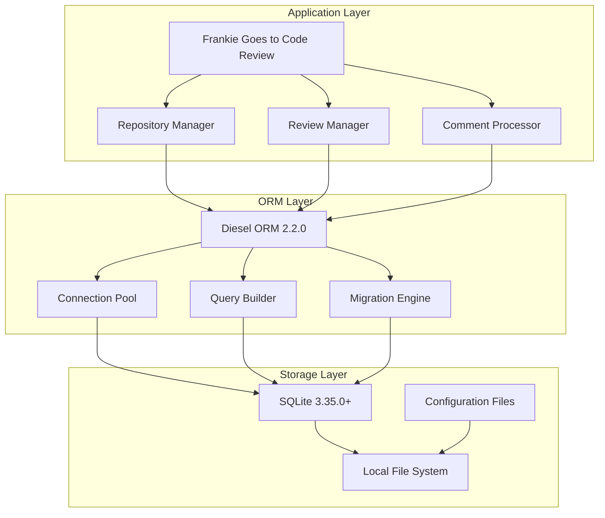
```mermaid
flowchart TD
    subgraph "Application Layer"
        A["Frankie Goes to Code Review"]
        B["Repository Manager"]
        C["Review Manager"]
        D["Comment Processor"]
    end

    subgraph "ORM Layer"
        E["Diesel ORM 2.2.0"]
        F["Connection Pool"]
        G["Query Builder"]
        H["Migration Engine"]
    end

    subgraph "Storage Layer"
        I["SQLite 3.35.0+"]
        K["Configuration Files"]
        J["Local File System"]
    end

    A --> B
    A --> C
    A --> D
    B --> E
    C --> E
    D --> E
    E --> F
    E --> G
    E --> H
    F --> I
    G --> I
    H --> I
    I --> J
    K --> J
```

### 3.5.2 Data Persistence Strategy

| Data Type           | Storage Method               | Caching Strategy                                    | Retention Policy  |
| ------------------- | ---------------------------- | --------------------------------------------------- | ----------------- |
| GitHub PR Metadata  | SQLite with indexing         | Configurable time-to-live (TTL) (default: 24 hours) | 30-day cleanup    |
| Review Comments     | SQLite with full-text search | Session-based                                       | User-configurable |
| User Configuration  | TOML files                   | In-memory cache                                     | Persistent        |
| AI Interaction Logs | SQLite with rotation         | No caching                                          | 7-day retention   |

GitHub PR metadata caching uses a configurable TTL. The default is 24 hours,
derived from `pr_metadata_cache_ttl_seconds` (set via
`FRANKIE_PR_METADATA_CACHE_TTL_SECONDS` or `--pr-metadata-cache-ttl-seconds`).

**Schema Design Principles:**

- **Normalized Structure**: Separate tables for repositories, pull
  requests, reviews, and comments
- **Indexing Strategy**: Composite indexes on frequently queried fields
  (repo_id, pr_number, created_at)
- **JSON Support**: Diesel ORM support for JSON fields in SQLite for
  flexible metadata storage

### 3.5.3 Configuration Storage

| Configuration Type    | Format                | Location               | Management                   |
| --------------------- | --------------------- | ---------------------- | ---------------------------- |
| Application Settings  | TOML                  | ~/.frankie/config.toml | ortho-config library         |
| Database Connection   | Environment Variables | .env file              | dotenvy library              |
| GitHub Authentication | Encrypted Storage     | System keychain        | Secure credential management |
| AI Service Settings   | TOML                  | ~/.frankie/ai.toml     | Profile-based configuration  |

## 3.6 Development & Deployment

### 3.6.1 Development Tools

| Tool           | Version | Purpose                      | Configuration                     |
| -------------- | ------- | ---------------------------- | --------------------------------- |
| Rust Toolchain | 1.86.0+ | Compilation and development  | rustup with 2024 edition          |
| Cargo          | Latest  | Package management and build | Workspace configuration           |
| diesel_cli     | 2.2.0   | Database migrations          | SQLite-only features              |
| cargo-watch    | Latest  | Development hot-reload       | File watching for TUI development |

**Development Workflow:**

```bash
# Database setup
diesel setup
diesel migration generate initial_schema
diesel migration run

#### Development server
cargo watch -x 'run -- --dev-mode'

#### Testing
cargo test --all-features
cargo bench

#### Linting and formatting
cargo clippy -- -D warnings
cargo fmt --all
```

### 3.6.2 Build System

| Component          | Technology   | Configuration          | Output                     |
| ------------------ | ------------ | ---------------------- | -------------------------- |
| Build Tool         | Cargo        | Cargo.toml workspace   | Native binaries            |
| Cross Compilation  | cargo-cross  | Cross.toml             | Multi-platform targets     |
| Asset Bundling     | include_str! | Compile-time embedding | Single binary distribution |
| Version Management | vergen       | Build-time metadata    | Git hash and build info    |

**Target Platforms:**

- x86_64-unknown-linux-gnu (Linux)
- x86_64-unknown-linux-musl (Linux static)
- x86_64-apple-darwin (macOS Intel)
- aarch64-apple-darwin (macOS Apple Silicon)
- x86_64-pc-windows-msv (Windows via WSL)

### 3.6.3 Distribution Strategy

| Distribution Method | Platform      | Package Format        | Installation Command                        |
| ------------------- | ------------- | --------------------- | ------------------------------------------- |
| GitHub Releases     | All platforms | Compressed binaries   | Manual download and extract                 |
| Cargo Registry      | All platforms | Source compilation    | `cargo install frankie-goes-to-code-review` |
| Homebrew            | macOS/Linux   | Formula               | `brew install frankie-goes-to-code-review`  |
| Package Managers    | Linux         | Distribution packages | `apt install` / `yum install`               |

### 3.6.4 Ci/cd Requirements

**GitHub Actions Workflow:**

```yaml
# Continuous Integration Pipeline
- Build Matrix: Multiple Rust versions and platforms
- Testing: Unit tests, integration tests, and benchmarks
- Security: Cargo audit and dependency scanning
- Quality: Clippy linting and formatting checks
- Documentation: API docs generation and deployment
- Release: Automated binary building and GitHub release creation
```

**Quality Gates:**

- All tests must pass on supported platforms
- Code coverage minimum: 80%
- No high-severity security vulnerabilities
- Documentation coverage for public APIs
- Performance regression testing for TUI responsiveness

### 3.6.5 Security Considerations

| Security Aspect       | Implementation                                      | Validation                   |
| --------------------- | --------------------------------------------------- | ---------------------------- |
| Dependency Scanning   | cargo-audit in CI                                   | Daily automated scans        |
| Credential Management | System keychain integration                         | Encrypted storage validation |
| Input Sanitization    | Type-safe parsing with serde                        | Fuzzing tests                |
| Sandboxing            | OpenAI Codex CLI approval modes and safety policies | Security policy enforcement  |

**Security Architecture:**

- No network access for core TUI components
- GitHub API credentials stored in system keychain
- AI service integration through approved command execution
- Input validation at API boundaries
- Audit logging for sensitive operations

## 4. Process Flowchart

## 4.1 System Workflows

### 4.1.1 Core Business Processes

#### 4.1.1.1 End-to-end User Journey: Pr Review Management

The primary user journey encompasses the complete workflow from repository
access to AI-assisted code review resolution. This process integrates multiple
system components and external services to provide a seamless developer
experience.

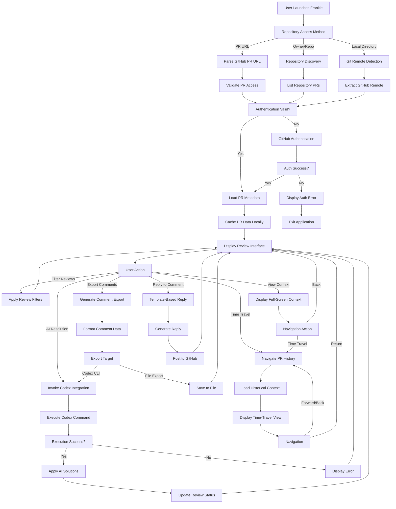
```mermaid
flowchart TD
    A["User Launches Frankie"]
    B["Repository Access Method"]
    C["Parse GitHub PR URL"]
    D["Repository Discovery"]
    E["Git Remote Detection"]
    F["Validate PR Access"]
    G["List Repository PRs"]
    H["Extract GitHub Remote"]
    I["Authentication Valid?"]
    J["GitHub Authentication"]
    K["Load PR Metadata"]
    L["Auth Success?"]
    M["Display Auth Error"]
    N["Cache PR Data Locally"]
    O["Display Review Interface"]
    P["User Action"]
    Q["Apply Review Filters"]
    R["Display Full-Screen Context"]
    S["Generate Comment Export"]
    T["Invoke Codex Integration"]
    U["Template-Based Reply"]
    V["Navigate PR History"]
    W["Navigation Action"]
    X["Format Comment Data"]
    Y["Export Target"]
    Z["Save to File"]
    AA["Execute Codex Command"]
    BB["Execution Success?"]
    CC["Apply AI Solutions"]
    DD["Display Error"]
    EE["Update Review Status"]
    FF["Generate Reply"]
    GG["Post to GitHub"]
    HH["Load Historical Context"]
    II["Display Time-Travel View"]
    JJ["Navigation"]
    KK["Exit Application"]
    A --> B
    B -- PR URL --> C
    B -- Owner/Repo --> D
    B -- Local Directory --> E
    C --> F
    D --> G
    E --> H
    F --> I
    G --> I
    H --> I
    I -- No --> J
    I -- Yes --> K
    J --> L
    L -- No --> M
    L -- Yes --> K
    K --> N
    N --> O
    O --> P
    P -- Filter Reviews --> Q
    P -- View Context --> R
    P -- Export Comments --> S
    P -- AI Resolution --> T
    P -- Reply to Comment --> U
    P -- Time Travel --> V
    Q --> O
    R --> W
    W -- Back --> O
    W -- Time Travel --> V
    S --> X
    X --> Y
    Y -- Codex CLI --> T
    Y -- File Export --> Z
    T --> AA
    AA --> BB
    BB -- Yes --> CC
    BB -- No --> DD
    CC --> EE
    DD --> O
    EE --> O
    U --> FF
    FF --> GG
    GG --> O
    V --> HH
    HH --> II
    II --> JJ
    JJ -- Forward/Back --> V
    JJ -- Return --> O
    Z --> O
    M --> KK
```

**Process Validation Rules:**

- **Authentication Requirements**: All GitHub API operations require
  valid authentication tokens
- **Repository Validation**: Local repositories must have GitHub remote
  origins
- **Git Safety**: Codex requires commands to run inside a Git repository
  to prevent destructive changes
- **Rate Limiting**: GitHub API calls must respect rate limits with
  local caching fallback

#### 4.1.1.2 Review Filtering And Management Workflow

Review filtering is cache-first: when cached reviews are fresh we apply the
requested filters (status, file, reviewer, commit range) locally; otherwise we
fetch from GitHub, refresh the cache, then apply the same filters. When a stale
cache is used the UI shows an explicit warning.

**Performance Criteria:**

- Filter application: \<1 second response time
- Cache validation: \<500ms for local data access
- API fallback: \<2 seconds for fresh data retrieval

#### 4.1.1.3 Ai-assisted Resolution Process

The AI integration workflow leverages OpenAI Codex CLI, a coding agent that
runs locally from your terminal and can read, modify, and run code on your
machine for automated code review resolution.

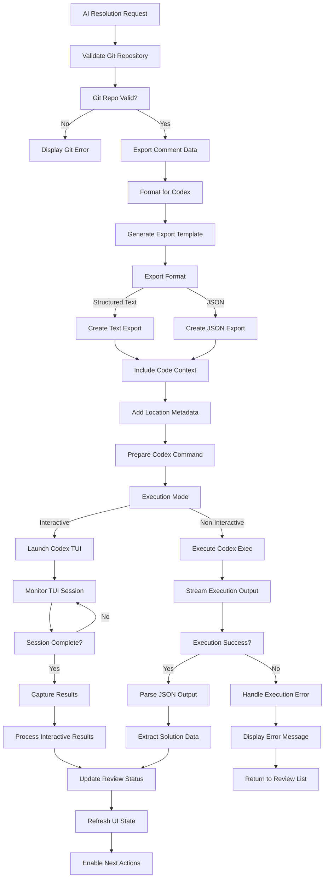
```mermaid
flowchart TD
    A["AI Resolution Request"]
    B["Validate Git Repository"]
    C["Git Repo Valid?"]
    D["Display Git Error"]
    E["Export Comment Data"]
    F["Format for Codex"]
    G["Generate Export Template"]
    H["Export Format"]
    I["Create Text Export"]
    J["Create JSON Export"]
    K["Include Code Context"]
    L["Add Location Metadata"]
    M["Prepare Codex Command"]
    N["Execution Mode"]
    O["Launch Codex TUI"]
    P["Execute Codex Exec"]
    Q["Monitor TUI Session"]
    R["Stream Execution Output"]
    S["Session Complete?"]
    T["Execution Success?"]
    U["Capture Results"]
    V["Parse JSON Output"]
    W["Handle Execution Error"]
    X["Process Interactive Results"]
    Y["Extract Solution Data"]
    Z["Display Error Message"]
    AA["Update Review Status"]
    BB["Return to Review List"]
    CC["Refresh UI State"]
    DD["Enable Next Actions"]

    A --> B
    B --> C
    C -- No --> D
    C -- Yes --> E
    E --> F
    F --> G
    G --> H
    H -- Structured Text --> I
    H -- JSON --> J
    I --> K
    J --> K
    K --> L
    L --> M
    M --> N
    N -- Interactive --> O
    N -- Non-Interactive --> P
    O --> Q
    P --> R
    Q --> S
    R --> T
    S -- No --> Q
    S -- Yes --> U
    T -- Yes --> V
    T -- No --> W
    U --> X
    V --> Y
    W --> Z
    X --> AA
    Y --> AA
    Z --> BB
    AA --> CC
    CC --> DD
```

**Technical Implementation Details:**

- **Command Execution**: codex exec streams Codex's progress to stderr
  and prints only the final agent message to stdout. This makes it easy to pipe
  the final result into other tools
- **JSON Output**: codex exec supports a --json mode that streams events
  to stdout as JSON Lines (JSONL) while the agent runs
- **Session Resumption**: Resume a previous non-interactive session with
  codex exec resume or codex exec resume --last. This preserves conversation
  context

### 4.1.2 Integration Workflows

#### 4.1.2.1 Github Api Data Flow

The GitHub API integration manages authentication, rate limiting, and data
synchronization between the remote GitHub service and local application state.

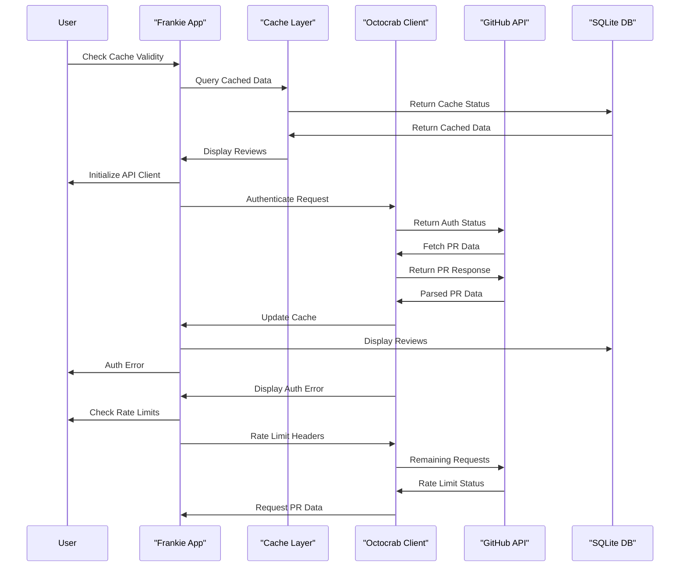
```mermaid
sequenceDiagram
    participant User
    participant Frankie_App as "Frankie App"
    participant Cache_Layer as "Cache Layer"
    participant Octocrab_Client as "Octocrab Client"
    participant GitHub_API as "GitHub API"
    participant SQLite_DB as "SQLite DB"
    User ->> Frankie_App : Check Cache Validity
    Frankie_App ->> Cache_Layer : Query Cached Data
    Cache_Layer ->> SQLite_DB : Return Cache Status
    SQLite_DB ->> Cache_Layer : Return Cached Data
    Cache_Layer ->> Frankie_App : Display Reviews
    Frankie_App ->> User : Initialize API Client
    Frankie_App ->> Octocrab_Client : Authenticate Request
    Octocrab_Client ->> GitHub_API : Return Auth Status
    GitHub_API ->> Octocrab_Client : Fetch PR Data
    Octocrab_Client ->> GitHub_API : Return PR Response
    GitHub_API ->> Octocrab_Client : Parsed PR Data
    Octocrab_Client ->> Frankie_App : Update Cache
    Frankie_App ->> SQLite_DB : Display Reviews
    Frankie_App ->> User : Auth Error
    Octocrab_Client ->> Frankie_App : Display Auth Error
    Frankie_App ->> User : Check Rate Limits
    Frankie_App ->> Octocrab_Client : Rate Limit Headers
    Octocrab_Client ->> GitHub_API : Remaining Requests
    GitHub_API ->> Octocrab_Client : Rate Limit Status
    Octocrab_Client ->> Frankie_App : Request PR Data
```

**Integration Specifications:**

- **Authentication**: The semantic API provides strong typing around
  GitHub's API, a set of models that maps to GitHub's types, and auth functions
  that are useful for GitHub apps
- **Builder Pattern**: All methods with multiple optional parameters are
  built as Builder structs, allowing you to easily specify parameters
- **Rate Limiting**: GitHub API provides 5,000 requests/hour for
  authenticated users

#### 4.1.2.2 Local Git Repository Integration

The Git integration workflow handles repository discovery, metadata extraction,
and change tracking for time-travel navigation and context display.

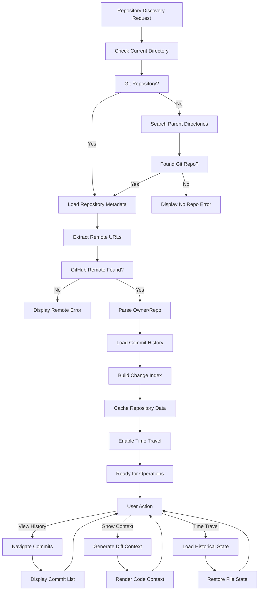
```mermaid
flowchart TD
    A["Repository Discovery Request"]
    B["Check Current Directory"]
    C["Git Repository?"]
    D["Search Parent Directories"]
    E["Load Repository Metadata"]
    F["Found Git Repo?"]
    G["Display No Repo Error"]
    H["Extract Remote URLs"]
    I["GitHub Remote Found?"]
    J["Display Remote Error"]
    K["Parse Owner/Repo"]
    L["Load Commit History"]
    M["Build Change Index"]
    N["Cache Repository Data"]
    O["Enable Time Travel"]
    P["Ready for Operations"]
    Q["User Action"]
    R["Navigate Commits"]
    S["Generate Diff Context"]
    T["Load Historical State"]
    U["Display Commit List"]
    V["Render Code Context"]
    W["Restore File State"]

    A --> B
    B --> C
    C -- No --> D
    C -- Yes --> E
    D --> F
    F -- No --> G
    F -- Yes --> E
    E --> H
    H --> I
    I -- No --> J
    I -- Yes --> K
    K --> L
    L --> M
    M --> N
    N --> O
    O --> P
    P --> Q
    Q -- View History --> R
    Q -- Show Context --> S
    Q -- Time Travel --> T
    R --> U
    S --> V
    T --> W
    U --> Q
    V --> Q
    W --> Q
```

**Git Operations:**

- Repository discovery using git2 library
- Remote URL parsing for GitHub origins
- Commit history traversal for time-travel features
- Diff generation for code context display

#### 4.1.2.3 Database Persistence And Caching

The local database manages persistent storage for GitHub data, user
preferences, and AI interaction history with intelligent caching strategies.

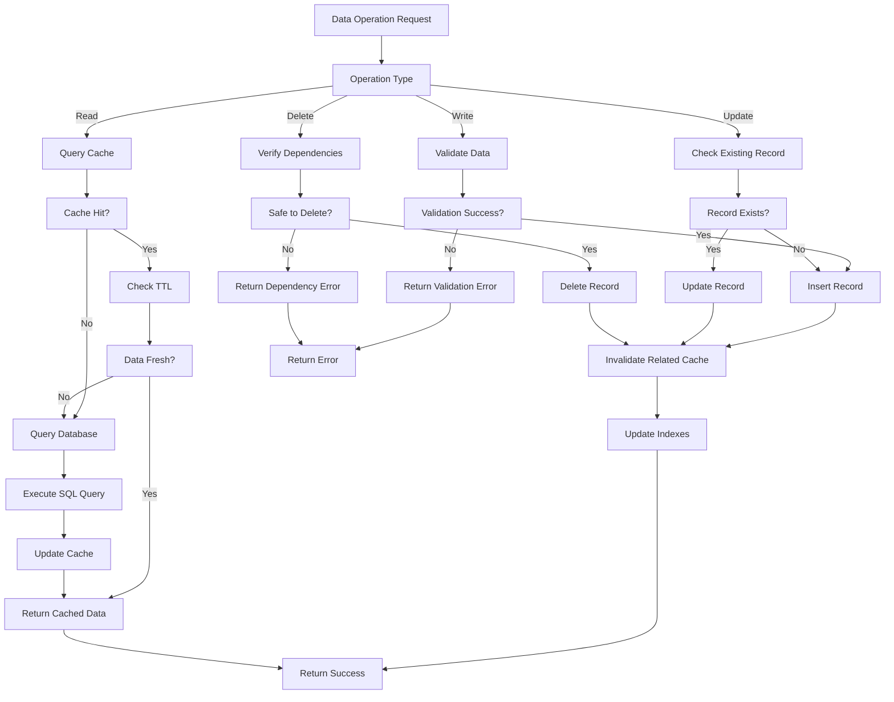
```mermaid
flowchart TD
    A["Data Operation Request"]
    B["Operation Type"]
    C["Query Cache"]
    D["Validate Data"]
    E["Check Existing Record"]
    F["Verify Dependencies"]
    G["Cache Hit?"]
    H["Check TTL"]
    I["Query Database"]
    J["Data Fresh?"]
    K["Return Cached Data"]
    L["Execute SQL Query"]
    M["Update Cache"]
    N["Validation Success?"]
    O["Insert Record"]
    P["Return Validation Error"]
    Q["Record Exists?"]
    R["Update Record"]
    S["Safe to Delete?"]
    T["Delete Record"]
    U["Return Dependency Error"]
    V["Invalidate Related Cache"]
    W["Update Indexes"]
    X["Return Success"]
    Y["Return Error"]

    A --> B
    B -- Read --> C
    B -- Write --> D
    B -- Update --> E
    B -- Delete --> F
    C --> G
    G -- Yes --> H
    G -- No --> I
    H --> J
    J -- Yes --> K
    J -- No --> I
    I --> L
    L --> M
    M --> K
    D --> N
    N -- Yes --> O
    N -- No --> P
    E --> Q
    Q -- Yes --> R
    Q -- No --> O
    F --> S
    S -- Yes --> T
    S -- No --> U
    O --> V
    R --> V
    T --> V
    V --> W
    W --> X
    K --> X
    P --> Y
    U --> Y
```

**Database Schema:**

- **Repositories**: GitHub repository metadata and configuration
- **Pull Requests**: PR data with review status tracking
- **Comments**: Review comments with resolution status
- **Cache Metadata**: TTL and invalidation tracking
- **User Preferences**: Application configuration and templates

## 4.2 Error Handling And Recovery

### 4.2.1 Network And Api Error Handling

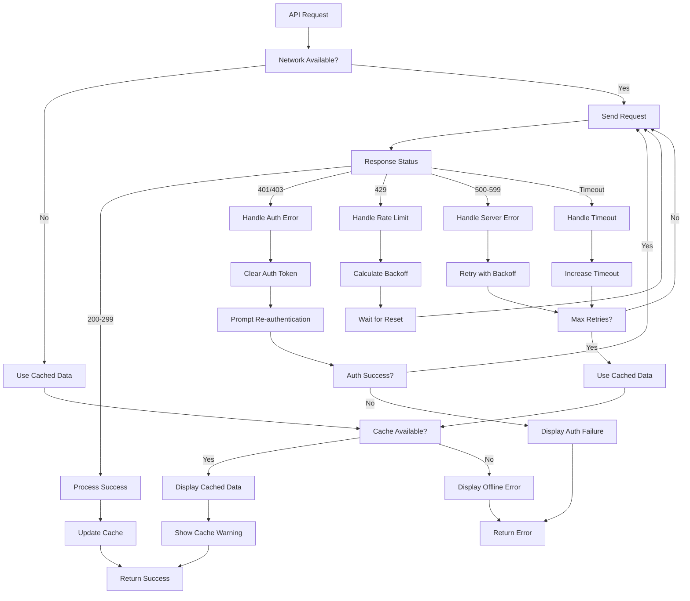
```mermaid
flowchart TD
    A["API Request"]
    B["Network Available?"]
    C["Use Cached Data"]
    D["Send Request"]
    E["Response Status"]
    F["Process Success"]
    G["Handle Auth Error"]
    H["Handle Rate Limit"]
    I["Handle Server Error"]
    J["Handle Timeout"]
    K["Clear Auth Token"]
    L["Prompt Re-authentication"]
    M["Auth Success?"]
    N["Display Auth Failure"]
    O["Calculate Backoff"]
    P["Wait for Reset"]
    Q["Retry with Backoff"]
    R["Max Retries?"]
    S["Use Cached Data"]
    T["Increase Timeout"]
    U["Cache Available?"]
    V["Display Cached Data"]
    W["Display Offline Error"]
    X["Update Cache"]
    Y["Return Success"]
    Z["Show Cache Warning"]
    AA["Return Error"]

    A --> B
    B -- No --> C
    B -- Yes --> D
    D --> E
    E -- 200-299 --> F
    E -- 401/403 --> G
    E -- 429 --> H
    E -- 500-599 --> I
    E -- Timeout --> J
    G --> K
    K --> L
    L --> M
    M -- Yes --> D
    M -- No --> N
    H --> O
    O --> P
    P --> D
    I --> Q
    Q --> R
    R -- No --> D
    R -- Yes --> S
    J --> T
    T --> R
    C --> U
    U -- Yes --> V
    U -- No --> W
    S --> U
    F --> X
    X --> Y
    V --> Z
    Z --> Y
    N --> AA
    W --> AA
```

### 4.2.2 Ai Service Error Handling

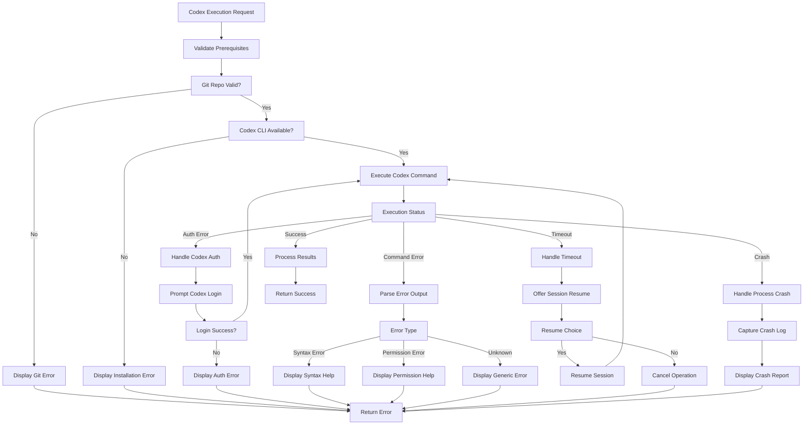
```mermaid
flowchart TD
    A["Codex Execution Request"]
    B["Validate Prerequisites"]
    C["Git Repo Valid?"]
    D["Display Git Error"]
    E["Codex CLI Available?"]
    F["Display Installation Error"]
    G["Execute Codex Command"]
    H["Execution Status"]
    I["Process Results"]
    J["Handle Codex Auth"]
    K["Parse Error Output"]
    L["Handle Timeout"]
    M["Handle Process Crash"]
    N["Prompt Codex Login"]
    O["Login Success?"]
    P["Display Auth Error"]
    Q["Error Type"]
    R["Display Syntax Help"]
    S["Display Permission Help"]
    T["Display Generic Error"]
    U["Offer Session Resume"]
    V["Resume Choice"]
    W["Resume Session"]
    X["Cancel Operation"]
    Y["Capture Crash Log"]
    Z["Display Crash Report"]
    AA["Return Success"]
    BB["Return Error"]

    A --> B
    B --> C
    C -- No --> D
    C -- Yes --> E
    E -- No --> F
    E -- Yes --> G
    G --> H
    H -- Success --> I
    H -- Auth Error --> J
    H -- Command Error --> K
    H -- Timeout --> L
    H -- Crash --> M
    J --> N
    N --> O
    O -- Yes --> G
    O -- No --> P
    K --> Q
    Q -- Syntax Error --> R
    Q -- Permission Error --> S
    Q -- Unknown --> T
    L --> U
    U --> V
    V -- Yes --> W
    V -- No --> X
    M --> Y
    Y --> Z
    W --> G
    I --> AA
    D --> BB
    F --> BB
    P --> BB
    R --> BB
    S --> BB
    T --> BB
    X --> BB
    Z --> BB
```

## 4.3 State Management And Transitions

### 4.3.1 Application State Diagram

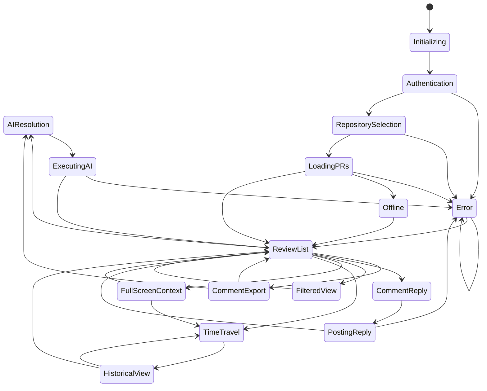
```mermaid
stateDiagram-v2
    AIResolution --> ExecutingAI
    Authentication --> Error
    Authentication --> RepositorySelection
    CommentExport --> AIResolution
    CommentExport --> ReviewList
    CommentReply --> PostingReply
    Error --> Error
    Error --> ReviewList
    ExecutingAI --> Error
    ExecutingAI --> ReviewList
    FilteredView --> ReviewList
    FullScreenContext --> ReviewList
    FullScreenContext --> TimeTravel
    HistoricalView --> ReviewList
    HistoricalView --> TimeTravel
    Initializing --> Authentication
    LoadingPRs --> Error
    LoadingPRs --> Offline
    LoadingPRs --> ReviewList
    Offline --> ReviewList
    PostingReply --> Error
    PostingReply --> ReviewList
    RepositorySelection --> Error
    RepositorySelection --> LoadingPRs
    ReviewList --> AIResolution
    ReviewList --> CommentExport
    ReviewList --> CommentReply
    ReviewList --> FilteredView
    ReviewList --> FullScreenContext
    ReviewList --> TimeTravel
    TimeTravel --> HistoricalView
    [*] --> Initializing
```

### 4.3.2 Data Flow State Transitions

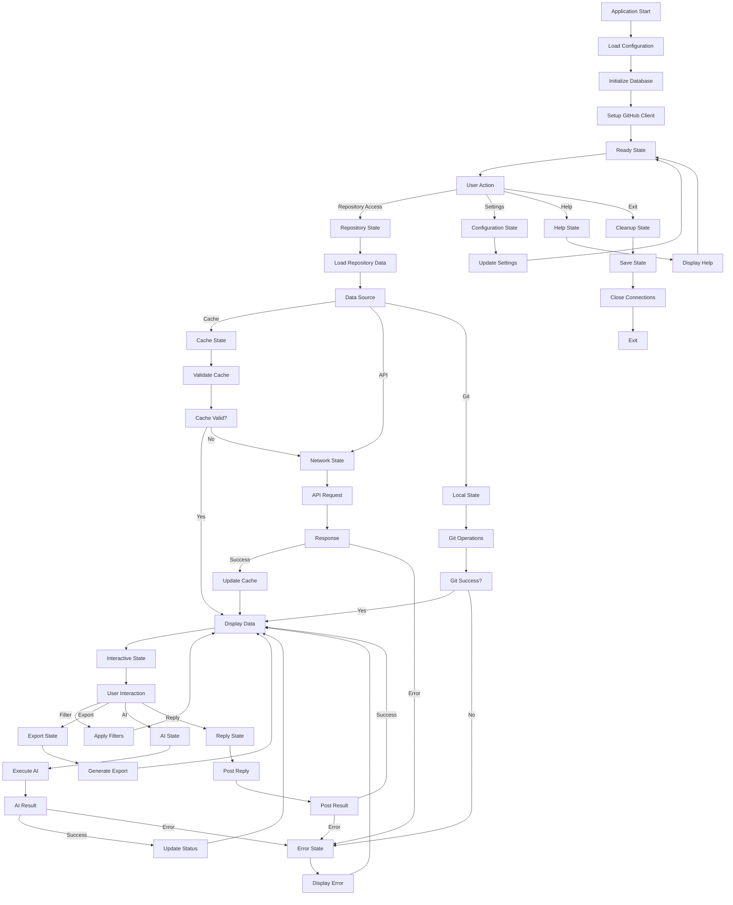
```mermaid
flowchart TD
    A["Application Start"]
    B["Load Configuration"]
    C["Initialize Database"]
    D["Setup GitHub Client"]
    E["Ready State"]
    F["User Action"]
    G["Repository State"]
    H["Configuration State"]
    I["Help State"]
    J["Cleanup State"]
    K["Load Repository Data"]
    L["Data Source"]
    M["Cache State"]
    N["Network State"]
    O["Local State"]
    P["Validate Cache"]
    Q["Cache Valid?"]
    R["Display Data"]
    S["API Request"]
    T["Response"]
    U["Update Cache"]
    V["Error State"]
    W["Git Operations"]
    X["Git Success?"]
    Y["Interactive State"]
    Z["User Interaction"]
    AA["Apply Filters"]
    BB["Export State"]
    CC["AI State"]
    DD["Reply State"]
    EE["Generate Export"]
    FF["Execute AI"]
    GG["AI Result"]
    HH["Update Status"]
    II["Post Reply"]
    JJ["Post Result"]
    KK["Display Error"]
    LL["Update Settings"]
    MM["Display Help"]
    NN["Save State"]
    OO["Close Connections"]
    PP["Exit"]

    A --> B
    B --> C
    C --> D
    D --> E
    E --> F
    F -- Repository Access --> G
    F -- Settings --> H
    F -- Help --> I
    F -- Exit --> J
    G --> K
    K --> L
    L -- Cache --> M
    L -- API --> N
    L -- Git --> O
    M --> P
    P --> Q
    Q -- Yes --> R
    Q -- No --> N
    N --> S
    S --> T
    T -- Success --> U
    T -- Error --> V
    O --> W
    W --> X
    X -- Yes --> R
    X -- No --> V
    U --> R
    R --> Y
    Y --> Z
    Z -- Filter --> AA
    Z -- Export --> BB
    Z -- AI --> CC
    Z -- Reply --> DD
    AA --> R
    BB --> EE
    EE --> R
    CC --> FF
    FF --> GG
    GG -- Success --> HH
    GG -- Error --> V
    DD --> II
    II --> JJ
    JJ -- Success --> R
    JJ -- Error --> V
    HH --> R
    V --> KK
    KK --> R
    H --> LL
    LL --> E
    I --> MM
    MM --> E
    J --> NN
    NN --> OO
    OO --> PP
```

## 4.4 Performance And Timing Considerations

### 4.4.1 Response Time Requirements

| Operation            | Target Response Time | Maximum Acceptable | Fallback Strategy         |
| -------------------- | -------------------- | ------------------ | ------------------------- |
| Repository Discovery | \<500ms              | 1s                 | Local cache only          |
| PR List Loading      | \<1s                 | 3s                 | Cached data with refresh  |
| Filter Application   | \<200ms              | 500ms              | Progressive loading       |
| Context Display      | \<300ms              | 1s                 | Syntax highlighting async |
| AI Command Execution | Real-time streaming  | 30s timeout        | Session resumption        |
| Comment Export       | \<1s                 | 3s                 | Background processing     |

### 4.4.2 Concurrency And Async Operations

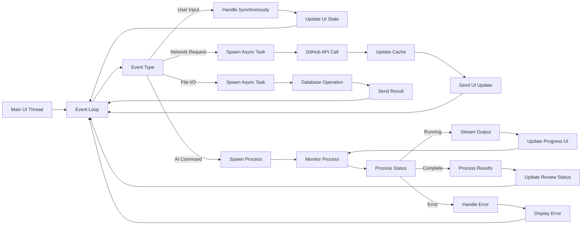
```mermaid
flowchart LR
    A["Main UI Thread"]
    B["Event Loop"]
    C["Event Type"]
    D["Handle Synchronously"]
    E["Spawn Async Task"]
    F["Spawn Async Task"]
    G["Spawn Process"]
    H["Update UI State"]
    I["GitHub API Call"]
    J["Update Cache"]
    K["Send UI Update"]
    L["Database Operation"]
    M["Send Result"]
    N["Monitor Process"]
    O["Process Status"]
    P["Stream Output"]
    Q["Process Results"]
    R["Handle Error"]
    S["Update Progress UI"]
    T["Update Review Status"]
    U["Display Error"]

    A --> B
    B --> C
    C -- User Input --> D
    C -- Network Request --> E
    C -- File I/O --> F
    C -- AI Command --> G
    D --> H
    H --> B
    E --> I
    I --> J
    J --> K
    K --> B
    F --> L
    L --> M
    M --> B
    G --> N
    N --> O
    O -- Running --> P
    O -- Complete --> Q
    O -- Error --> R
    P --> S
    S --> N
    Q --> T
    T --> B
    R --> U
    U --> B
```

### 4.4.3 Resource Management And Cleanup

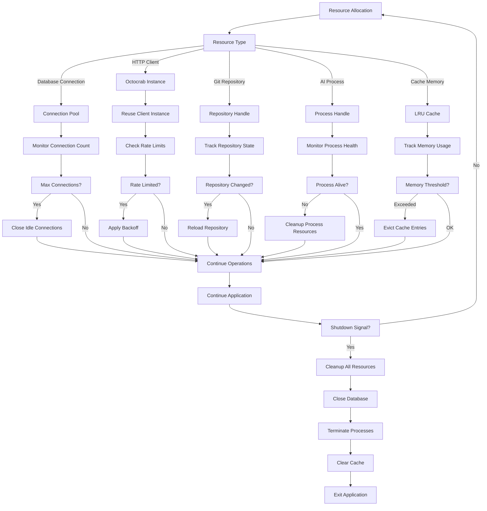
```mermaid
flowchart TD
    A["Resource Allocation"]
    B["Resource Type"]
    C["Connection Pool"]
    D["Octocrab Instance"]
    E["Repository Handle"]
    F["Process Handle"]
    G["LRU Cache"]
    H["Monitor Connection Count"]
    I["Reuse Client Instance"]
    J["Track Repository State"]
    K["Monitor Process Health"]
    L["Track Memory Usage"]
    M["Max Connections?"]
    N["Close Idle Connections"]
    O["Continue Operations"]
    P["Check Rate Limits"]
    Q["Rate Limited?"]
    R["Apply Backoff"]
    S["Repository Changed?"]
    T["Reload Repository"]
    U["Process Alive?"]
    V["Cleanup Process Resources"]
    W["Memory Threshold?"]
    X["Evict Cache Entries"]
    Y["Continue Application"]
    Z["Shutdown Signal?"]
    AA["Cleanup All Resources"]
    BB["Close Database"]
    CC["Terminate Processes"]
    DD["Clear Cache"]
    EE["Exit Application"]
    A --> B
    B -- Database Connection --> C
    B -- HTTP Client --> D
    B -- Git Repository --> E
    B -- AI Process --> F
    B -- Cache Memory --> G
    C --> H
    D --> I
    E --> J
    F --> K
    G --> L
    H --> M
    M -- Yes --> N
    M -- No --> O
    I --> P
    P --> Q
    Q -- Yes --> R
    Q -- No --> O
    J --> S
    S -- Yes --> T
    S -- No --> O
    K --> U
    U -- No --> V
    U -- Yes --> O
    L --> W
    W -- Exceeded --> X
    W -- OK --> O
    N --> O
    R --> O
    T --> O
    V --> O
    X --> O
    O --> Y
    Y --> Z
    Z -- Yes --> AA
    Z -- No --> A
    AA --> BB
    BB --> CC
    CC --> DD
    DD --> EE
```

This comprehensive process flowchart section provides detailed workflows for
all major system operations, error handling strategies, state management, and
performance considerations. The diagrams use proper Mermaid.js syntax and
include clear decision points, timing constraints, and recovery procedures as
specified in the requirements.

## 5. System Architecture

## 5.1 High-level Architecture

### 5.1.1 System Overview

Frankie Goes to Code Review employs the Model-View-Update (MVU) architecture
pattern with async command support, providing clean separation of state, logic,
and rendering through the bubbletea-rs framework. The system is designed as a
terminal-native application that bridges GitHub's web-based code review
interface with local development workflows through AI-assisted automation.

The architecture follows a layered approach with clear separation of concerns:

**Presentation Layer**: Terminal User Interface built using the
Model-View-Update pattern with async command support and rich styling
capabilities through lipgloss-extras. The TUI provides keyboard-driven
navigation optimized for developer workflows.

**Business Logic Layer**: Core application logic manages repository discovery,
review filtering, comment processing, and AI integration workflows. This layer
orchestrates interactions between external services while maintaining
application state consistency.

**Integration Layer**: High level strongly typed semantic API and lower level
HTTP API for extending behaviour with strong typing around GitHub's API and
models that map to GitHub's types through octocrab, alongside local Git
operations via git2 and AI service integration through OpenAI Codex CLI.

**Data Layer**: High-level ORM that eliminates runtime errors without
sacrificing performance and takes full advantage of Rust's type system using
Diesel with SQLite for local persistence and caching.

### 5.1.2 Core Components Table

| Component Name         | Primary Responsibility                                        | Key Dependencies                           | Integration Points                 |
| ---------------------- | ------------------------------------------------------------- | ------------------------------------------ | ---------------------------------- |
| TUI Controller         | User interface management and event handling                  | bubbletea-rs, bubbletea-widgets, crossterm | All business logic components      |
| Repository Manager     | GitHub repository discovery and metadata management           | octocrab, git2                             | GitHub API, Local Git repositories |
| Review Processor       | Code review filtering, comment parsing, and export generation | syntect, diesel                            | Repository Manager, Database Layer |
| AI Integration Service | OpenAI Codex CLI command execution and response processing    | Process execution, JSON parsing            | Review Processor, File System      |

### 5.1.3 Data Flow Description

The primary data flow follows a request-response pattern with local caching
optimization. User interactions trigger commands through the TUI Controller,
which delegates to appropriate business logic components. The Repository
Manager handles GitHub API interactions with intelligent caching through the
Database Layer, while the Review Processor manages comment filtering and export
generation.

AI integration flows operate asynchronously, with the AI Integration Service
executing Codex commands and streaming results back to the TUI. Codex streams
its activity to stderr and only writes the final message from the agent to
stdout, making it easier to pipe codex exec into another tool without extra
filtering.

Data transformation occurs at integration boundaries: GitHub API responses are
deserialized into strongly-typed models, review comments are processed into
structured export formats, and AI responses are parsed from JSON Lines format
for real-time progress updates.

The Database Layer provides persistent storage for GitHub metadata, user
preferences, and AI interaction history with configurable TTL policies for
cache invalidation.

### 5.1.4 External Integration Points

| System Name          | Integration Type    | Data Exchange Pattern            | Protocol/Format        |
| -------------------- | ------------------- | -------------------------------- | ---------------------- |
| GitHub API           | REST API Client     | Request/Response with Pagination | HTTPS/JSON             |
| OpenAI Codex CLI     | Process Execution   | Command/Response with Streaming  | JSON Lines over stdio  |
| Local Git Repository | Library Integration | Direct File System Access        | git2 native bindings   |
| SQLite Database      | ORM Integration     | Query/Response with Transactions | Diesel ORM abstraction |

## 5.2 Component Details

### 5.2.1 Tui Controller Component

**Purpose and Responsibilities**: The TUI Controller manages the complete user
interface lifecycle, handling keyboard events, rendering updates, and
coordinating with business logic components. It provides comprehensive event
handling for keyboard, mouse, window resize, and focus events with memory
monitoring and gradient rendering capabilities.

**Technologies and Frameworks**: Built on bubbletea-rs 0.0.9 with
bubbletea-widgets 0.1.12 for reusable components and lipgloss-extras for
styling. Each component follows the Elm Architecture pattern with init(),
update(), and view() methods, providing a consistent and predictable API.

**Key Interfaces and APIs**: Implements the Model trait with async command
support, providing init(), update(), and view() methods. The component exposes
keyboard binding management through the KeyMap trait and integrates with the
help system for contextual assistance.

**Data Persistence Requirements**: No direct persistence requirements; state is
managed in-memory with periodic synchronization to the Database Layer for user
preferences and session data.

**Scaling Considerations**: In performance testing, Rust TUI implementations
consistently used 30-40% less memory and had a 15% lower CPU footprint than
equivalent implementations, primarily due to Rust's lack of a garbage collector
and zero-cost abstractions.

### 5.2.2 Repository Manager Component

**Purpose and Responsibilities**: Handles all GitHub repository interactions
including authentication, API rate limiting, repository discovery, and pull
request metadata management. Provides intelligent caching to minimize API calls
and support offline operation.

**Technologies and Frameworks**: Uses octocrab with Builder structs for methods
with multiple optional parameters, allowing easy parameter specification with
pagination support. Integrates git2 for local repository operations and
metadata extraction.

**Key Interfaces and APIs**: Exposes repository discovery methods (URL parsing,
owner/repo specification, local Git detection), pull request listing with
filtering capabilities, and review comment retrieval with structured metadata.

**Data Persistence Requirements**: Caches GitHub API responses in SQLite with
configurable TTL, stores authentication tokens securely, and maintains
repository metadata for offline access. The SQLite database file must reside
under `$XDG_DATA_HOME` using `directories::ProjectDirs` resolution to follow
platform-specific data placement conventions.

**Scaling Considerations**: Implements pagination support with rate limiting
awareness, as GitHub API provides 5,000 requests/hour for authenticated users.

### 5.2.3 Review Processor Component

**Purpose and Responsibilities**: Manages code review comment processing,
filtering, and export generation. Handles syntax highlighting, diff context
generation, and template-based comment formatting for AI integration.

**Technologies and Frameworks**: Uses syntect for syntax highlighting and code
context rendering, diesel for database operations, and custom template engines
for comment export formatting.

**Key Interfaces and APIs**: Provides filtering methods (by status, file,
reviewer, commit range), export generation in multiple formats, and
template-based comment processing for AI integration.

**Data Persistence Requirements**: Stores processed review comments with
resolution status, maintains filter preferences, and caches syntax highlighting
results for performance optimization.

**Scaling Considerations**: Implements lazy loading for large comment sets,
progressive syntax highlighting for responsive UI, and configurable export
batch sizes for memory management.

### 5.2.4 Ai Integration Service Component

**Purpose and Responsibilities**: Manages OpenAI Codex CLI integration as a
coding agent that runs locally from the terminal and can read, modify, and run
code on the machine. Handles command execution, response parsing, and session
management.

**Technologies and Frameworks**: Integrates with codex exec which supports JSON
mode that streams events to stdout as JSON Lines (JSONL) while the agent runs.
Uses process execution with streaming I/O and JSON parsing for real-time
progress updates.

**Key Interfaces and APIs**: Provides command execution methods with approval
workflows, session resumption capabilities, and streaming progress monitoring.
Supports resuming previous non-interactive sessions with codex exec resume or
codex exec resume --last, preserving conversation context.

**Data Persistence Requirements**: Requires commands to run inside a Git
repository to prevent destructive changes, with override capability for safe
environments. Stores session metadata and execution logs for resumption and
audit purposes.

**Scaling Considerations**: Implements concurrent session management,
configurable timeout handling, and resource monitoring for long-running AI
operations.

### 5.2.5 Component Interaction Diagrams

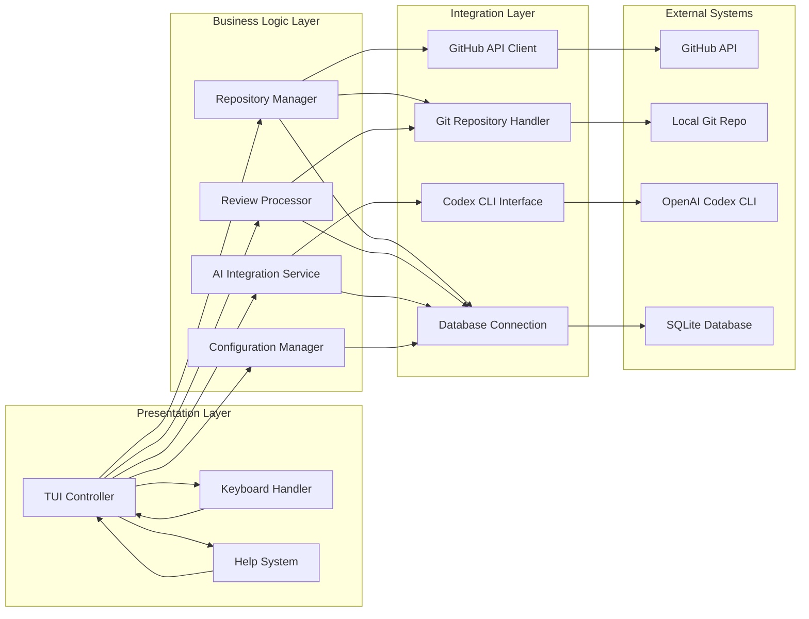
```mermaid
flowchart LR
    subgraph "Presentation Layer"
        A["TUI Controller"]
        B["Keyboard Handler"]
        C["Help System"]
    end

    subgraph "Business Logic Layer"
        D["Repository Manager"]
        E["Review Processor"]
        F["AI Integration Service"]
        G["Configuration Manager"]
    end

    subgraph "Integration Layer"
        H["GitHub API Client"]
        I["Git Repository Handler"]
        J["Codex CLI Interface"]
        K["Database Connection"]
    end

    subgraph "External Systems"
        L["GitHub API"]
        M["Local Git Repo"]
        N["OpenAI Codex CLI"]
        O["SQLite Database"]
    end

    A --> B
    A --> C
    A --> D
    A --> E
    A --> F
    A --> G
    D --> H
    D --> I
    D --> K
    E --> K
    E --> I
    F --> J
    F --> K
    G --> K
    H --> L
    I --> M
    J --> N
    K --> O
    B --> A
    C --> A
```

### 5.2.6 State Transition Diagrams

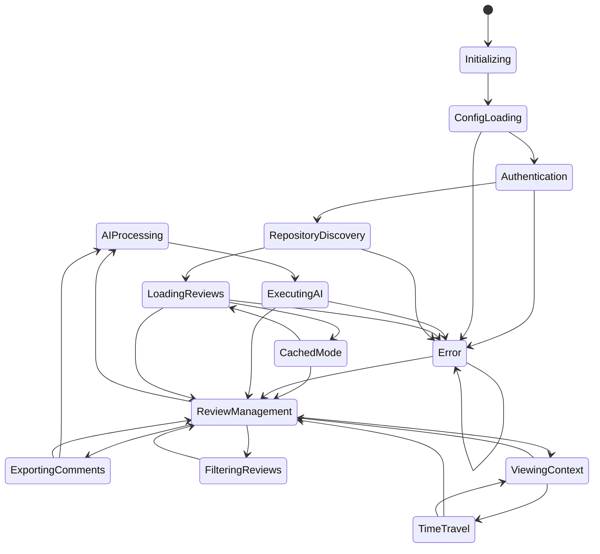
```mermaid
stateDiagram-v2
    AIProcessing --> ExecutingAI
    Authentication --> Error
    Authentication --> RepositoryDiscovery
    CachedMode --> LoadingReviews
    CachedMode --> ReviewManagement
    ConfigLoading --> Authentication
    ConfigLoading --> Error
    Error --> Error
    Error --> ReviewManagement
    ExecutingAI --> Error
    ExecutingAI --> ReviewManagement
    ExportingComments --> AIProcessing
    ExportingComments --> ReviewManagement
    FilteringReviews --> ReviewManagement
    Initializing --> ConfigLoading
    LoadingReviews --> CachedMode
    LoadingReviews --> Error
    LoadingReviews --> ReviewManagement
    RepositoryDiscovery --> Error
    RepositoryDiscovery --> LoadingReviews
    ReviewManagement --> AIProcessing
    ReviewManagement --> ExportingComments
    ReviewManagement --> FilteringReviews
    ReviewManagement --> ViewingContext
    TimeTravel --> ReviewManagement
    TimeTravel --> ViewingContext
    ViewingContext --> ReviewManagement
    ViewingContext --> TimeTravel
    [*] --> Initializing
```

### 5.2.7 Key Flow Sequence Diagrams

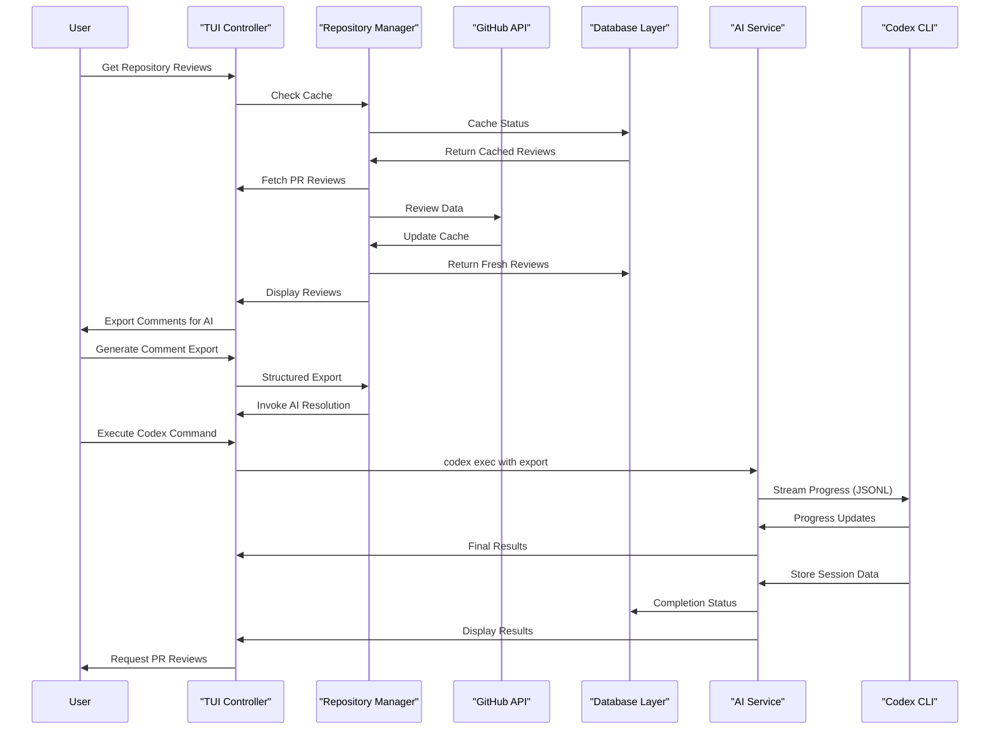
```mermaid
sequenceDiagram
    participant User
    participant TUI_Controller as "TUI Controller"
    participant Repository_Manager as "Repository Manager"
    participant GitHub_API as "GitHub API"
    participant Database_Layer as "Database Layer"
    participant AI_Service as "AI Service"
    participant Codex_CLI as "Codex CLI"
    User ->> TUI_Controller : Get Repository Reviews
    TUI_Controller ->> Repository_Manager : Check Cache
    Repository_Manager ->> Database_Layer : Cache Status
    Database_Layer ->> Repository_Manager : Return Cached Reviews
    Repository_Manager ->> TUI_Controller : Fetch PR Reviews
    Repository_Manager ->> GitHub_API : Review Data
    GitHub_API ->> Repository_Manager : Update Cache
    Repository_Manager ->> Database_Layer : Return Fresh Reviews
    Repository_Manager ->> TUI_Controller : Display Reviews
    TUI_Controller ->> User : Export Comments for AI
    User ->> TUI_Controller : Generate Comment Export
    TUI_Controller ->> Repository_Manager : Structured Export
    Repository_Manager ->> TUI_Controller : Invoke AI Resolution
    User ->> TUI_Controller : Execute Codex Command
    TUI_Controller ->> AI_Service : codex exec with export
    AI_Service ->> Codex_CLI : Stream Progress (JSONL)
    Codex_CLI ->> AI_Service : Progress Updates
    AI_Service ->> TUI_Controller : Final Results
    Codex_CLI ->> AI_Service : Store Session Data
    AI_Service ->> Database_Layer : Completion Status
    AI_Service ->> TUI_Controller : Display Results
    TUI_Controller ->> User : Request PR Reviews
```

## 5.3 Technical Decisions

### 5.3.1 Architecture Style Decisions And Tradeoffs

**Model-View-Update (MVU) Pattern Selection**: The MVU architecture provides
clean separation of state, logic, and rendering with async command support,
chosen over traditional MVC patterns for its functional approach and
predictable state management. This decision enables better testability and
reduces complexity in handling asynchronous operations.

**Terminal User Interface Over Web Interface**: Selected TUI to maintain
developer workflow continuity and eliminate context switching between terminal
and browser environments. Rust with terminal interfaces provides superior
performance, fine-grained control, and memory safety, making it the better
choice for performance-critical applications where resource management is
paramount.

**Rust Language Selection**: Chosen for memory safety, zero-cost abstractions,
and strong type system benefits. Diesel eliminates runtime errors without
sacrificing performance and takes full advantage of Rust's type system to
create a low overhead query builder.

| Decision Factor      | Alternative Considered      | Selected Approach          | Rationale                       |
| -------------------- | --------------------------- | -------------------------- | ------------------------------- |
| UI Framework         | Web-based (Tauri, Electron) | Terminal UI (bubbletea-rs) | Developer workflow integration  |
| Language             | Go, Python, TypeScript      | Rust                       | Performance and type safety     |
| Architecture Pattern | MVC, Component-based        | MVU (Model-View-Update)    | Functional programming benefits |
| Database Integration | Raw SQL, SQLx               | Diesel ORM                 | Compile-time query validation   |

### 5.3.2 Communication Pattern Choices

**Async Command Pattern**: Implements async command system with non-blocking
operations and command-based side effects to handle GitHub API calls, file I/O,
and AI service integration without blocking the UI thread.

**Event-Driven Architecture**: Uses message passing between components to
maintain loose coupling and enable reactive updates. The TUI Controller acts as
the central event dispatcher, coordinating between business logic components.

**Streaming Data Processing**: Leverages JSON Lines streaming for real-time AI
progress updates, allowing the application to display progress while Codex
executes.

**Request-Response with Caching**: GitHub API interactions follow a
request-response pattern with intelligent local caching to minimize API calls
and support offline operation.

### 5.3.3 Data Storage Solution Rationale

**SQLite with Diesel ORM Selection**: Diesel 2.2.0 with SQLite features
including returning_clauses_for_sqlite_3_35 for enhanced SQL capabilities
provides local persistence without external database dependencies.

**Local-First Architecture**: Chosen to ensure application functionality
without network connectivity and to maintain data privacy by keeping sensitive
code review information local.

**Structured Caching Strategy**: Implements TTL-based cache invalidation with
configurable retention policies to balance data freshness with API rate
limiting constraints.

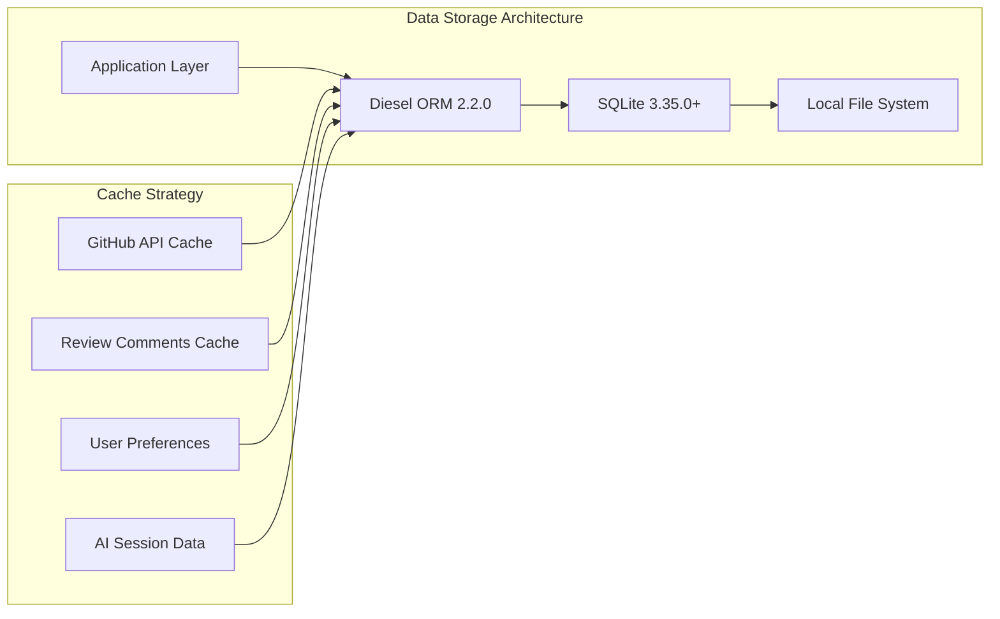
```mermaid
flowchart LR
    subgraph "Cache Strategy"
        E["GitHub API Cache"]
        F["Review Comments Cache"]
        G["User Preferences"]
        H["AI Session Data"]
    end

    subgraph "Data Storage Architecture"
        A["Application Layer"]
        B["Diesel ORM 2.2.0"]
        C["SQLite 3.35.0+"]
        D["Local File System"]
    end

    A --> B
    B --> C
    C --> D
    E --> B
    F --> B
    G --> B
    H --> B
```

### 5.3.4 Caching Strategy Justification

**Multi-Tier Caching Approach**: Implements memory caching for frequently
accessed data with SQLite persistence for durability. GitHub API rate limiting
requires careful management with 5,000 requests/hour for authenticated users.

**Intelligent Cache Invalidation**: Uses content-based and time-based
invalidation strategies to ensure data freshness while minimizing API calls.
Pull request metadata has longer TTL than dynamic review comments.

**Offline Capability**: Cache-first approach enables continued operation during
network outages, with graceful degradation and clear user feedback about data
staleness.

### 5.3.5 Security Mechanism Selection

**Local Credential Management**: Stores GitHub authentication tokens using
system keychain integration for secure credential storage without exposing
sensitive data in configuration files.

**Sandboxed AI Execution**: Leverages Codex approval modes including Auto
(default) for working directory access, Read Only for consultative mode, and
Full Access for trusted repositories.

**Input Validation and Sanitization**: Implements comprehensive input
validation at API boundaries using Rust's type system and serde for safe
deserialization of external data.

**Git Repository Safety**: Requires Git repository context for AI operations to
prevent destructive changes, with explicit override capability for safe
environments.

### 5.3.6 Architecture Decision Records

```mermaid
flowchart LR
    A["Architecture Decision"]
    B["Decision Type"]
    C["Language/Framework Selection"]
    D["Architectural Pattern Choice"]
    E["External Service Integration"]
    F["Rust + bubbletea-rs"]
    G["Diesel + SQLite"]
    H["octocrab + git2"]
    I["MVU Pattern"]
    J["Event-Driven Communication"]
    K["Local-First Data"]
    L["GitHub API Integration"]
    M["OpenAI Codex CLI"]
    N["Local Git Operations"]
    O["Performance + Type Safety"]
    P["Local Persistence + Query Safety"]
    Q["Strongly Typed APIs"]
    R["Predictable State Management"]
    S["Loose Coupling + Reactivity"]
    T["Offline Capability + Privacy"]
    U["Comprehensive PR Management"]
    V["AI-Assisted Code Review"]
    W["Repository Context + History"]

    A --> B
    B -- Technology --> C
    B -- Pattern --> D
    B -- Integration --> E
    C --> F
    C --> G
    C --> H
    D --> I
    D --> J
    D --> K
    E --> L
    E --> M
    E --> N
    F --> O
    G --> P
    H --> Q
    I --> R
    J --> S
    K --> T
    L --> U
    M --> V
    N --> W
```

#### Architecture decision record (ADR-001): incremental sync for review comments

**Context**: The TUI needs to keep review comments up to date without losing
the user's current selection or requiring manual refresh.

**Decision**: Implement timer-based background sync (30-second interval) with
ID-based selection tracking.

**Rationale**:

1. **Timer + Manual Approach**: Using one-shot timers with explicit re-arming
   prevents timer accumulation. Manual refresh (`r` key) delegates to the same
   sync logic for consistent behaviour.

2. **ID-Based Merge**: Comments are merged using `ReviewComment.id` as the
   stable identifier. The algorithm inserts new comments, updates modified
   ones, and removes deleted ones. Results are sorted by ID for deterministic
   ordering.

3. **Selection Preservation**: Instead of tracking cursor position (which
   becomes invalid after data changes), the TUI tracks `selected_comment_id`.
   After merge, the cursor is restored to the new index of the selected ID, or
   clamped if the comment was deleted.

4. **Telemetry Integration**: Sync latency is recorded via the
   `SyncLatencyRecorded` telemetry event, including duration, comment count,
   and whether the sync was incremental.

**Consequences**:

- Users see fresh data without manual intervention
- Selection is preserved across syncs unless the selected comment is deleted
- Latency metrics enable performance monitoring

#### Architecture decision record (ADR-002): Codex execution stream and transcript model

**Context**: The review TUI must trigger `codex app-server` directly from
filtered comments, display live progress, and preserve machine-readable
execution transcripts for diagnostics.

**Decision**: Integrate Codex execution through a dedicated AI service module
that runs `codex app-server` via the JSON-RPC protocol, polls progress updates
in the TUI loop, and writes one JSONL transcript file per run to the local
state directory.

**Rationale**:

1. **Boundary clarity**: Process execution and stream parsing live in `src/ai/`
   so TUI state transitions remain in `src/tui/`.

2. **Deterministic persistence**: Transcript files use a deterministic naming
   pattern `<owner>-<repo>-pr-<number>-<utc-yyyymmddThhmmssZ>.jsonl` under
   `${XDG_STATE_HOME:-$HOME/.local/state}/frankie/codex-transcripts/`.

3. **Operational visibility**: The TUI status bar shows streamed progress
   events while runs are active and maps non-zero exits into explicit error
   messages including exit code and transcript path.

**Consequences**:

- Users can launch Codex with a single key (`x`) from the review list view.
- Transcripts are retained on disk for both successful and failed runs.
- Non-zero Codex exits are no longer silent and are surfaced immediately in the
  interface.

#### Architecture decision record (ADR-003): Session resumption for interrupted Codex runs

**Context**: Codex runs can be interrupted by process crashes, signals, or
server-side interruptions. Users lose progress and must restart from scratch,
including re-approval of previously accepted actions.

**Decision**: Persist session state in JSON sidecar files alongside transcripts
and use the native `thread/resume` JSON-RPC method to reconnect to a prior
server-side thread when an interrupted session is detected.

**Rationale**:

1. **Sidecar file design**: Each Codex run creates a `.session.json` file
   alongside its `.jsonl` transcript, recording thread ID, PR context, status,
   and timestamps. Sidecar files are self-contained and do not require database
   changes.

2. **Native protocol usage**: The `thread/resume` method is part of the Codex
   `app-server` JSON-RPC protocol. Using it directly avoids re-implementing
   conversation state management and preserves server-side approvals.

3. **Thread ID capture**: The thread ID from the `thread/start` response is
   stored in session state as soon as it is received. This ensures resumption
   is possible even when the interruption occurs during execution.

4. **Resume prompt UX**: The resume prompt is shown inline in the status bar
   (`y`/`n`/`Esc`) rather than as a modal dialog. This keeps the interaction
   lightweight and consistent with the existing TUI key-driven workflow.

**Consequences**:

- Interrupted runs can be resumed with preserved approvals and conversation
  history.
- Transcript files accumulate content across sessions, separated by
  `--- session resumed ---` markers.
- Session discovery scans sidecar files on disk; no additional database schema
  is required.
- The most recent interrupted session per PR is offered for resumption; users
  can decline to start fresh.

#### Architecture decision record (ADR-004): Inline template-based reply drafting

**Context**: Review workflows need fast, keyboard-driven reply composition
without leaving the TUI. The roadmap acceptance for this step requires inline
rendering, edit-before-send behaviour, and configured length enforcement.

**Decision**: Add a dedicated reply-draft state slice to the review TUI with
template insertion (`1` to `9`), free-form editing, and a local send-intent
action. Templates are rendered with `MiniJinja` using comment-scoped variables
(`comment_id`, `reviewer`, `file`, `line`, `body`).

**Rationale**:

1. **MVU boundary clarity**: Reply drafting is implemented as its own message
   group and handlers so navigation, Codex execution, and sync logic remain
   isolated.

2. **Keyboard-first interaction**: Starting draft mode with `a` and inserting
   template slots with number keys matches the existing terminal-first UX and
   avoids modal forms.

3. **Deterministic validation**: Draft limits are enforced as Unicode scalar
   counts during both typing and template insertion, producing consistent
   behaviour across multilingual text.

4. **Scoped delivery**: `Enter` marks a draft as ready to send but does not
   post to GitHub in this phase, keeping the change focused on drafting UX.

**Consequences**:

- Selected comments now show inline reply-draft content and draft metadata in
  the detail pane.
- Users can create and edit templates through config layers
  (`reply_max_length`, `reply_templates`) without code changes.
- Over-limit insertions and invalid template slots surface explicit inline
  errors instead of silently truncating content.

## 5.4 Cross-cutting Concerns

### 5.4.1 Monitoring And Observability Approach

**Structured Logging Strategy**: Implements comprehensive logging using the
tracing crate with structured log events for debugging, performance monitoring,
and audit trails. Log levels are configurable through the application
configuration system.

**Performance Metrics Collection**: Tracks key performance indicators including
GitHub API response times, database query performance, AI command execution
duration, and UI responsiveness metrics. Metrics are collected locally and can
be exported for analysis.

**Health Check Implementation**: Provides system health monitoring for external
service connectivity (GitHub API availability, Codex CLI functionality),
database integrity, and local Git repository access.

**Error Tracking and Reporting**: Comprehensive error handling with structured
error types using thiserror, enabling detailed error reporting and recovery
strategies.

### 5.4.2 Logging And Tracing Strategy

**Hierarchical Log Levels**: Implements DEBUG for development diagnostics, INFO
for operational events, WARN for recoverable issues, and ERROR for critical
failures requiring user attention.

**Contextual Tracing**: Uses tracing spans to track request flows across
component boundaries, enabling correlation of related events and performance
analysis of complex operations.

**Sensitive Data Protection**: Implements log sanitization to prevent exposure
of authentication tokens, personal information, or proprietary code content in
log outputs.

**Configurable Output Formats**: Supports both human-readable console output
for development and structured JSON output for production monitoring and
analysis.

### 5.4.3 Error Handling Patterns

**Layered Error Handling**: Implements domain-specific error types at each
architectural layer with conversion traits for error propagation and context
preservation.

**Graceful Degradation**: Provides fallback mechanisms for external service
failures, including cached data usage, offline mode operation, and user
notification of service limitations.

**Recovery Strategies**: Implements automatic retry logic with exponential
backoff for transient failures, session resumption for interrupted AI
operations, and data consistency checks for database operations.

**User-Friendly Error Messages**: Translates technical errors into actionable
user guidance with suggested resolution steps and help system integration.

```mermaid
flowchart LR
    A["Error Occurrence"]
    B["Error Type"]
    C["GitHub API Error"]
    D["AI Service Error"]
    E["Storage Error"]
    F["Validation Error"]
    G["Recoverable?"]
    H["Retry with Backoff"]
    I["Use Cached Data"]
    J["Session Active?"]
    K["Resume Session"]
    L["Display Error + Guidance"]
    M["Data Integrity?"]
    N["Retry Operation"]
    O["Rebuild Cache"]
    P["Show Validation Message"]
    Q["Continue Operation"]
    R["Offline Mode"]
    S["User Action Required"]
    T["Cache Rebuilt"]
    U["User Correction"]
    V["Success"]
    W["Limited Functionality"]
    X["Manual Resolution"]
    Y["Retry Validation"]

    A --> B
    B -- Network --> C
    B -- Process --> D
    B -- Database --> E
    B -- User Input --> F
    C --> G
    G -- Yes --> H
    G -- No --> I
    D --> J
    J -- Yes --> K
    J -- No --> L
    E --> M
    M -- OK --> N
    M -- Corrupted --> O
    F --> P
    H --> Q
    I --> R
    K --> Q
    L --> S
    N --> Q
    O --> T
    P --> U
    Q --> V
    R --> W
    S --> X
    T --> Q
    U --> Y
```

### 5.4.4 Authentication And Authorization Framework

**GitHub Authentication Management**: Supports Personal Access Tokens and
GitHub App authentication with secure token storage using system keychain
integration. Implements token validation and refresh mechanisms.

**OpenAI Service Authentication**: Integrates with ChatGPT Plus, Pro, Business,
Edu, or Enterprise accounts for Codex access, with API key support for
fine-grained control. Credentials are managed separately from GitHub
authentication.

**Permission-Based Access Control**: Implements repository-level access
validation ensuring users can only access repositories they have permission to
view. Validates GitHub API permissions before attempting operations.

**Secure Configuration Management**: Uses ortho-config for secure configuration
file handling with environment variable support and encrypted credential
storage.

### 5.4.5 Performance Requirements And Slas

**Response Time Targets**: Repository discovery \<500ms, PR list loading \<1s,
filter application \<200ms, context display \<300ms, and real-time AI command
streaming with 30s timeout limits.

**Memory Usage Optimization**: Leverages Rust's memory efficiency with 30-40%
less memory usage and 15% lower CPU footprint compared to equivalent
implementations through zero-cost abstractions and no garbage collection
overhead.

**Concurrent Operation Support**: Handles multiple simultaneous operations
including background cache updates, streaming AI responses, and responsive UI
interactions without blocking.

**Scalability Thresholds**: Supports repositories with up to 1000 pull
requests, 10,000 review comments, and maintains performance with large diff
contexts through progressive loading and virtual scrolling.

### 5.4.6 Disaster Recovery Procedures

**Data Backup and Recovery**: Implements automatic SQLite database backup with
configurable retention policies. Provides database repair utilities for
corruption recovery and data export capabilities for migration.

**Configuration Recovery**: Maintains configuration file versioning with
automatic backup creation before updates. Provides configuration reset
utilities and default configuration restoration.

**Session Recovery**: Supports AI session resumption with preserved
conversation context, allowing recovery from interrupted operations. Maintains
session metadata for recovery across application restarts.

**Network Failure Resilience**: Implements comprehensive offline mode with
cached data access, queued operations for network restoration, and clear user
feedback about connectivity status.

| Recovery Scenario       | Detection Method           | Recovery Procedure                        | Recovery Time |
| ----------------------- | -------------------------- | ----------------------------------------- | ------------- |
| Database Corruption     | Integrity check on startup | Restore from backup + rebuild cache       | \<30 seconds  |
| Configuration Loss      | File system validation     | Restore defaults + user reconfiguration   | \<10 seconds  |
| Network Outage          | API request failure        | Switch to offline mode + cached data      | Immediate     |
| AI Service Interruption | Process monitoring         | Session resumption + context preservation | \<5 seconds   |

This comprehensive System Architecture section provides detailed technical
specifications for implementing Frankie Goes to Code Review, covering all major
architectural decisions, component interactions, and cross-cutting concerns
necessary for successful system development and operation.

## 6. System Components Design

## 6.1 Core Component Architecture

### 6.1.1 Tui Controller Component

**Component Overview**: The TUI Controller serves as the central orchestrator
for the terminal user interface, implementing the Model-View-Update (MVU)
architecture pattern with async command support. This component provides clean
separation of state, logic, and rendering through the bubbletea-rs framework,
which provides developers with the tools to build interactive terminal
applications using the Model-View-Update (MVU) architecture pattern.

**Technical Implementation**: Built on bubbletea-rs 0.0.9 with
bubbletea-widgets 0.1.12 for reusable components and lipgloss-extras for
styling. Each component follows the Elm Architecture pattern with init(),
update(), and view() methods, providing a consistent and predictable API.

**Key Responsibilities**:

- Event handling for keyboard, mouse, window resize, and focus events
- State management and coordination between business logic components
- Rendering pipeline management with async command execution
- Memory monitoring and gradient rendering capabilities with built-in
  memory usage tracking and leak detection

**Interface Specifications**:

| Method         | Purpose                     | Parameters                 | Return Type      |
| -------------- | --------------------------- | -------------------------- | ---------------- |
| `init()`       | Component initialization    | Configuration options      | `(Self, Option)` |
| `update()`     | State updates from messages | `&mut self, msg: Msg`      | `Option`         |
| `view()`       | Render current state        | `&self`                    | `String`         |
| `handle_key()` | Process keyboard input      | `&mut self, key: KeyEvent` | `Option`         |

**Performance Characteristics**: In performance testing, Rust TUI
implementations consistently used 30-40% less memory and had a 15% lower CPU
footprint than equivalent implementations, primarily due to Rust's lack of a
garbage collector and zero-cost abstractions.

### 6.1.2 Repository Manager Component

**Component Overview**: The Repository Manager handles all GitHub repository
interactions, providing intelligent caching and offline operation capabilities.
This component uses octocrab which comes with two primary sets of APIs for
communicating with GitHub, a high level strongly typed semantic API, and a
lower level HTTP API for extending behaviour. The semantic API provides strong
typing around GitHub's API, a set of models that maps to GitHub's types, and
auth functions that are useful for GitHub apps.

**Technical Implementation**: Currently available as of version 0.44.1, all
methods with multiple optional parameters are built as Builder structs,
allowing you to easily specify parameters. Integration with git2 library
provides local repository operations and metadata extraction.

**Core Functionality**:

```mermaid
flowchart LR
    subgraph "Repository Manager"
        D["Authentication Handler"]
        A["GitHub API Client"]
        B["Local Git Handler"]
        C["Cache Manager"]
    end

    subgraph "External Systems"
        E["GitHub API"]
        F["Local Git Repository"]
        G["SQLite Cache"]
    end

    A --> E
    B --> F
    C --> G
    D --> A
    A --> C
    B --> C
```

**API Integration Specifications**:

- **Authentication**: Supports Personal Access Tokens and GitHub App
  authentication
- **Rate Limiting**: GitHub API provides 5,000 requests/hour for
  authenticated users with warning that there's no rate limiting built-in, so
  developers must be careful
- **Pagination**: Builder pattern implementation with pagination support
  for handling large result sets

**Data Flow Patterns**:

| Operation             | Cache Strategy | Fallback Mechanism              | Performance Target |
| --------------------- | -------------- | ------------------------------- | ------------------ |
| PR Metadata Retrieval | 24-hour TTL    | Stale cache on API failure      | \<1 second         |
| Repository Discovery  | Session-based  | Local Git detection             | \<500ms            |
| Review Comments       | Real-time sync | Cached with staleness indicator | \<2 seconds        |

### 6.1.3 Review Processor Component

**Component Overview**: The Review Processor manages code review comment
processing, filtering, and export generation with syntax highlighting
capabilities. This component bridges the gap between GitHub's review data and
AI-compatible export formats.

**Technical Implementation**: Uses syntect library for syntax highlighting and
code context rendering, diesel ORM for database operations, and custom template
engines for comment export formatting.

**Processing Pipeline**:

```mermaid
flowchart TD
    A["Raw Review Data"]
    B["Comment Parser"]
    C["Syntax Highlighter"]
    D["Context Generator"]
    E["Filter Engine"]
    F["Export Formatter"]
    G["AI-Compatible Output"]
    H["Filter Criteria"]
    I["Template System"]
    J["Code Context"]

    A --> B
    B --> C
    C --> D
    D --> E
    E --> F
    F --> G
    H --> E
    I --> F
    J --> D
```

**Filtering Capabilities**:

| Filter Type       | Implementation                  | Query Optimization             | Use Case                        |
| ----------------- | ------------------------------- | ------------------------------ | ------------------------------- |
| Resolution Status | Database index on status field  | Composite index with timestamp | Triage unresolved comments      |
| File Path         | Pattern matching with wildcards | B-tree index on file paths     | Focus on specific modules       |
| Reviewer          | User ID matching                | Foreign key relationship       | Review by specific team members |
| Commit Range      | Git history traversal           | Temporal indexing              | Track evolution of feedback     |

**Export Format Specifications**:

- **Structured Text**: Location metadata, code context, and issue
  descriptions
- **Markdown Rendering**: Full markdown processing with syntax
  highlighting
- **AI Integration**: Template-based formatting for OpenAI Codex CLI
  compatibility

### 6.1.4 Ai Integration Service Component

**Component Overview**: The AI Integration Service manages OpenAI Codex CLI
integration, providing automated code review resolution through command
execution and response processing. Codex CLI is a coding agent that you can run
locally from your terminal and that can read, modify, and run code on your
machine, in the chosen directory.

**Technical Implementation**: codex exec streams Codex's progress to stderr and
prints only the final agent message to stdout. This makes it easy to pipe the
final result into other tools. codex exec supports a --json mode that streams
events to stdout as JSON Lines (JSONL) while the agent runs.

**Command Execution Architecture**:

```mermaid
sequenceDiagram
    participant Frankie_App as "Frankie App"
    participant AI_Service as "AI Service"
    participant Codex_CLI as "Codex CLI"
    participant Git_Repository as "Git Repository"
    Frankie_App ->> AI_Service : Validate Git Repository
    AI_Service ->> Git_Repository : Repository Valid
    Git_Repository ->> AI_Service : codex exec with comment data
    AI_Service ->> Codex_CLI : Stream Progress (JSONL)
    Codex_CLI ->> AI_Service : Apply Code Changes
    Codex_CLI ->> Git_Repository : Changes Applied
    Git_Repository ->> Codex_CLI : Final Results
    Codex_CLI ->> AI_Service : Completion Status
    AI_Service ->> Frankie_App : Execute Review Resolution
```

**Safety and Security Features**:

- **Git Repository Requirement**: Codex requires commands to run inside
  a Git repository to prevent destructive changes. Override this check with
  codex exec --skip-git-repo-check if you know the environment is safe
- **Approval Modes**: Auto (default) lets Codex read files, edit, and
  run commands within the working directory. Read Only keeps Codex in a
  consultative mode. Full Access grants Codex the ability to work across your
  machine, including network access, without asking

**Session Management**:

- **Resumption Capability**: Resume a previous non-interactive run to
  continue the same conversation context with codex exec resume --last or
  target a specific session ID with codex exec resume
- **Context Preservation**: Each resumed run keeps the original
  transcript, plan history, and approvals, so Codex can use prior context while
  you supply new instructions

### 6.1.5 Database Layer Component

**Component Overview**: The Database Layer provides persistent storage and
caching capabilities using SQLite with Diesel ORM. Diesel gets rid of the
boilerplate for database interaction and eliminates runtime errors without
sacrificing performance. It takes full advantage of Rust's type system to
create a low overhead query builder that "feels like Rust."

**Technical Implementation**: Uses diesel = { version = "2.2.0", features =
\["sqlite", "returning_clauses_for_sqlite_3_35"\] } for enhanced SQL
capabilities. Includes diesel_migrations = { version = "2.2.0", features =
\["sqlite"\] } for automatic migrations.

**Schema Design**:

```mermaid
erDiagram
    REPOSITORIES {
        id integer PK
        owner text
        name text
        remote_url text
        created_at timestamp
        updated_at timestamp
    }
    PULL_REQUESTS {
        id integer PK
        repository_id integer FK
        pr_number integer
        title text
        state text
        created_at timestamp
        updated_at timestamp
    }
    REVIEW_COMMENTS {
        id integer PK
        pull_request_id integer FK
        comment_id integer
        body text
        file_path text
        line_number integer
        resolution_status text
        created_at timestamp
        updated_at timestamp
    }
    USER_PREFERENCES {
        id integer PK
        key text
        value text
        updated_at timestamp
    }
    AI_SESSIONS {
        session_id text PK
        command_data text
        results text
        status text
        created_at timestamp
        completed_at timestamp
    }
    REPOSITORIES ||--o{ PULL_REQUESTS : contains
    PULL_REQUESTS ||--o{ REVIEW_COMMENTS : has
```

**Caching Strategy**:

| Data Type              | TTL Policy    | Invalidation Trigger      | Storage Optimization      |
| ---------------------- | ------------- | ------------------------- | ------------------------- |
| GitHub PR Metadata     | 24 hours      | Manual refresh or webhook | Compressed JSON fields    |
| Review Comments        | Session-based | Real-time updates         | Full-text search index    |
| Repository Information | 7 days        | Git remote changes        | Normalized storage        |
| AI Session Data        | 7 days        | Manual cleanup            | JSONB for flexible schema |

**Query Optimization**:

- **Composite Indexes**: Repository + PR number, File path + line number
- **Full-Text Search**: Review comment body indexing for search
  functionality
- **Temporal Indexing**: Created/updated timestamps for time-based
  filtering

## 6.2 Component Integration Patterns

### 6.2.1 Inter-component Communication

**Message Passing Architecture**: Components communicate through a centralized
message bus implemented via the TUI Controller's update mechanism. This ensures
loose coupling and enables reactive updates across the system.

**Event Flow Diagram**:

```mermaid
flowchart LR
    A["User Input"]
    B["TUI Controller"]
    C["Event Type"]
    D["Repository Manager"]
    E["Review Processor"]
    F["AI Integration Service"]
    G["Database Layer"]
    H["GitHub API Response"]
    I["Processed Comments"]
    J["AI Results"]
    K["Cached Data"]
    L["UI Update"]

    A --> B
    B --> C
    C -- Repository Action --> D
    C -- Review Processing --> E
    C -- AI Command --> F
    C -- Data Query --> G
    D --> H
    E --> I
    F --> J
    G --> K
    H --> B
    I --> B
    J --> B
    K --> B
    B --> L
```

**Command Pattern Implementation**:

| Command Type     | Source Component   | Target Component       | Async Handling |
| ---------------- | ------------------ | ---------------------- | -------------- |
| `FetchPRs`       | TUI Controller     | Repository Manager     | Yes            |
| `FilterComments` | TUI Controller     | Review Processor       | No             |
| `ExportComments` | Review Processor   | AI Integration Service | Yes            |
| `CacheUpdate`    | Repository Manager | Database Layer         | Yes            |

### 6.2.2 Data Transformation Pipelines

**GitHub API to Internal Model**:

```mermaid
flowchart LR
    A["GitHub API Response"]
    B["Octocrab Deserialization"]
    C["Internal Model Mapping"]
    D["Validation & Sanitization"]
    E["Database Storage"]
    F["Cache Update"]

    A --> B
    B --> C
    C --> D
    D --> E
    E --> F
```

**Comment Export Pipeline**:

```mermaid
flowchart LR
    A["Raw Comments"]
    B["Markdown Processing"]
    C["Syntax Highlighting"]
    D["Context Extraction"]
    E["Template Application"]
    F["AI-Compatible Format"]

    A --> B
    B --> C
    C --> D
    D --> E
    E --> F
```

**Transformation Specifications**:

| Stage              | Input Format    | Output Format    | Processing Time     |
| ------------------ | --------------- | ---------------- | ------------------- |
| API Response       | JSON            | Rust Structs     | \<100ms             |
| Comment Processing | Markdown        | Highlighted HTML | \<200ms             |
| Export Generation  | Internal Models | Structured Text  | \<500ms             |
| AI Integration     | Structured Text | JSON Lines       | Real-time streaming |

### 6.2.3 Error Propagation And Recovery

**Hierarchical Error Handling**:

```mermaid
flowchart LR
    A["Component Error"]
    B["Error Type"]
    C["Retry with Backoff"]
    D["Re-authenticate"]
    E["Use Cached Data"]
    F["Graceful Degradation"]
    G["Max Retries?"]
    H["Retry Operation"]
    I["Fallback Mode"]
    J["Auth Success?"]
    K["Resume Operation"]
    L["User Intervention"]
    M["Display Staleness Warning"]
    N["Limited Functionality"]
    O["User Notification"]

    A --> B
    B -- Network --> C
    B -- Authentication --> D
    B -- Data --> E
    B -- System --> F
    C --> G
    G -- No --> H
    G -- Yes --> I
    D --> J
    J -- Yes --> K
    J -- No --> L
    E --> M
    F --> N
    H --> A
    I --> O
    K --> A
    L --> O
    M --> O
    N --> O
```

**Recovery Strategies**:

| Error Category         | Recovery Mechanism                   | User Impact                  | Fallback Data           |
| ---------------------- | ------------------------------------ | ---------------------------- | ----------------------- |
| GitHub API Failure     | Cached data with staleness indicator | Limited real-time updates    | Last successful sync    |
| AI Service Unavailable | Session resumption on reconnect      | Delayed AI assistance        | Previous session state  |
| Database Corruption    | Automatic backup restoration         | Temporary data loss          | Last backup             |
| Git Repository Issues  | Repository re-detection              | Limited time-travel features | Cached repository state |

## 6.3 Performance And Scalability Design

### 6.3.1 Memory Management Strategy

**Component Memory Allocation**:

| Component              | Memory Usage Pattern      | Optimization Strategy          | Peak Memory |
| ---------------------- | ------------------------- | ------------------------------ | ----------- |
| TUI Controller         | Event-driven allocation   | Object pooling for events      | 10MB        |
| Repository Manager     | Batch processing          | Streaming API responses        | 50MB        |
| Review Processor       | Syntax highlighting cache | LRU cache for highlighted code | 100MB       |
| AI Integration Service | Session state management  | Compressed session storage     | 25MB        |
| Database Layer         | Connection pooling        | Prepared statement cache       | 20MB        |

**Garbage Collection Avoidance**: Rust's lack of a garbage collector and
zero-cost abstractions provide 30-40% less memory usage and 15% lower CPU
footprint compared to equivalent implementations.

### 6.3.2 Concurrent Processing Architecture

**Async Task Management**:

```mermaid
flowchart TD
    A["Main UI Thread"]
    B["Event Loop"]
    C["Task Type"]
    D["Synchronous Processing"]
    E["Async Task Spawn"]
    F["Async Task Spawn"]
    G["Process Spawn"]
    H["Immediate UI Update"]
    I["GitHub API Call"]
    J["Database Operation"]
    K["Codex Execution"]
    L["Result Channel"]
    M["Progress Stream"]
    N["UI Update Message"]

    A --> B
    B --> C
    C -- UI Update --> D
    C -- Network Request --> E
    C -- File I/O --> F
    C -- AI Command --> G
    D --> H
    E --> I
    F --> J
    G --> K
    I --> L
    J --> L
    K --> M
    L --> N
    M --> N
    N --> B
```

**Thread Pool Configuration**:

| Task Category        | Thread Pool Size | Queue Depth   | Timeout     |
| -------------------- | ---------------- | ------------- | ----------- |
| GitHub API Calls     | 4 threads        | 100 requests  | 30 seconds  |
| Database Operations  | 2 threads        | 50 queries    | 10 seconds  |
| File I/O Operations  | 2 threads        | 20 operations | 5 seconds   |
| AI Command Execution | 1 thread         | 5 commands    | 300 seconds |

### 6.3.3 Caching And Data Locality

**Multi-Tier Caching Strategy**:

```mermaid
flowchart LR
    subgraph "Memory Cache"
        C["Template Cache"]
        A["LRU Cache"]
        B["Syntax Highlighting Cache"]
    end

    subgraph "File System Cache"
        G["Configuration Cache"]
        H["Session State"]
        I["Export Templates"]
    end

    subgraph "Database Cache"
        D["SQLite Storage"]
        E["Prepared Statements"]
        F["Query Result Cache"]
    end

    A --> D
    B --> D
    C --> G
    D --> F
    E --> F
```

**Cache Performance Metrics**:

| Cache Type           | Hit Rate Target | Eviction Policy | Size Limit |
| -------------------- | --------------- | --------------- | ---------- |
| API Response Cache   | 85%             | TTL-based       | 100MB      |
| Syntax Highlighting  | 90%             | LRU             | 50MB       |
| Database Query Cache | 75%             | LRU + TTL       | 25MB       |
| Template Cache       | 95%             | Static          | 5MB        |

### 6.3.4 Resource Monitoring And Limits

**Resource Consumption Tracking**:

```mermaid
flowchart TD
    A["Resource Monitor"]
    B["Resource Type"]
    C["Memory Tracker"]
    D["CPU Monitor"]
    E["Bandwidth Monitor"]
    F["Storage Monitor"]
    G["Threshold Exceeded?"]
    H["Resource Cleanup"]
    I["Continue Monitoring"]
    J["Cache Eviction"]
    K["Connection Cleanup"]
    L["Process Termination"]

    A --> B
    B -- Memory --> C
    B -- CPU --> D
    B -- Network --> E
    B -- Disk --> F
    C --> G
    D --> G
    E --> G
    F --> G
    G -- Yes --> H
    G -- No --> I
    H --> J
    H --> K
    H --> L
    J --> I
    K --> I
    L --> I
```

**Resource Limits and Thresholds**:

| Resource             | Soft Limit | Hard Limit | Cleanup Action     |
| -------------------- | ---------- | ---------- | ------------------ |
| Total Memory         | 200MB      | 500MB      | Cache eviction     |
| Open Connections     | 10         | 20         | Connection pooling |
| Concurrent Processes | 3          | 5          | Process queuing    |
| Disk Usage           | 100MB      | 1GB        | Log rotation       |

## 6.4 Security And Data Protection

### 6.4.1 Authentication And Authorization

**Credential Management Architecture**:

```mermaid
flowchart TD
    A["User Credentials"]
    B["Storage Method"]
    C["System Keychain"]
    D["Encrypted Config"]
    E["Memory Only"]
    F["Secure Retrieval"]
    G["Decryption Process"]
    H["Runtime Access"]
    I["GitHub API Client"]
    J["AI Service Client"]
    K["Session Management"]

    A --> B
    B -- GitHub Token --> C
    B -- API Keys --> D
    B -- Session Data --> E
    C --> F
    D --> G
    E --> H
    F --> I
    G --> J
    H --> K
```

**Security Measures**:

| Credential Type              | Storage Method          | Encryption          | Access Control        |
| ---------------------------- | ----------------------- | ------------------- | --------------------- |
| GitHub Personal Access Token | System keychain         | OS-level encryption | Process-level access  |
| OpenAI API Key               | Encrypted configuration | AES-256             | File permission-based |
| Session Tokens               | Memory only             | No persistence      | Runtime scope         |
| Database Credentials         | Environment variables   | No storage          | Process environment   |

### 6.4.2 Input Validation And Sanitization

**Validation Pipeline**:

```mermaid
flowchart LR
    A["User Input"]
    B["Type Validation"]
    C["Format Validation"]
    D["Content Sanitization"]
    E["Business Logic Validation"]
    F["Safe Processing"]
    G["Type Error"]
    H["Format Error"]
    I["Security Warning"]
    J["Logic Error"]
    K["Error Response"]

    A --> B
    B --> C
    C --> D
    D --> E
    E --> F
    B --> G
    C --> H
    D --> I
    E --> J
    G --> K
    H --> K
    I --> K
    J --> K
```

**Validation Rules**:

| Input Type        | Validation Method         | Sanitization         | Error Handling              |
| ----------------- | ------------------------- | -------------------- | --------------------------- |
| GitHub URLs       | Regex pattern matching    | URL encoding         | User-friendly error message |
| File Paths        | Path traversal prevention | Path normalization   | Security warning            |
| Command Arguments | Whitelist validation      | Escape sequences     | Command rejection           |
| User Comments     | Markdown sanitization     | HTML entity encoding | Content filtering           |

### 6.4.3 Data Privacy And Protection

**Data Classification and Handling**:

| Data Type           | Classification | Storage Location    | Retention Policy  |
| ------------------- | -------------- | ------------------- | ----------------- |
| Source Code Context | Sensitive      | Local cache only    | Session-based     |
| Review Comments     | Confidential   | Local database      | User-configurable |
| Repository Metadata | Internal       | Local database      | 30-day cleanup    |
| User Preferences    | Personal       | Configuration files | Persistent        |
| AI Interaction Logs | Sensitive      | Local database      | 7-day retention   |

**Privacy Protection Measures**:

- **Local-First Architecture**: All sensitive data remains on the local
  machine
- **No Cloud Storage**: Repository content and review data never
  transmitted to external services except AI APIs
- **Audit Logging**: Comprehensive logging of data access and AI service
  interactions
- **User Consent**: Explicit user approval for AI service data
  transmission

This comprehensive System Components Design provides detailed specifications
for implementing each major component of Frankie Goes to Code Review, including
their interactions, performance characteristics, and security considerations.
The design leverages the latest versions of the specified libraries and
frameworks while ensuring scalability, maintainability, and security.

## 6.5 Core Services Architecture

Frankie runs as a single-process, monolithic TUI built on the MVU loop outlined
in Section 5.1. UI, review logic, and integrations share one binary and memory
space to minimise keyboard latency, simplify distribution, and honour the
local-first constraint of a developer tool. No alternative runtime topologies
are planned.

## 6.6 Database Design

### 6.6.1 Schema Design

#### 6.6.1.1 Entity Relationship Model

The database design for Frankie Goes to Code Review implements a normalized
schema optimized for GitHub code review data management with local caching
capabilities. Diesel gets rid of the boilerplate for database interaction and
eliminates runtime errors without sacrificing performance. It takes full
advantage of Rust's type system to create a low overhead query builder that
"feels like Rust."

```mermaid
erDiagram
    REPOSITORIES {
        id integer PK
        owner text
        name text
        remote_url text
        default_branch text
        created_at timestamp
        updated_at timestamp
        last_synced timestamp
    }
    PULL_REQUESTS {
        id integer PK
        repository_id integer FK
        pr_number integer
        title text
        body text
        state text
        head_sha text
        base_sha text
        user_id integer
        created_at timestamp
        updated_at timestamp
        last_synced timestamp
    }
    REVIEW_COMMENTS {
        id integer PK
        pull_request_id integer FK
        github_comment_id integer
        body text
        file_path text
        line_number integer
        original_line_number integer
        diff_hunk text
        resolution_status text
        reviewer_id integer
        created_at timestamp
        updated_at timestamp
    }
    USERS {
        id integer PK
        github_user_id integer
        login text
        name text
        avatar_url text
        created_at timestamp
        updated_at timestamp
    }
    AI_SESSIONS {
        session_id text PK
        pull_request_id integer FK
        command_data text
        results text
        status text
        codex_session_id text
        created_at timestamp
        completed_at timestamp
    }
    USER_PREFERENCES {
        id integer PK
        preference_key text
        preference_value text
        updated_at timestamp
    }
    CACHE_METADATA {
        id integer PK
        cache_key text
        cache_type text
        expires_at timestamp
        created_at timestamp
    }
    REPOSITORIES ||--o{ PULL_REQUESTS : contains
    PULL_REQUESTS ||--o{ REVIEW_COMMENTS : has
    USERS ||--o{ PULL_REQUESTS : creates
    USERS ||--o{ REVIEW_COMMENTS : reviews
    PULL_REQUESTS ||--o{ AI_SESSIONS : processes
```

#### 6.6.1.2 Core Entity Specifications

| Entity          | Primary Purpose                                     | Key Relationships                                               | Data Retention                          |
| --------------- | --------------------------------------------------- | --------------------------------------------------------------- | --------------------------------------- |
| REPOSITORIES    | GitHub repository metadata and configuration        | One-to-many with PULL_REQUESTS                                  | 30-day cleanup for inactive             |
| PULL_REQUESTS   | Pull request data with review status tracking       | Many-to-one with REPOSITORIES, one-to-many with REVIEW_COMMENTS | User-configurable retention             |
| REVIEW_COMMENTS | Individual review comments with resolution tracking | Many-to-one with PULL_REQUESTS and USERS                        | Session-based with optional persistence |
| USERS           | GitHub user information for reviewers and authors   | One-to-many with PULL_REQUESTS and REVIEW_COMMENTS              | Persistent with periodic updates        |

#### 6.6.1.3 Data Model Structures

**Repository Model**:

```rust
#[derive(Queryable, Selectable, Debug)]
#[diesel(table_name = repositories)]
pub struct Repository {
    pub id: i32,
    pub owner: String,
    pub name: String,
    pub remote_url: String,
    pub default_branch: Option<String>,
    pub created_at: chrono::NaiveDateTime,
    pub updated_at: chrono::NaiveDateTime,
    pub last_synced: Option<chrono::NaiveDateTime>,
}
```

**Pull Request Model**:

```rust
#[derive(Queryable, Selectable, Debug)]
#[diesel(table_name = pull_requests)]
pub struct PullRequest {
    pub id: i32,
    pub repository_id: i32,
    pub pr_number: i32,
    pub title: String,
    pub body: Option<String>,
    pub state: String,
    pub head_sha: String,
    pub base_sha: String,
    pub user_id: i32,
    pub created_at: chrono::NaiveDateTime,
    pub updated_at: chrono::NaiveDateTime,
    pub last_synced: Option<chrono::NaiveDateTime>,
}
```

**Review Comment Model**:

```rust
#[derive(Queryable, Selectable, Debug)]
#[diesel(table_name = review_comments)]
pub struct ReviewComment {
    pub id: i32,
    pub pull_request_id: i32,
    pub github_comment_id: i64,
    pub body: String,
    pub file_path: String,
    pub line_number: Option<i32>,
    pub original_line_number: Option<i32>,
    pub diff_hunk: Option<String>,
    pub resolution_status: String,
    pub reviewer_id: i32,
    pub created_at: chrono::NaiveDateTime,
    pub updated_at: chrono::NaiveDateTime,
}
```

### 6.6.2 Indexing Strategy

#### 6.6.2.1 Performance-critical Indexes

Understanding when to create an index is crucial for optimal database
performance: Frequent Column Filtering: If a column is frequently used in WHERE
clauses, consider indexing it. Join Conditions: Index columns involved in join
conditions to speed up query execution.

| Index Name                      | Table           | Columns                              | Purpose                             | Query Pattern                                         |
| ------------------------------- | --------------- | ------------------------------------ | ----------------------------------- | ----------------------------------------------------- |
| `idx_repositories_owner_name`   | repositories    | (owner, name)                        | Repository discovery and uniqueness | `WHERE owner = ? AND name = ?`                        |
| `idx_pull_requests_repo_number` | pull_requests   | (repository_id, pr_number)           | PR lookup by repository             | `WHERE repository_id = ? AND pr_number = ?`           |
| `idx_review_comments_pr_status` | review_comments | (pull_request_id, resolution_status) | Comment filtering by resolution     | `WHERE pull_request_id = ? AND resolution_status = ?` |
| `idx_review_comments_file_line` | review_comments | (file_path, line_number)             | File-specific comment lookup        | `WHERE file_path = ? AND line_number = ?`             |

#### 6.6.2.2 Composite Index Design

SQLite supports covering indexes, where all the columns required by a query are
present in the index, enabling optimized query performance without main table
lookups.

**Repository Discovery Index**:

```sql
CREATE INDEX idx_repositories_owner_name_url
ON repositories(owner, name, remote_url);
```

**Comment Resolution Tracking Index**:

```sql
CREATE INDEX idx_comments_pr_status_updated
ON review_comments(pull_request_id, resolution_status, updated_at);
```

**AI Session Lookup Index**:

```sql
CREATE INDEX idx_ai_sessions_pr_status
ON ai_sessions(pull_request_id, status, created_at);
```

#### 6.6.2.3 Index Optimization Guidelines

Hence, a good rule of thumb is that your database schema should never contain
two indices where one index is a prefix of the other. Drop the index with fewer
columns. SQLite will still be able to do efficient lookups with the longer
index.

| Optimization Rule         | Implementation                                                   | Performance Impact                           |
| ------------------------- | ---------------------------------------------------------------- | -------------------------------------------- |
| Avoid Redundant Indexes   | Single composite index instead of multiple single-column indexes | Reduced storage overhead and faster writes   |
| Column Order Optimization | Most selective columns first in composite indexes                | Improved query plan selection                |
| Covering Index Usage      | Include frequently accessed columns in index                     | Eliminates table lookups for covered queries |
| Cardinality Consideration | Index high-cardinality columns for better selectivity            | Faster binary search operations              |

### 6.6.3 Data Management

#### 6.6.3.1 Migration Procedures

Use the Diesel CLI to create database file and migrations · Write SQL
migrations, then run them to create tables and generate schema.rs

**Migration Management Strategy**:

```mermaid
flowchart TD
    A["Application Startup"]
    B["Check Migration Status"]
    C["Migrations Pending?"]
    D["Run Pending Migrations"]
    E["Continue Startup"]
    F["Migration Success?"]
    G["Update Schema Version"]
    H["Rollback and Exit"]
    I["Rebuild Indexes"]
    J["Log Migration Error"]
    K["Exit Application"]

    A --> B
    B --> C
    C -- Yes --> D
    C -- No --> E
    D --> F
    F -- Yes --> G
    F -- No --> H
    G --> I
    I --> E
    H --> J
    J --> K
```

**Migration File Structure**:

```text
    migrations/
    ├── 2024-01-01-000001_create_repositories/
    │   ├── up.sql
    │   └── down.sql
    ├── 2024-01-01-000002_create_pull_requests/
    │   ├── up.sql
    │   └── down.sql
    └── 2024-01-01-000003_create_review_comments/
        ├── up.sql
        └── down.sql
```

#### 6.6.3.1.1 Phase 1 implementation decisions

The initial implementation in this repository starts with Diesel migrations
that create the Phase 1 tables needed for local persistence and caching:

- `repositories`
- `pull_requests`
- `review_comments` (stores GitHub pull request review comments)
- `sync_checkpoints`
- `pr_metadata_cache` (stores cached pull request metadata with HTTP validators
  and TTL expiry)

The additional entities in the ER diagram (for example `users`, `ai_sessions`,
and `cache_metadata`) are intentionally deferred until later roadmap slices.
The `pr_metadata_cache` table is a pragmatic exception: it enables cache-first
pull request intake without requiring repository discovery or the full PR data
model to be populated in SQLite.

`pr_metadata_cache` uses `id` as a surrogate primary key and enforces a
uniqueness constraint on (`api_base`, `owner`, `repo`, `pr_number`) as the
logical identity of a cached pull request. It stores:

- Cached PR metadata fields needed by the CLI
- Optional `ETag` / `Last-Modified` response headers for conditional requests
- Unix timestamps for `fetched_at_unix` and `expires_at_unix`, derived from
  `pr_metadata_cache_ttl_seconds` (default 24 hours), to implement a coherent
  TTL policy

The TTL can be configured via `pr_metadata_cache_ttl_seconds`
(`FRANKIE_PR_METADATA_CACHE_TTL_SECONDS`, `--pr-metadata-cache-ttl-seconds`).

Cache reads and writes treat the schema as missing only when the
`pr_metadata_cache` table is absent in `sqlite_master`, avoiding brittle
string-matching on SQLite error messages.

Figure: PR metadata cache identity and relationships (identity keys only; see
the main schema diagrams for full repository/pull request tables).

```mermaid
erDiagram
    PR_METADATA_CACHE {
        integer id PK
        text api_base
        text owner
        text repo
        integer pr_number
        text title
        text state
        text html_url
        text author
        text etag
        text last_modified
        integer fetched_at_unix
        integer expires_at_unix
        timestamp created_at
        timestamp updated_at
    }

    PULL_REQUEST_IDENTITY {
        text api_base
        text owner
        text repo
        integer pr_number
    }

    REPOSITORY_IDENTITY {
        text api_base
        text owner
        text repo
    }

    REPOSITORY_IDENTITY ||--o{ PULL_REQUEST_IDENTITY : has
    PR_METADATA_CACHE }o--|| REPOSITORY_IDENTITY : caches_for
    PR_METADATA_CACHE }o--|| PULL_REQUEST_IDENTITY : mirrors_identity_of
```

`sync_checkpoints` tracks incremental sync state per repository and resource
using an opaque `checkpoint` string, allowing future implementations to store
GitHub cursors, ETags, timestamps, or other sync tokens without schema churn.

When migrations are applied via the application, Frankie reads the latest
`version` value from Diesel's `__diesel_schema_migrations` table (for example
`20251220000000`) and emits a `TelemetryEvent::SchemaVersionRecorded` event via
the stderr JSONL telemetry sink.

#### 6.6.3.2 Versioning Strategy

| Version Component     | Implementation               | Purpose                       | Example             |
| --------------------- | ---------------------------- | ----------------------------- | ------------------- |
| Schema Version        | Diesel migration tracking    | Database structure versioning | `20240101000001`    |
| Data Version          | Application-level versioning | Data format compatibility     | `v1.0.0`            |
| Cache Version         | TTL-based invalidation       | Cache consistency management  | Timestamp-based     |
| Configuration Version | Config file versioning       | Settings migration            | Semantic versioning |

#### 6.6.3.3 Archival Policies

**Data Lifecycle Management**:

```mermaid
flowchart LR
    A["Active Data"]
    B["Aging Policy Check"]
    C["Age Threshold?"]
    D["Keep Active"]
    E["Mark for Archive"]
    F["Archive/Delete"]
    G["Compress Data"]
    H["Move to Archive Table"]
    I["User Preference?"]
    J["Soft Delete"]
    K["Cleanup Job"]

    A --> B
    B --> C
    C -- < 7 days --> D
    C -- 7-30 days --> E
    C -- > 30 days --> F
    E --> G
    G --> H
    F --> I
    I -- Keep --> G
    I -- Delete --> J
    J --> K
```

| Data Type        | Retention Period                    | Archival Action           | Cleanup Frequency |
| ---------------- | ----------------------------------- | ------------------------- | ----------------- |
| GitHub API Cache | 24 hours                            | Automatic refresh         | Hourly            |
| Review Comments  | User-configurable (default 30 days) | Soft delete with recovery | Daily             |
| AI Session Data  | 7 days                              | Hard delete               | Weekly            |
| User Preferences | Persistent                          | Backup only               | On change         |

### 6.6.4 Performance Optimization

#### 6.6.4.1 Query Optimization Patterns

SQLite offers a powerful tool called EXPLAIN that lets you look under the hood
of your SQL queries to see how they get executed. This gives insight into
whether your indexes are being used correctly or if your queries can be
optimized further. EXPLAIN QUERY PLAN SELECT \* FROM users WHERE name =
'Alice';Copy · Interpreting the output allows you to determine whether you're
evaluating too many rows or whether the execution plan can be improved by
adding or changing indexes.

**Query Performance Analysis**:

| Query Type             | Optimization Technique           | Expected Performance | Index Usage                      |
| ---------------------- | -------------------------------- | -------------------- | -------------------------------- |
| Repository Discovery   | Composite index on (owner, name) | O(log n)             | `idx_repositories_owner_name`    |
| PR Comment Filtering   | Covering index with status       | O(log n) + O(k)      | `idx_comments_pr_status_updated` |
| File-specific Comments | Multi-column index               | O(log n)             | `idx_review_comments_file_line`  |
| AI Session Lookup      | Temporal index with status       | O(log n)             | `idx_ai_sessions_pr_status`      |

**Optimized Query Examples**:

```sql
-- Repository discovery with covering index
SELECT id, owner, name, remote_url
FROM repositories
WHERE owner = ? AND name = ?;

-- Comment filtering with composite index
SELECT id, body, file_path, resolution_status
FROM review_comments
WHERE pull_request_id = ? AND resolution_status = 'unresolved'
ORDER BY updated_at DESC;

-- AI session status with temporal ordering
SELECT session_id, status, created_at
FROM ai_sessions
WHERE pull_request_id = ? AND status = 'active'
ORDER BY created_at DESC LIMIT 1;
```

#### 6.6.4.2 Caching Strategy

**Multi-Tier Caching Architecture**:

```mermaid
flowchart LR
    subgraph "Application Layer"
        A["Query Request"]
        B["Cache Manager"]
    end

    subgraph "Memory Cache"
        C["LRU Cache"]
        D["Query Result Cache"]
        E["Metadata Cache"]
    end

    subgraph "Database Layer"
        F["SQLite Database"]
        G["Prepared Statements"]
        H["Connection Pool"]
    end

    subgraph "External APIs"
        I["GitHub API"]
        J["AI Services"]
    end

    A --> B
    B --> C
    C --> D
    C --> E
    B --> F
    F --> G
    F --> H
    B --> I
    B --> J
    C -- Cache Miss --> F
    D -- TTL Expired --> I
    E -- Stale Data --> J
```

**Cache Configuration**:

| Cache Type          | Size Limit | TTL Policy    | Eviction Strategy | Hit Rate Target |
| ------------------- | ---------- | ------------- | ----------------- | --------------- |
| GitHub API Response | 100MB      | 24 hours      | TTL-based         | 85%             |
| Query Result Cache  | 50MB       | 1 hour        | LRU               | 75%             |
| Metadata Cache      | 25MB       | 6 hours       | TTL + LRU         | 90%             |
| Syntax Highlighting | 75MB       | Session-based | LRU               | 95%             |

#### 6.6.4.3 Connection Pooling

**Database Connection Management**:

| Configuration            | Value          | Rationale                                 | Monitoring                |
| ------------------------ | -------------- | ----------------------------------------- | ------------------------- |
| Max Connections          | 5              | Single-user TUI application               | Connection count tracking |
| Connection Timeout       | 30 seconds     | Balance responsiveness and resource usage | Timeout frequency         |
| Idle Timeout             | 300 seconds    | Prevent resource leaks                    | Idle connection cleanup   |
| Prepared Statement Cache | 100 statements | Reduce parsing overhead                   | Cache hit rate            |

#### 6.6.4.4 Batch Processing Approach

Wrapping multiple write operations in a single transaction can improve
performance significantly. Without transaction groups, SQLite commits each SQL
statement separately, which incurs the overhead of writing to disk repeatedly.

**Batch Operation Patterns**:

```mermaid
flowchart TD
    A["Batch Request"]
    B["Transaction Begin"]
    C["Batch Size Check"]
    D["Size > Threshold?"]
    E["Split into Chunks"]
    F["Process Batch"]
    G["Process Chunk"]
    H["More Chunks?"]
    I["Next Chunk"]
    J["Commit Transaction"]
    K["Update Cache"]
    L["Return Results"]

    A --> B
    B --> C
    C --> D
    D -- Yes --> E
    D -- No --> F
    E --> G
    G --> H
    H -- Yes --> I
    H -- No --> J
    F --> J
    I --> G
    J --> K
    K --> L
```

| Operation Type     | Batch Size  | Transaction Scope  | Performance Gain                   |
| ------------------ | ----------- | ------------------ | ---------------------------------- |
| GitHub API Sync    | 50 records  | Per batch          | 10x faster than individual inserts |
| Comment Processing | 100 records | Per batch          | 5x faster with reduced I/O         |
| Cache Updates      | 200 records | Per batch          | 3x faster with bulk operations     |
| Index Rebuilds     | Full table  | Single transaction | Atomic operation with rollback     |

### 6.6.5 Compliance Considerations

#### 6.6.5.1 Data Retention Rules

**Retention Policy Framework**:

| Data Category       | Legal Requirement       | Business Requirement      | Implementation              | Audit Trail         |
| ------------------- | ----------------------- | ------------------------- | --------------------------- | ------------------- |
| Source Code Context | No specific requirement | Developer privacy         | Local-only storage          | Access logging      |
| Review Comments     | No specific requirement | Project history           | User-configurable retention | Deletion logging    |
| User Information    | GDPR compliance         | Functionality requirement | Minimal data collection     | Data processing log |
| AI Interaction Logs | Service provider terms  | Debugging and improvement | 7-day retention             | Interaction logging |

#### 6.6.5.2 Privacy Controls

**Data Protection Implementation**:

```mermaid
flowchart TD
    A["Data Collection"]
    B["Privacy Assessment"]
    C["Personal Data?"]
    D["Apply Privacy Controls"]
    E["Standard Processing"]
    F["Data Minimization"]
    G["Purpose Limitation"]
    H["Retention Limits"]
    I["Access Controls"]
    J["Business Processing"]
    K["Audit Logging"]

    A --> B
    B --> C
    C -- Yes --> D
    C -- No --> E
    D --> F
    F --> G
    G --> H
    H --> I
    E --> J
    I --> J
    J --> K
```

| Privacy Control    | Implementation                           | Scope                    | Compliance        |
| ------------------ | ---------------------------------------- | ------------------------ | ----------------- |
| Data Minimization  | Collect only necessary GitHub metadata   | All user data            | GDPR Article 5    |
| Purpose Limitation | Use data only for code review management | All processing           | GDPR Article 5    |
| Storage Limitation | Configurable retention periods           | All cached data          | GDPR Article 5    |
| Local Processing   | No cloud storage of sensitive data       | Source code and comments | Privacy by design |

#### 6.6.5.3 Audit Mechanisms

**Audit Trail Architecture**:

| Audit Event       | Data Captured                                | Storage Duration | Access Control |
| ----------------- | -------------------------------------------- | ---------------- | -------------- |
| Database Access   | Query type, timestamp, affected records      | 30 days          | Admin only     |
| Data Modification | Before/after values, user context            | 90 days          | Admin only     |
| Privacy Actions   | Data deletion, retention changes             | Permanent        | Admin only     |
| Security Events   | Authentication failures, unauthorized access | 1 year           | Security team  |

#### 6.6.5.4 Backup And Fault Tolerance

**Backup Strategy**:

```mermaid
flowchart LR
    A["Database Operations"]
    B["Continuous WAL Mode"]
    C["Incremental Backup"]
    D["Full Backup Schedule"]
    E["Backup Type"]
    F["Incremental Backup"]
    G["Full Database Backup"]
    H["Archive Backup"]
    I["Local Storage"]
    J["Long-term Storage"]
    K["Backup Verification"]
    L["Recovery Testing"]

    A --> B
    B --> C
    C --> D
    D --> E
    E -- Daily --> F
    E -- Weekly --> G
    E -- Monthly --> H
    F --> I
    G --> I
    H --> J
    I --> K
    J --> K
    K --> L
```

**Fault Tolerance Configuration**:

| Component     | Fault Tolerance Mechanism             | Recovery Time | Data Loss Tolerance                  |
| ------------- | ------------------------------------- | ------------- | ------------------------------------ |
| Database File | WAL mode with automatic checkpointing | \< 1 second   | None (ACID compliance)               |
| Cache Layer   | Automatic rebuild from source         | \< 30 seconds | Acceptable (performance impact only) |
| Configuration | Automatic backup on change            | \< 5 seconds  | None (critical for operation)        |
| AI Sessions   | Session state persistence             | \< 10 seconds | Minimal (resumable operations)       |

This comprehensive Database Design section provides detailed specifications for
implementing a robust, performant, and compliant data layer for Frankie Goes to
Code Review, leveraging the latest Diesel ORM capabilities and SQLite best
practices for optimal performance and reliability.

## 6.7 Integration Architecture

### 6.7.1 Api Design

#### 6.7.1.1 Protocol Specifications

Frankie Goes to Code Review integrates with multiple external systems through
well-defined API protocols. The integration architecture leverages modern Rust
libraries to provide type-safe, performant communication with GitHub's REST API
and OpenAI's Codex CLI.

**GitHub API Integration Protocol**:

| Protocol Component       | Specification                                   | Implementation                                                                                                                                                           | Version                |
| ------------------------ | ----------------------------------------------- | ------------------------------------------------------------------------------------------------------------------------------------------------------------------------ | ---------------------- |
| Transport Protocol       | HTTPS/1.1 with TLS 1.2+                         | octocrab comes with two primary sets of APIs for communicating with GitHub, a high level strongly typed semantic API, and a lower level HTTP API for extending behaviour | REST API v4            |
| Data Format              | JSON with UTF-8 encoding                        | The semantic API provides strong typing around GitHub's API, a set of models that maps to GitHub's types, and auth functions that are useful for GitHub apps             | GitHub API Schema      |
| Content Negotiation      | Accept: application/vnd.github+json             | octocrab automatic header management                                                                                                                                     | GitHub API v2022-11-28 |
| Request/Response Pattern | Synchronous HTTP with async Rust implementation | All methods with multiple optional parameters are built as Builder structs, allowing you to easily specify parameters                                                    | Builder Pattern        |

**OpenAI Codex CLI Integration Protocol**:

| Protocol Component | Specification                                                                                                                                                                                    | Implementation                                                                                                                                                                                 | Version                |
| ------------------ | ------------------------------------------------------------------------------------------------------------------------------------------------------------------------------------------------ | ---------------------------------------------------------------------------------------------------------------------------------------------------------------------------------------------- | ---------------------- |
| Transport Protocol | Local process execution via stdio                                                                                                                                                                | By default, Codex streams its activity to stderr and only writes the final message from the agent to stdout. This makes it easier to pipe codex exec into another tool without extra filtering | Process IPC            |
| Data Format        | codex exec supports a --json mode that streams events to stdout as JSON Lines (JSONL) while the agent runs                                                                                       | JSON Lines streaming                                                                                                                                                                           | JSONL                  |
| Command Interface  | CLI arguments with structured input                                                                                                                                                              | Codex requires commands to run inside a Git repository to prevent destructive changes. Override this check with codex exec --skip-git-repo-check if you know the environment is safe           | Command-line interface |
| Session Management | Resume a previous non-interactive run to continue the same conversation context: codex exec "Review the change for race conditions" codex exec resume --last "Fix the race conditions you found" | Session persistence                                                                                                                                                                            | Stateful execution     |

#### 6.7.1.2 Authentication Methods

**GitHub API Authentication Framework**:

```mermaid
sequenceDiagram
    participant Frankie_App as "Frankie App"
    participant Octocrab_Client as "Octocrab Client"
    participant GitHub_API as "GitHub API"
    participant System_Keychain as "System Keychain"
    Frankie_App ->> System_Keychain : Personal Access Token
    System_Keychain ->> Frankie_App : Initialize with Token
    Frankie_App ->> Octocrab_Client : Authenticate Request
    Octocrab_Client ->> GitHub_API : Authentication Response
    GitHub_API ->> Octocrab_Client : Authenticated Client
    Octocrab_Client ->> Frankie_App : API Request
    Frankie_App ->> Octocrab_Client : Authenticated API Call
    Octocrab_Client ->> GitHub_API : API Response
    GitHub_API ->> Octocrab_Client : Typed Response Data
    Octocrab_Client ->> Frankie_App : Authentication Error
    Octocrab_Client ->> Frankie_App : Prompt for New Token
    Frankie_App ->> Frankie_App : Store New Token
    Frankie_App ->> System_Keychain : Retrieve Stored Token
```

**Authentication Method Specifications**:

| Authentication Type       | Implementation                                                                                                                                                                                             | Security Level                  | Use Case                   |
| ------------------------- | ---------------------------------------------------------------------------------------------------------------------------------------------------------------------------------------------------------- | ------------------------------- | -------------------------- |
| Personal Access Token     | System keychain storage with octocrab integration                                                                                                                                                          | High - encrypted at rest        | Individual developer usage |
| GitHub App Authentication | JWT-based app authentication with installation tokens                                                                                                                                                      | Very High - time-limited tokens | Enterprise deployment      |
| Device Flow OAuth         | Authenticate with Github's device flow. This starts the process to obtain a new OAuth. See <https://docs.github.com/en/developers/apps/building-oauth-apps/authorizing-oauth-apps#device-flow> for details | High - user-authorized          | Interactive setup          |

**OpenAI Codex CLI Authentication**:

| Authentication Method       | Configuration                                                                                                                                                                                 | Security Model | Access Control       |
| --------------------------- | --------------------------------------------------------------------------------------------------------------------------------------------------------------------------------------------- | -------------- | -------------------- |
| ChatGPT Account Integration | Sign in with your ChatGPT Plus, Pro, Business, Edu, or Enterprise account for the quickest setup, or provide an API key if you need fine-grained control                                      | OAuth-based    | Plan-based access    |
| API Key Authentication      | codex exec reuses the CLI's authentication by default. To override the credential for a single run, set CODEX_API_KEY: CODEX_API_KEY=your-api-key codex exec --json "triage open bug reports" | API key-based  | Fine-grained control |

#### 6.7.1.3 Authorization Framework

**GitHub API Authorization Model**:

```mermaid
flowchart TD
    A["API Request"]
    B["Token Valid?"]
    C["Authentication Error"]
    D["Repository Access?"]
    E["Authorization Error"]
    F["Rate Limit OK?"]
    G["Rate Limit Error"]
    H["Process Request"]
    I["Re-authenticate"]
    J["Request Access"]
    K["Apply Backoff"]
    L["Return Response"]
    M["Manual Intervention"]
    N["Retry Request"]

    A --> B
    B -- No --> C
    B -- Yes --> D
    D -- No --> E
    D -- Yes --> F
    F -- No --> G
    F -- Yes --> H
    C --> I
    E --> J
    G --> K
    H --> L
    I --> A
    J --> M
    K --> N
    N --> A
```

**Authorization Scope Requirements**:

| GitHub Scope | Purpose                  | Required Operations                         | Risk Level |
| ------------ | ------------------------ | ------------------------------------------- | ---------- |
| `repo`       | Full repository access   | Read PRs, comments, and repository metadata | High       |
| `read:user`  | User profile information | Identify reviewers and PR authors           | Low        |
| `read:org`   | Organization membership  | Repository access validation                | Medium     |

**Codex CLI Authorization Modes**:

| Authorization Mode                                                                                                                                                           | Permissions              | Safety Level | Use Case                        |
| ---------------------------------------------------------------------------------------------------------------------------------------------------------------------------- | ------------------------ | ------------ | ------------------------------- |
| Auto (default) lets Codex read files, edit, and run commands within the working directory. It still asks before touching anything outside that scope or using the network    | Working directory access | Medium       | Standard code review resolution |
| Read Only keeps Codex in a consultative mode. It can browse files but won't make changes or execute commands until you approve a plan                                        | Read-only access         | High         | Code analysis and suggestions   |
| Full Access grants Codex the ability to work across your machine, including network access, without asking. Use it sparingly and only when you trust the repository and task | System-wide access       | Low          | Trusted environments only       |

#### 6.7.1.4 Rate Limiting Strategy

**GitHub API Rate Limiting**:

Warning: There's no rate limiting so // be careful - octocrab does not provide
built-in rate limiting, requiring careful implementation in Frankie Goes to
Code Review.

```mermaid
flowchart TD
    A["API Request"]
    B["Check Rate Limit Cache"]
    C["Requests Available?"]
    D["Execute Request"]
    E["Calculate Wait Time"]
    F["Update Rate Limit Cache"]
    G["Return Response"]
    H["Apply Exponential Backoff"]
    I["Wait for Reset"]
    J["Retry Request"]
    K["Rate Limit Headers?"]
    L["Update Limits"]
    M["Use Default Limits"]
    N["Cache Updated"]

    A --> B
    B --> C
    C -- Yes --> D
    C -- No --> E
    D --> F
    F --> G
    E --> H
    H --> I
    I --> J
    J --> A
    G --> K
    K -- Yes --> L
    K -- No --> M
    L --> N
    M --> N
```

**Rate Limiting Implementation Strategy**:

| Rate Limit Type       | GitHub Limit                        | Implementation                    | Fallback Strategy               |
| --------------------- | ----------------------------------- | --------------------------------- | ------------------------------- |
| Primary Rate Limit    | 5,000 requests/hour (authenticated) | Local cache with request counting | Exponential backoff with jitter |
| Secondary Rate Limit  | 100 requests/minute (burst)         | Token bucket algorithm            | Queue requests with priority    |
| GraphQL Rate Limit    | 5,000 points/hour                   | Query complexity analysis         | Fallback to REST API            |
| Search API Rate Limit | 30 requests/minute                  | Separate rate limiter             | Cache search results            |

#### 6.7.1.5 Versioning Approach

**API Version Management**:

| API Component        | Versioning Strategy     | Current Version                                                                                  | Compatibility                      |
| -------------------- | ----------------------- | ------------------------------------------------------------------------------------------------ | ---------------------------------- |
| GitHub REST API      | Header-based versioning | `X-GitHub-Api-Version: 2022-11-28`                                                               | Backward compatible                |
| GitHub GraphQL API   | Schema evolution        | v4                                                                                               | Additive changes only              |
| OpenAI Codex CLI     | Semantic versioning     | Codex releases regularly new versions of the CLI. Check out the changelog for the latest release | Breaking changes in major versions |
| Frankie Internal API | Semantic versioning     | v1.0.0                                                                                           | Rust trait-based compatibility     |

#### 6.7.1.6 Documentation Standards

**API Documentation Framework**:

| Documentation Type     | Format                          | Location           | Update Frequency  |
| ---------------------- | ------------------------------- | ------------------ | ----------------- |
| GitHub API Integration | Rust doc comments with examples | Source code inline | Per release       |
| Codex CLI Integration  | Markdown with command examples  | docs/integrations/ | Per Codex version |
| Error Handling Guide   | Structured error documentation  | docs/errors/       | As needed         |
| Authentication Setup   | Step-by-step guides             | README.md          | Per major release |

### 6.7.2 Message Processing

#### 6.7.2.1 Event Processing Patterns

**GitHub API Event Processing Architecture**:

```mermaid
flowchart LR
    A["GitHub API Response"]
    B["Response Deserializer"]
    C["Event Type Router"]
    D["Event Type"]
    E["PR Event Processor"]
    F["Comment Event Processor"]
    G["Repo Event Processor"]
    H["User Event Processor"]
    I["PR State Manager"]
    J["Comment State Manager"]
    K["Repository Cache"]
    L["User Cache"]
    M["Database Update"]
    N["UI State Update"]
    O["Render Update"]
    API_Request["API Request"]
    Token_Validation["Token Validation"]
    Authentication_Error["Authentication Error"]
    Repository_Access_Check["Repository Access Check"]
    Authorization_Error["Authorization Error"]
    Read_Operations_Allowed["Read Operations Allowed"]
    Write_Operations_Allowed["Write Operations Allowed"]
    Administrative_Operations_Allowed["Administrative Operations Allowed"]
    PR_Metadata_Retrieval["PR Metadata Retrieval"]
    Review_Comment_Access["Review Comment Access"]
    Comment_Creation["Comment Creation"]
    PR_Status_Updates["PR Status Updates"]
    Repository_Configuration["Repository Configuration"]
    Webhook_Management["Webhook Management"]
    Performance_Monitor["Performance Monitor"]
    Resource_Collector["Resource Collector"]
    Memory_Usage_Tracking["Memory Usage Tracking"]
    CPU_Usage_Monitoring["CPU Usage Monitoring"]
    I_O_Performance_Tracking["I/O Performance Tracking"]
    Network_Latency_Monitoring["Network Latency Monitoring"]
    Heap_Allocation_Tracking["Heap Allocation Tracking"]
    Stack_Usage_Monitoring["Stack Usage Monitoring"]
    Thread_CPU_Usage["Thread CPU Usage"]
    System_CPU_Impact["System CPU Impact"]
    Database_Query_Performance["Database Query Performance"]
    File_System_Operations["File System Operations"]
    GitHub_API_Response_Times["GitHub API Response Times"]
    AI_Service_Latency["AI Service Latency"]
    Memory_Threshold_Check["Memory Threshold Check"]
    P["CPU Threshold Check"]
    Q["Performance Alert"]
    R["Network Alert"]
    S["Memory > 200MB?"]
    T["CPU > 80%?"]
    U["Query > 5s?"]
    V["Latency > 10s?"]
    W["Trigger Memory Cleanup"]
    X["Log CPU Warning"]
    Y["Log Performance Warning"]
    Z["Log Network Warning"]

    A --> B
    B --> C
    C --> D
    D -- Pull Request --> E
    D -- Review Comment --> F
    D -- Repository --> G
    D -- User --> H
    E --> I
    F --> J
    G --> K
    H --> L
    I --> M
    J --> M
    K --> M
    L --> M
    M --> N
    N --> O
    A --> B
    B -- Invalid --> C
    B -- Valid --> D
    D -- No Access --> E
    D -- Read Access --> F
    D -- Write Access --> G
    D -- Admin Access --> H
    F --> I
    F --> J
    G --> K
    G --> L
    H --> M
    H --> N
    A --> B
    B --> C
    B --> D
    B --> E
    B --> F
    C --> G
    C --> H
    D --> I
    D --> J
    E --> K
    E --> L
    F --> M
    F --> N
    G --> O
    H --> O
    I --> P
    J --> P
    K --> Q
    L --> Q
    M --> R
    N --> R
    O --> S
    P --> T
    Q --> U
    R --> V
    S -- Yes --> W
    T -- Yes --> X
    U -- Yes --> Y
    V -- Yes --> Z
```

**Event Processing Specifications**:

| Event Type            | Processing Pattern                  | State Impact              | Performance Target      |
| --------------------- | ----------------------------------- | ------------------------- | ----------------------- |
| Pull Request Events   | Incremental state updates           | PR metadata and status    | \<100ms processing time |
| Review Comment Events | Batch processing with deduplication | Comment resolution status | \<200ms for batch of 50 |
| Repository Events     | Cache invalidation and refresh      | Repository metadata       | \<50ms cache update     |
| Rate Limit Events     | Immediate backoff application       | Request throttling state  | \<10ms response time    |

#### 6.7.2.2 Stream Processing Design

**Codex CLI Stream Processing**:

codex exec supports a --json mode that streams events to stdout as JSON Lines
(JSONL) while the agent runs

```mermaid
sequenceDiagram
    participant Frankie_App as "Frankie App"
    participant Codex_Process as "Codex Process"
    participant Stream_Processor as "Stream Processor"
    participant UI_Controller as "UI Controller"
    Frankie_App ->> Codex_Process : Stream JSONL Events
    Codex_Process ->> Stream_Processor : Parse JSON Line
    Stream_Processor ->> Stream_Processor : Validate Event Schema
    Stream_Processor ->> Stream_Processor : Send Progress Update
    Stream_Processor ->> UI_Controller : Update Progress Display
    UI_Controller ->> UI_Controller : Final Result Event
    Codex_Process ->> Stream_Processor : Complete Status
    Stream_Processor ->> Frankie_App : Process Final Results
    Frankie_App ->> Frankie_App : Execute codex exec --json
```

**Stream Event Types**:

| Event Type       | JSON Schema                                   | Processing Action           | UI Update               |
| ---------------- | --------------------------------------------- | --------------------------- | ----------------------- |
| `thread.started` | `{"type":"thread.started","thread_id":"…"}`   | Initialize session tracking | Show progress indicator |
| `turn.started`   | `{"type":"turn.started"}`                     | Begin processing turn       | Update status message   |
| `item.completed` | `{"type":"item.completed","item":{…}}`        | Process completed item      | Update progress bar     |
| `agent_message`  | `{"type":"agent_message","text":"…"}`         | Display agent response      | Show final message      |

#### 6.7.2.3 Batch Processing Flows

**GitHub API Batch Processing**:

```mermaid
flowchart TD
    A["Batch Request Queue"]
    B["Request Grouping"]
    C["Rate Limit Check"]
    D["Rate Limit OK?"]
    E["Apply Backoff"]
    F["Execute Batch"]
    G["Wait for Reset"]
    H["Process Responses"]
    I["Update Local Cache"]
    J["Database Transaction"]
    K["UI State Update"]
    L["More Batches?"]
    M["Complete Processing"]

    A --> B
    B --> C
    C --> D
    D -- No --> E
    D -- Yes --> F
    E --> G
    G --> C
    F --> H
    H --> I
    I --> J
    J --> K
    K --> L
    L -- Yes --> A
    L -- No --> M
```

**Batch Processing Configuration**:

| Batch Type           | Batch Size      | Processing Time | Error Handling                            |
| -------------------- | --------------- | --------------- | ----------------------------------------- |
| PR Metadata Sync     | 25 requests     | \<5 seconds     | Individual retry with exponential backoff |
| Comment Retrieval    | 50 comments     | \<3 seconds     | Partial success with error logging        |
| User Information     | 100 users       | \<2 seconds     | Cache stale data on failure               |
| Repository Discovery | 10 repositories | \<1 second      | Fail fast with user notification          |

#### 6.7.2.4 Error Handling Strategy

**Hierarchical Error Processing**:

```mermaid
flowchart LR
    A["Integration Error"]
    B["Error Category"]
    C["Network Error Handler"]
    D["Auth Error Handler"]
    E["Rate Limit Handler"]
    F["Data Error Handler"]
    G["Process Error Handler"]
    H["Retryable?"]
    I["Exponential Backoff"]
    J["Offline Mode"]
    K["Re-authentication Flow"]
    L["Rate Limit Backoff"]
    M["Data Validation Recovery"]
    N["Process Restart"]
    O["Retry Operation"]
    P["Use Cached Data"]
    Q["Update Credentials"]
    R["Wait and Retry"]
    S["Sanitize and Continue"]
    T["Restart with Backoff"]

    A --> B
    B -- Network --> C
    B -- Authentication --> D
    B -- Rate Limit --> E
    B -- Data --> F
    B -- Process --> G
    C --> H
    H -- Yes --> I
    H -- No --> J
    D --> K
    E --> L
    F --> M
    G --> N
    I --> O
    J --> P
    K --> Q
    L --> R
    M --> S
    N --> T
```

**Error Recovery Strategies**:

| Error Type             | Recovery Mechanism                                                              | User Impact                | Fallback Data          |
| ---------------------- | ------------------------------------------------------------------------------- | -------------------------- | ---------------------- |
| GitHub API Timeout     | Exponential backoff with jitter                                                 | Temporary delay            | Last successful cache  |
| Authentication Failure | Interactive re-authentication                                                   | User intervention required | Read-only mode         |
| Codex Process Crash    | Resume a previous non-interactive run to continue the same conversation context | Session resumption         | Previous session state |
| Data Corruption        | Automatic cache rebuild                                                         | Performance impact         | Fresh API data         |

### 6.7.3 External Systems

#### 6.7.3.1 Third-party Integration Patterns

**GitHub API Integration Architecture**:

```mermaid
flowchart LR
    subgraph "Frankie Goes to Code Review"
        A["Repository Manager"]
        B["Review Processor"]
        C["Cache Layer"]
        D["Authentication Manager"]
    end

    subgraph "GitHub API"
        E["REST API v4"]
        F["GraphQL API v4"]
        H["Authentication Service"]
        G["Rate Limiting"]
    end

    subgraph "OpenAI Codex CLI"
        I["Local CLI Process"]
        K["Command Execution"]
        J["Session Management"]
        L["Result Streaming"]
    end

    A --> E
    B --> E
    C --> E
    D --> H
    A -- Fallback --> F
    B -- Complex Queries --> F
    A --> I
    B --> K
    C --> J
    D --> L
    E --> G
    F --> G
```

**Integration Pattern Specifications**:

| Integration Pattern | Implementation                                                                                       | Benefits                           | Trade-offs                        |
| ------------------- | ---------------------------------------------------------------------------------------------------- | ---------------------------------- | --------------------------------- |
| Direct API Client   | octocrab with typed responses                                                                        | Type safety and performance        | Limited to available API coverage |
| HTTP Extension      | octocrab exposes a suite of HTTP methods allowing you to easily extend Octocrab's existing behaviour | Full API access                    | Manual response handling          |
| Process Integration | Command-line execution with stdio                                                                    | Local execution and privacy        | Process management complexity     |
| Caching Proxy       | Local SQLite with TTL                                                                                | Offline capability and performance | Data staleness concerns           |

#### 6.7.3.2 Legacy System Interfaces

Frankie Goes to Code Review does not integrate with legacy systems. The
application is designed as a modern, terminal-native tool that interfaces
directly with contemporary APIs and services. All integrations use current,
well-maintained protocols and libraries.

#### 6.7.3.3 Api Gateway Configuration

**Local API Gateway Pattern**:

```mermaid
flowchart TD
    A["Frankie Application"]
    B["Integration Gateway"]
    C["Request Type"]
    D["GitHub Client"]
    E["Process Manager"]
    F["Git Handler"]
    G["SQLite Connection"]
    H["Rate Limiter"]
    I["GitHub API"]
    J["Command Validator"]
    K["Codex Process"]
    L["Repository Validator"]
    M["Local Git Repo"]
    N["Query Optimizer"]
    O["SQLite Database"]

    A --> B
    B --> C
    C -- GitHub API --> D
    C -- Codex CLI --> E
    C -- Local Git --> F
    C -- Database --> G
    D --> H
    H --> I
    E --> J
    J --> K
    F --> L
    L --> M
    G --> N
    N --> O
```

**Gateway Configuration Specifications**:

| Gateway Component | Configuration                          | Purpose                                       | Performance Impact      |
| ----------------- | -------------------------------------- | --------------------------------------------- | ----------------------- |
| Request Router    | Type-based routing with async dispatch | Route requests to appropriate handlers        | \<1ms routing overhead  |
| Rate Limiter      | Token bucket with configurable limits  | Prevent API abuse and respect limits          | \<5ms per request       |
| Response Cache    | LRU cache with TTL                     | Reduce API calls and improve performance      | 50-90% cache hit rate   |
| Error Handler     | Centralized error processing           | Consistent error handling across integrations | \<10ms error processing |

#### 6.7.3.4 External Service Contracts

**GitHub API Service Contract**:

| Contract Element | Specification                       | SLA                | Monitoring                   |
| ---------------- | ----------------------------------- | ------------------ | ---------------------------- |
| Availability     | 99.9% uptime                        | GitHub Status Page | Health check every 5 minutes |
| Response Time    | \<2 seconds for API calls           | GitHub API metrics | Request timing logs          |
| Rate Limits      | 5,000 requests/hour (authenticated) | Built-in headers   | Rate limit tracking          |
| Data Consistency | Eventually consistent               | GitHub's guarantee | Data validation checks       |

**OpenAI Codex CLI Service Contract**:

| Contract Element | Specification                                                                                                                                                           | SLA                    | Monitoring                |
| ---------------- | ----------------------------------------------------------------------------------------------------------------------------------------------------------------------- | ---------------------- | ------------------------- |
| Availability     | Included with ChatGPT Plus, Pro, Business, Edu, and Enterprise plans                                                                                                    | Plan-dependent         | Process health monitoring |
| Response Time    | Variable based on task complexity                                                                                                                                       | No specific SLA        | Execution time tracking   |
| Resource Usage   | Local compute resources                                                                                                                                                 | User machine dependent | Resource monitoring       |
| Data Privacy     | All file reads, writes, and command executions happen locally. Only your prompt, high‑level context, and optional diff summaries are sent to the model for generation   | Privacy by design      | Data flow auditing        |

### 6.7.4 Integration Flow Diagrams

#### 6.7.4.1 Complete Integration Flow

```mermaid
sequenceDiagram
    participant User
    participant Frankie_App as "Frankie App"
    participant GitHub_API as "GitHub API"
    participant Codex_CLI as "Codex CLI"
    participant Database
    participant Git_Repository as "Git Repository"
    User ->> Frankie_App : Initialize Database
    Frankie_App ->> Database : Discover Repository
    Frankie_App ->> Git_Repository : Repository Metadata
    Git_Repository ->> Frankie_App : Request PR Reviews
    User ->> Frankie_App : Fetch PR Data
    Frankie_App ->> GitHub_API : PR and Review Data
    GitHub_API ->> Frankie_App : Cache PR Data
    Frankie_App ->> Database : Filter Reviews
    User ->> Frankie_App : Query Filtered Data
    Frankie_App ->> Database : Filtered Results
    Database ->> Frankie_App : Display Reviews
    Frankie_App ->> User : Export Comments for AI
    User ->> Frankie_App : Generate Export Format
    Frankie_App ->> Frankie_App : Execute Codex Command
    Frankie_App ->> Codex_CLI : Progress Events (JSONL)
    Codex_CLI ->> Frankie_App : Update Progress Display
    Frankie_App ->> User : Final Results
    Codex_CLI ->> Frankie_App : Store Session Data
    Frankie_App ->> Database : Update Review Status
    Frankie_App ->> GitHub_API : Update Confirmation
    GitHub_API ->> Frankie_App : Display Completion
    Frankie_App ->> User : Launch Application
```

#### 6.7.4.2 Error Recovery Flow

```mermaid
flowchart TD
    A["Integration Operation"]
    B["Operation Success?"]
    C["Process Results"]
    D["Identify Error Type"]
    E["Error Type"]
    F["Check Connectivity"]
    G["Validate Credentials"]
    H["Apply Backoff"]
    I["Restart Process"]
    J["Connected?"]
    K["Retry with Backoff"]
    L["Switch to Offline Mode"]
    M["Credentials Valid?"]
    N["Check Permissions"]
    O["Re-authenticate"]
    P["Wait for Reset"]
    Q["Retry Operation"]
    R["Clean Process State"]
    S["Restart with Session Resume"]
    T["Use Cached Data"]
    U["Request Access"]
    V["Update Credentials"]
    W["Success"]
    X["Limited Functionality"]
    Y["Manual Intervention"]

    A --> B
    B -- Yes --> C
    B -- No --> D
    D --> E
    E -- Network --> F
    E -- Auth --> G
    E -- Rate Limit --> H
    E -- Process --> I
    F --> J
    J -- Yes --> K
    J -- No --> L
    G --> M
    M -- Yes --> N
    M -- No --> O
    H --> P
    P --> Q
    I --> R
    R --> S
    K --> A
    L --> T
    N --> U
    O --> V
    Q --> A
    S --> A
    C --> W
    T --> X
    U --> Y
    V --> A
```

#### 6.7.4.3 Data Synchronization Flow

```mermaid
flowchart TD
    A["Sync Request"]
    B["Check Last Sync Time"]
    C["Sync Needed?"]
    D["Use Cached Data"]
    E["Fetch from GitHub API"]
    F["Process API Response"]
    G["Validate Data Integrity"]
    H["Data Valid?"]
    I["Update Database"]
    J["Log Validation Error"]
    K["Update Cache Metadata"]
    L["Notify UI Components"]
    M["Use Previous Cache"]
    N["Mark Data as Stale"]
    O["Return Cached Data"]
    P["Return Fresh Data"]
    Q["Return Stale Data"]
    R["Complete"]

    A --> B
    B --> C
    C -- No --> D
    C -- Yes --> E
    E --> F
    F --> G
    G --> H
    H -- Yes --> I
    H -- No --> J
    I --> K
    K --> L
    J --> M
    M --> N
    D --> O
    L --> P
    N --> Q
    O --> R
    P --> R
    Q --> R
```

This comprehensive Integration Architecture section provides detailed
specifications for all external system integrations in Frankie Goes to Code
Review, covering GitHub API integration through octocrab, OpenAI Codex CLI
process management, and local Git repository operations. The architecture
emphasizes type safety, performance, and robust error handling while
maintaining the privacy and security requirements of a local-first development
tool.

## 6.8 Security Architecture

### 6.8.1 Authentication Framework

#### 6.8.1.1 Identity Management

Frankie Goes to Code Review implements a multi-service authentication framework
designed to securely manage credentials for GitHub API access and OpenAI Codex
CLI integration. The system follows a local-first security model where
sensitive authentication data is stored and processed locally, minimizing
exposure to external threats.

**Authentication Service Architecture**:

```mermaid
flowchart LR
    A["User Authentication Request"]
    B["Service Type"]
    C["GitHub Authentication Handler"]
    D["Codex Authentication Handler"]
    E["Personal Access Token"]
    F["GitHub App Authentication"]
    G["Device Flow OAuth"]
    H["ChatGPT Account Integration"]
    I["API Key Authentication"]
    J["System Keychain Storage"]
    K["OAuth Token Storage"]
    L["Encrypted Configuration"]
    M["Secure Credential Retrieval"]
    N["Service Client Initialization"]

    A --> B
    B -- GitHub API --> C
    B -- OpenAI Codex --> D
    C --> E
    C --> F
    C --> G
    D --> H
    D --> I
    E --> J
    F --> J
    G --> J
    H --> K
    I --> L
    J --> M
    K --> M
    L --> M
    M --> N
```

**Identity Provider Integration**:

| Identity Provider | Authentication Method                                                                              | Security Level | Implementation                                        |
| ----------------- | -------------------------------------------------------------------------------------------------- | -------------- | ----------------------------------------------------- |
| GitHub.com        | Personal Access Token with minimum permissions and expiration date, preferably fine-grained tokens | High           | System keychain with encrypted storage                |
| GitHub Enterprise | GitHub App authentication for organizational use                                                   | Very High      | JWT-based app authentication with installation tokens |
| OpenAI ChatGPT    | Included with ChatGPT Plus, Pro, Business, Edu, and Enterprise plans                               | High           | OAuth-based account integration                       |
| OpenAI API        | API key authentication via stdin for fine-grained control                                          | High           | Encrypted credential storage                          |

#### 6.8.1.2 Multi-factor Authentication Requirements

**GitHub API Security Requirements**:

GitHub requires two-factor authentication (2FA) using a time-based one-time
password (TOTP), with authenticator apps like Google Authenticator or Authy
recommended for the most secure 2FA experience because the authentication code
changes every few seconds.

**OpenAI Codex Security Requirements**:

Because Codex interacts directly with your codebase, it requires a higher level
of account security. If you log in using an email and password, you will be
required to set up MFA on your account before accessing Codex.

**MFA Implementation Strategy**:

| Authentication Flow          | MFA Requirement               | Implementation                                                                        | Fallback Strategy                 |
| ---------------------------- | ----------------------------- | ------------------------------------------------------------------------------------- | --------------------------------- |
| GitHub Personal Access Token | User account MFA required     | Two-Factor Authentication adds an extra layer of protection beyond just your password | Token revocation and regeneration |
| GitHub App Authentication    | Organization-level MFA policy | SSO administrator should ensure MFA is enforced for all users                         | App credential rotation           |
| OpenAI ChatGPT Integration   | Account-level MFA required    | Strongly recommend setting up MFA with your social login provider                     | API key fallback authentication   |

#### 6.8.1.3 Session Management

**Local Session Architecture**:

```mermaid
sequenceDiagram
    participant User
    participant Frankie_App as "Frankie App"
    participant System_Keychain as "System Keychain"
    participant GitHub_API as "GitHub API"
    participant Codex_CLI as "Codex CLI"
    User ->> Frankie_App : Retrieve Stored Credentials
    Frankie_App ->> System_Keychain : Encrypted Credentials
    System_Keychain ->> Frankie_App : Validate Credential Freshness
    Frankie_App ->> Frankie_App : Authenticate GitHub API
    Frankie_App ->> GitHub_API : Initialize Codex Session
    Frankie_App ->> Codex_CLI : Authentication Success
    GitHub_API ->> Frankie_App : Session Established
    Codex_CLI ->> Frankie_App : Prompt Re-authentication
    Frankie_App ->> User : Provide New Credentials
    User ->> Frankie_App : Store Updated Credentials
    Frankie_App ->> System_Keychain : Re-authenticate
    Frankie_App ->> GitHub_API : Launch Application
```

**Session Security Controls**:

| Session Component       | Security Measure                                         | Implementation                   | Monitoring                |
| ----------------------- | -------------------------------------------------------- | -------------------------------- | ------------------------- |
| GitHub API Session      | Token expiration with minimum time needed                | Automatic token refresh          | API rate limit tracking   |
| Codex CLI Session       | auth.json file not tied to specific host for portability | Session state persistence        | Process health monitoring |
| Local Application State | Memory-only sensitive data                               | No persistent storage of secrets | Memory usage monitoring   |
| Configuration Data      | Encrypted .env file storage, never pushed to repository  | ortho-config with encryption     | File integrity checking   |

#### 6.8.1.4 Token Handling And Rotation

**Credential Lifecycle Management**:

You should create a plan to handle any security breaches in a timely manner. In
the event that your token or other authentication credential is leaked, you
will need to: Generate a new credential, Replace the old credential with the
new one everywhere, Delete the old compromised credential.

**Token Security Implementation**:

| Token Type                   | Storage Method                                            | Rotation Policy                                         | Security Controls                                                           |
| ---------------------------- | --------------------------------------------------------- | ------------------------------------------------------- | --------------------------------------------------------------------------- |
| GitHub Personal Access Token | Secret manager such as Azure Key Vault or HashiCorp Vault | Regular rotation to mitigate damage if stolen or leaked | Never hardcode credentials, don't push unencrypted tokens to any repository |
| GitHub App JWT               | System keychain with time-limited tokens                  | Automatic refresh before expiration                     | Minimum permissions that your GitHub App will need                          |
| OpenAI API Key               | Read from stdin to avoid shell history exposure           | Manual rotation on security events                      | Don't pass personal access token as plain text in command line              |

#### 6.8.1.5 Password Policies

**Credential Security Standards**:

Treat authentication credentials the same way you would treat your passwords or
other sensitive credentials. Don't share authentication credentials using an
unencrypted messaging or email system.

**Security Policy Framework**:

| Policy Area             | Requirement                                                                                        | Implementation                   | Compliance                 |
| ----------------------- | -------------------------------------------------------------------------------------------------- | -------------------------------- | -------------------------- |
| Credential Storage      | Never hardcode authentication credentials like tokens, keys, or app-related secrets into your code | System keychain integration      | Automated code scanning    |
| Credential Transmission | Use HTTPS with TLS 1.2+ and secure ciphers, use standard Authorization header                      | Encrypted API communication      | TLS certificate validation |
| Credential Sharing      | Never let users share GitHub accounts or passwords                                                 | Individual credential management | Access audit logging       |
| Credential Lifecycle    | Revoke access from former employees or contractors                                                 | Automated credential cleanup     | Regular access reviews     |

### 6.8.2 Authorization System

#### 6.8.2.1 Role-based Access Control

**GitHub API Authorization Model**:

```mermaid
flowchart TD
    N_6_4_2_Authorization_System["6.4.2 Authorization System"]
    N_6_4_2_1_Role_based_Access_Control["6.4.2.1 Role-based Access Control"]
    N_6_4_2_Authorization_System --> N_6_4_2_1_Role_based_Access_Control
```

**Permission Matrix**:

| GitHub Scope       | Required Operations                                    | Risk Level | Frankie Usage                  |
| ------------------ | ------------------------------------------------------ | ---------- | ------------------------------ |
| `repo`             | Full repository access with minimum permissions needed | High       | PR and review comment access   |
| `read:user`        | User profile information                               | Low        | Reviewer identification        |
| `read:org`         | Organization membership                                | Medium     | Repository access validation   |
| `write:discussion` | PR comment creation                                    | Medium     | Template-based comment replies |

#### 6.8.2.2 Openai Codex Authorization Modes

**Codex Security Framework**:

We've chosen a powerful default for how Codex works on your computer. In this
default approval mode, Codex can read files, make edits, and run commands in
the working directory automatically. However, Codex will need your approval to
work outside the working directory or run commands with network access.

**Authorization Mode Configuration**:

| Authorization Mode | Permissions                                                          | Safety Level | Use Case                        |
| ------------------ | -------------------------------------------------------------------- | ------------ | ------------------------------- |
| Auto (Default)     | Read files, edit, and run commands within working directory          | Medium       | Standard code review resolution |
| Read Only          | Chat mode or planning before diving in                               | High         | Code analysis and suggestions   |
| Full Access        | Reserved for tightly controlled containers                           | Low          | Trusted environments only       |
| Workspace-Write    | Write permissions limited to active workspace, prefer for most users | Medium-High  | Recommended enterprise setting  |

#### 6.8.2.3 Resource Authorization

**Git Repository Safety Requirements**:

On launch, Codex detects whether the folder is version-controlled and
recommends: Version-controlled folders: Auto (workspace write + on-request
approvals). This ensures that AI operations are performed within a safe,
version-controlled environment.

**Resource Access Control Matrix**:

| Resource Type        | Access Level                                                             | Authorization Check          | Audit Logging              |
| -------------------- | ------------------------------------------------------------------------ | ---------------------------- | -------------------------- |
| Local Git Repository | Read/Write within workspace                                              | Git repository validation    | File modification tracking |
| GitHub API Resources | Based on token permissions                                               | Repository access validation | API call logging           |
| File System Access   | Workspace includes current directory and temporary directories like /tmp | Path traversal prevention    | File access auditing       |
| Network Resources    | Network access disabled by default unless explicitly allowed             | Network policy enforcement   | Connection attempt logging |

#### 6.8.2.4 Policy Enforcement Points

**Enterprise Policy Management**:

Push the profile, then ask users to restart Codex to confirm managed values are
active. When revoking or changing policy, update the managed payload. Avoid
embedding secrets or high-churn dynamic values in the payload.

**Policy Enforcement Architecture**:

```mermaid
flowchart LR
    A["Policy Request"]
    B["Policy Engine"]
    C["Policy Type"]
    D["Repository Policy Check"]
    E["Sandbox Policy Check"]
    F["File System Policy Check"]
    G["Network Policy Check"]
    H["Repository Allowed?"]
    I["Execution Mode Allowed?"]
    J["Path Allowed?"]
    K["Network Allowed?"]
    L["Grant Access"]
    M["Deny Access"]
    N["Log Authorized Action"]
    O["Log Denied Action"]
    Application_Events["Application Events"]
    Tracing_Subscriber["Tracing Subscriber"]
    Log_Level_Filter["Log Level Filter"]
    Log_Level["Log Level"]
    Error_Handler["Error Handler"]
    Warning_Handler["Warning Handler"]
    Info_Handler["Info Handler"]
    Debug_Handler["Debug Handler"]
    Trace_Handler["Trace Handler"]
    Error_Log_File["Error Log File"]
    Terminal_Error_Display["Terminal Error Display"]
    Warning_Log_File["Warning Log File"]
    Terminal_Warning_Display["Terminal Warning Display"]
    Info_Log_File["Info Log File"]
    Terminal_Status_Display["Terminal Status Display"]
    P["Debug Log File"]
    Q["Error Analysis"]
    R["User Notification"]
    S["Performance Analysis"]
    T["User Warning"]
    U["Operational Tracking"]
    V["Status Updates"]
    W["Development Debugging"]

    A --> B
    B --> C
    C -- GitHub Access --> D
    C -- Codex Execution --> E
    C -- File Access --> F
    C -- Network Access --> G
    D --> H
    E --> I
    F --> J
    G --> K
    H -- Yes --> L
    H -- No --> M
    I -- Yes --> L
    I -- No --> M
    J -- Yes --> L
    J -- No --> M
    K -- Yes --> L
    K -- No --> M
    L --> N
    M --> O
    A --> B
    B --> C
    C --> D
    D -- ERROR --> E
    D -- WARN --> F
    D -- INFO --> G
    D -- DEBUG --> H
    D -- TRACE --> I
    E --> J
    E --> K
    F --> L
    F --> M
    G --> N
    G --> O
    H --> P
    I --> P
    J --> Q
    K --> R
    L --> S
    M --> T
    N --> U
    O --> V
    P --> W
```

#### 6.8.2.5 Audit Logging

**Security Event Logging Framework**:

| Event Category         | Log Level | Data Captured                         | Retention Period |
| ---------------------- | --------- | ------------------------------------- | ---------------- |
| Authentication Events  | INFO      | User ID, timestamp, success/failure   | 90 days          |
| Authorization Failures | WARN      | Resource requested, denial reason     | 90 days          |
| Credential Operations  | AUDIT     | Credential type, operation, timestamp | 1 year           |
| Policy Violations      | ERROR     | Policy violated, user context, action | 1 year           |

**Audit Trail Implementation**:

Keep log_user_prompt = false unless policy explicitly permits storing prompt
contents. Prompts can include source code and potentially sensitive data. Route
telemetry only to collectors you control.

### 6.8.3 Data Protection

#### 6.8.3.1 Encryption Standards

**Data Encryption Framework**:

```mermaid
flowchart TD
    A["Data Classification"]
    B["Data Sensitivity"]
    C["No Encryption Required"]
    D["Standard Encryption"]
    E["Strong Encryption"]
    F["Maximum Encryption"]
    G["AES-256 Encryption"]
    H["AES-256 + Key Derivation"]
    I["AES-256 + Hardware Security"]
    J["System Keychain Storage"]
    K["Hardware Security Module"]
    L["Encrypted Credential Access"]

    A --> B
    B -- Public --> C
    B -- Internal --> D
    B -- Confidential --> E
    B -- Restricted --> F
    D --> G
    E --> H
    F --> I
    G --> J
    H --> J
    I --> K
    J --> L
    K --> L
```

**Encryption Implementation Standards**:

| Data Type          | Encryption Standard                | Key Management               | Implementation                                                                                            |
| ------------------ | ---------------------------------- | ---------------------------- | --------------------------------------------------------------------------------------------------------- |
| GitHub API Tokens  | AES-256 with system keychain       | OS-managed key derivation    | Use well-vetted crates instead of writing your own crypto code, rely on proven, audited implementations   |
| OpenAI API Keys    | AES-256 with PBKDF2                | User-derived encryption keys | RustCrypto collections for algorithms like AES, SHA, HMAC, or higher-level libraries like ring and rustls |
| Configuration Data | AES-256 with file-level encryption | Application-managed keys     | ortho-config with encryption support                                                                      |
| Session State      | Memory-only, no persistence        | No key management required   | Zero-persistence security model                                                                           |

#### 6.8.3.2 Key Management

**Cryptographic Key Lifecycle**:

Rust has excellent libraries for encryption, hashing, and other crypto tasks.
Cryptography is easy to implement incorrectly, so rely on proven, audited
implementations and review how you use them carefully.

**Key Management Architecture**:

| Key Type                    | Generation Method                              | Storage Location              | Rotation Policy                    |
| --------------------------- | ---------------------------------------------- | ----------------------------- | ---------------------------------- |
| System Keychain Keys        | OS-provided key derivation                     | System keychain service       | OS-managed rotation                |
| Application Encryption Keys | SHA-256 hash generation using proven libraries | Encrypted configuration files | Manual rotation on security events |
| Session Encryption Keys     | Runtime key generation                         | Memory-only storage           | Per-session generation             |
| Transport Encryption        | TLS 1.2+ with secure ciphers                   | Certificate-based PKI         | Certificate authority managed      |

#### 6.8.3.3 Data Masking Rules

**Sensitive Data Protection**:

Keep log_user_prompt = false unless policy explicitly permits storing prompt
contents. Prompts can include source code and potentially sensitive data.

**Data Masking Implementation**:

| Data Category       | Masking Rule                                                                                                  | Implementation                                                              | Audit Requirements          |
| ------------------- | ------------------------------------------------------------------------------------------------------------- | --------------------------------------------------------------------------- | --------------------------- |
| Source Code Context | Redact sensitive patterns                                                                                     | Regex-based content filtering                                               | Code context access logging |
| API Credentials     | Full masking in logs                                                                                          | Don't return sensitive data like credentials, passwords, or security tokens | Credential access auditing  |
| User Information    | Partial masking (email domains)                                                                               | Hash-based anonymization                                                    | User data access tracking   |
| Command Arguments   | Treat tool arguments and outputs as potentially sensitive. Favor redaction at collector or SIEM when feasible | Dynamic content analysis                                                    | Command execution logging   |

#### 6.8.3.4 Secure Communication

**Transport Security Architecture**:

```mermaid
sequenceDiagram
    participant Frankie_App as "Frankie App"
    participant GitHub_API as "GitHub API"
    participant OpenAI_API as "OpenAI API"
    participant Local_Services as "Local Services"
    Frankie_App ->> GitHub_API : HTTPS/TLS 1.2+ Request
    GitHub_API ->> Frankie_App : HTTPS/TLS 1.2+ Request
    Frankie_App ->> OpenAI_API : Encrypted API Response
    OpenAI_API ->> Frankie_App : Local IPC/Stdio
    Frankie_App ->> Local_Services : Local Response
    Local_Services ->> Frankie_App : Encrypted API Response
```

**Communication Security Standards**:

| Communication Channel       | Security Protocol                       | Implementation                                                                   | Validation                  |
| --------------------------- | --------------------------------------- | -------------------------------------------------------------------------------- | --------------------------- |
| GitHub API                  | HTTPS with TLS 1.2+ and secure ciphers  | octocrab with rustls                                                             | Certificate validation      |
| OpenAI API                  | HTTPS/TLS 1.2+ with certificate pinning | reqwest with rustls-tls                                                          | Certificate pinning         |
| Local Process Communication | Process isolation with stdio            | Seatbelt policies on macOS and Linux seccomp + landlock enforce local sandboxing | Process security validation |
| Configuration Access        | File system permissions                 | Encrypted file storage                                                           | File integrity checking     |

#### 6.8.3.5 Compliance Controls

**Data Protection Compliance Framework**:

| Compliance Requirement | Implementation                                                                                                | Monitoring                    | Reporting                   |
| ---------------------- | ------------------------------------------------------------------------------------------------------------- | ----------------------------- | --------------------------- |
| Data Minimization      | Only select minimum permissions or scopes needed                                                              | Permission usage tracking     | Quarterly access reviews    |
| Purpose Limitation     | Local-first processing model                                                                                  | Data flow auditing            | Annual compliance reports   |
| Storage Limitation     | Set expiration date for minimum amount of time needed                                                         | Automated data cleanup        | Retention policy compliance |
| Security by Design     | Compile hints and recommendations for secure applications development with strong security level requirements | Security architecture reviews | Security assessment reports |

### 6.8.4 Security Architecture Diagrams

#### 6.8.4.1 Authentication Flow Diagram

```mermaid
sequenceDiagram
    participant User
    participant Frankie_App as "Frankie App"
    participant System_Keychain as "System Keychain"
    participant GitHub_API as "GitHub API"
    participant Codex_CLI as "Codex CLI"
    participant Auth_Provider as "Auth Provider"
    User ->> Frankie_App : Request Stored Credentials
    Frankie_App ->> System_Keychain : Return Encrypted Credentials
    System_Keychain ->> Frankie_App : Prompt for GitHub Token
    Frankie_App ->> User : Generate Personal Access Token
    User ->> Auth_Provider : Return Token with Expiration
    Auth_Provider ->> User : Provide Token
    User ->> Frankie_App : Store Encrypted Token
    Frankie_App ->> System_Keychain : Prompt for Codex Authentication
    Frankie_App ->> User : codex login (OAuth Flow)
    User ->> Codex_CLI : Authenticate with ChatGPT
    Codex_CLI ->> Auth_Provider : Return Session Token
    Auth_Provider ->> Codex_CLI : Authentication Complete
    Codex_CLI ->> Frankie_App : Validate GitHub Token
    Frankie_App ->> GitHub_API : Token Status
    GitHub_API ->> Frankie_App : Validate Codex Session
    Frankie_App ->> Codex_CLI : Session Status
    Codex_CLI ->> Frankie_App : Authentication Success
    Frankie_App ->> User : Re-authentication Required
    Frankie_App ->> User : Launch Application
```

#### 6.8.4.2 Authorization Flow Diagram

```mermaid
flowchart LR
    A["User Action Request"]
    B["Authentication Check"]
    C["User Authenticated?"]
    D["Redirect to Authentication"]
    E["Authorization Check"]
    F["Action Type"]
    G["Check GitHub Permissions"]
    H["Check Sandbox Policy"]
    I["Check File Permissions"]
    J["Check Network Policy"]
    K["Repository Access?"]
    L["Allow GitHub Operation"]
    M["Deny - Log Security Event"]
    N["Execution Mode Allowed?"]
    O["Allow Codex Operation"]
    P["Deny - Request Approval"]
    Q["Path Authorized?"]
    R["Allow File Operation"]
    S["Deny - Security Violation"]
    T["Network Allowed?"]
    U["Allow Network Operation"]
    V["Deny - Block Network"]
    W["Execute Authorized Action"]
    X["Log Denial Event"]
    Y["Request User Approval"]
    Z["Log Security Violation"]
    AA["Log Network Block"]
    BB["Audit Log Success"]
    CC["Security Alert"]
    DD["Approval Workflow"]

    A --> B
    B --> C
    C -- No --> D
    C -- Yes --> E
    E --> F
    F -- GitHub API --> G
    F -- Codex Execution --> H
    F -- File Access --> I
    F -- Network Access --> J
    G --> K
    K -- Yes --> L
    K -- No --> M
    H --> N
    N -- Yes --> O
    N -- No --> P
    I --> Q
    Q -- Yes --> R
    Q -- No --> S
    J --> T
    T -- Yes --> U
    T -- No --> V
    L --> W
    O --> W
    R --> W
    U --> W
    M --> X
    P --> Y
    S --> Z
    V --> AA
    W --> BB
    X --> CC
    Y --> DD
    Z --> CC
    AA --> CC
```

#### 6.8.4.3 Security Zone Diagram

```mermaid
flowchart LR
    subgraph "External Zone - Untrusted"
        EXT1["GitHub API"]
        EXT2["OpenAI API"]
        EXT3["Internet Resources"]
    end

    subgraph "DMZ Zone - Controlled Access"
        DMZ1["API Gateway"]
        DMZ2["Rate Limiter"]
        DMZ3["Certificate Validator"]
    end

    subgraph "Application Zone - Trusted"
        APP2["Repository Manager"]
        APP4["AI Integration Service"]
        APP3["Review Processor"]
        APP1["Frankie TUI Controller"]
    end

    subgraph "Security Zone - Highly Trusted"
        SEC3["Policy Engine"]
        SEC2["Credential Store"]
        SEC4["Audit Logger"]
        SEC1["Authentication Manager"]
    end

    subgraph "Local Zone - Sandboxed"
        LOC1["Git Repository"]
        LOC4["Codex Process"]
        LOC3["Configuration Files"]
        LOC2["SQLite Database"]
    end

    subgraph "System Zone - OS Protected"
        SYS3["Process Isolation"]
        SYS2["File System"]
        SYS1["System Keychain"]
        SYS4["Network Stack"]
    end
    EXT1 -- HTTPS/TLS 1.2+ --> DMZ1
    EXT2 -- HTTPS/TLS 1.2+ --> DMZ1
    EXT3 -- Blocked by Default --> DMZ2
    DMZ1 --> APP2
    DMZ2 --> APP4
    DMZ3 --> APP1
    APP1 --> SEC1
    APP2 --> SEC3
    APP3 --> SEC4
    APP4 --> SEC2
    SEC1 --> SYS1
    SEC2 --> SYS1
    SEC3 --> SYS3
    SEC4 --> SYS2
    APP2 --> LOC1
    APP3 --> LOC2
    APP4 --> LOC4
    SEC2 --> LOC3
    LOC4 -- Sandboxed --> SYS3
    LOC1 -- Version Control --> SYS2
```

### 6.8.5 Security Control Matrix

#### 6.8.5.1 Technical Security Controls

| Control Category | Control Name                | Implementation                                | Risk Mitigation           |
| ---------------- | --------------------------- | --------------------------------------------- | ------------------------- |
| Authentication   | Multi-Factor Authentication | GitHub 2FA with TOTP using authenticator apps | Credential compromise     |
| Authorization    | Least Privilege Access      | Minimum permissions and scopes needed         | Privilege escalation      |
| Encryption       | Data at Rest                | AES-256 with proven cryptographic libraries   | Data exposure             |
| Network Security | TLS Communication           | HTTPS with TLS 1.2+ and secure ciphers        | Man-in-the-middle attacks |

#### 6.8.5.2 Administrative Security Controls

| Control Category  | Control Name         | Implementation                                           | Risk Mitigation               |
| ----------------- | -------------------- | -------------------------------------------------------- | ----------------------------- |
| Access Management | Credential Rotation  | Regular rotation of SSH keys and Personal Access Tokens  | Long-term credential exposure |
| Policy Management | Security Policies    | Conservative defaults with workspace-write and approvals | Unauthorized system access    |
| Audit Management  | Security Logging     | Review events periodically for approval/sandbox changes  | Undetected security events    |
| Incident Response | Breach Response Plan | Timely credential replacement and revocation             | Security incident escalation  |

#### 6.8.5.3 Physical Security Controls

| Control Category  | Control Name        | Implementation                                               | Risk Mitigation                 |
| ----------------- | ------------------- | ------------------------------------------------------------ | ------------------------------- |
| Device Security   | Hardware Protection | Secure laptops and mobile devices with access to source code | Physical device compromise      |
| Access Control    | Workspace Security  | Sandbox with write permissions limited to active workspace   | Unauthorized file system access |
| Process Isolation | System Sandboxing   | Seatbelt policies on macOS and Linux seccomp + landlock      | Process privilege escalation    |

### 6.8.6 Compliance Requirements

#### 6.8.6.1 Industry Standards Compliance

| Standard                     | Requirement                                                | Implementation                      | Validation                  |
| ---------------------------- | ---------------------------------------------------------- | ----------------------------------- | --------------------------- |
| NIST Cybersecurity Framework | Identify, Protect, Detect, Respond, Recover                | Comprehensive security architecture | Annual security assessments |
| OWASP Top 10                 | API security countermeasures and authentication protection | Secure coding practices             | Automated security scanning |
| ISO 27001                    | Information Security Management                            | Security policy framework           | Third-party audits          |
| SOC 2 Type II                | Security, Availability, Confidentiality                    | Operational security controls       | Independent attestation     |

#### 6.8.6.2 Regulatory Compliance

**Data Protection Regulations**:

| Regulation | Scope                       | Implementation                                       | Monitoring                 |
| ---------- | --------------------------- | ---------------------------------------------------- | -------------------------- |
| GDPR       | Personal data processing    | Secure development with strong security requirements | Data processing audits     |
| CCPA       | California consumer privacy | Local-first data processing                          | Privacy impact assessments |
| HIPAA      | Healthcare data protection  | Enhanced encryption for sensitive data               | Compliance monitoring      |
| SOX        | Financial data integrity    | Audit trail and access controls                      | Financial controls testing |

#### 6.8.6.3 Security Assessment Requirements

**Continuous Security Validation**:

| Assessment Type        | Frequency                                                    | Scope                                           | Deliverables               |
| ---------------------- | ------------------------------------------------------------ | ----------------------------------------------- | -------------------------- |
| Vulnerability Scanning | Run cargo audit regularly to check for known vulnerabilities | All dependencies and code                       | Vulnerability reports      |
| Penetration Testing    | Annually                                                     | Full application security                       | Security assessment report |
| Code Security Review   | Per release                                                  | Code review process and disregard self-approval | Security code review       |
| Compliance Audit       | Annually                                                     | All security controls                           | Compliance certification   |

This comprehensive Security Architecture provides detailed specifications for
implementing robust security controls in Frankie Goes to Code Review,
leveraging the latest security best practices for Rust applications, GitHub API
integration, and OpenAI Codex CLI usage while maintaining a local-first
security model that prioritizes user privacy and data protection.

## 6.9 Monitoring And Observability

### 6.9.1 Monitoring Architecture Applicability Assessment

Detailed Monitoring Architecture is not applicable for this system. Frankie
Goes to Code Review is designed as a single-user Terminal User Interface (TUI)
application that runs locally on developer workstations. The application
leverages Rust's built-in observability capabilities through the tracing crate,
which provides a versatile interface for collecting structured
telemetry—including metrics, traces, and logs, making it ideal for local
development tool monitoring without requiring complex distributed monitoring
infrastructure.

### 6.9.2 Local-first Monitoring Rationale

**Single-User Application Characteristics**: Frankie Goes to Code Review
operates as a monolithic TUI application with the following monitoring
constraints:

| Characteristic     | Monitoring Implication          | Implementation Approach                                                        |
| ------------------ | ------------------------------- | ------------------------------------------------------------------------------ |
| Local Execution    | No distributed tracing required | Built-in tracing crate for structured telemetry collection                     |
| Single Process     | No service mesh monitoring      | Process-level health checks and resource monitoring                            |
| Developer Tool     | Debugging-focused observability | Enhanced observability to identify and address performance bottlenecks         |
| Terminal Interface | No web-based dashboards         | Terminal-based monitoring displays with live visibility into application state |

**Rust Ecosystem Advantages**: Rust brings a different philosophy to systems
programming, with memory safety and performance characteristics that eliminate
entire classes of monitoring concerns present in garbage-collected languages.

### 6.9.3 Basic Monitoring Practices

#### 6.9.3.1 Health Check Implementation

**Application Health Monitoring**:

```mermaid
flowchart TD
    A["Application Startup"]
    B["Initialize Health Checker"]
    C["Component Health Checks"]
    D["All Components Healthy?"]
    E["Application Ready"]
    F["Log Health Issues"]
    G["Periodic Health Monitoring"]
    H["Graceful Degradation"]
    I["Health Check Interval"]
    J["Check External Services"]
    K["Check Local Resources"]
    L["GitHub API Status"]
    M["Codex CLI Status"]
    N["Database Connection"]
    O["File System Access"]
    P["Service Available?"]
    Q["Resource Available?"]
    R["Update Service Status"]
    S["Mark Service Degraded"]
    T["Update Resource Status"]
    U["Log Resource Error"]
    V["Enable Offline Mode"]
    W["Attempt Recovery"]

    A --> B
    B --> C
    C --> D
    D -- Yes --> E
    D -- No --> F
    E --> G
    F --> H
    G --> I
    I -- Every 30s --> J
    I -- Every 5s --> K
    J --> L
    J --> M
    K --> N
    K --> O
    L --> P
    M --> P
    N --> Q
    O --> Q
    P -- Yes --> R
    P -- No --> S
    Q -- Yes --> T
    Q -- No --> U
    R --> G
    S --> V
    T --> G
    U --> W
    V --> G
    W --> G
```

**Health Check Components**:

| Component               | Check Type                     | Frequency             | Action on Failure          |
| ----------------------- | ------------------------------ | --------------------- | -------------------------- |
| GitHub API Connectivity | Network connectivity test      | 60 seconds            | Switch to cached data mode |
| SQLite Database         | Connection and integrity check | 30 seconds            | Attempt database repair    |
| Git Repository Access   | Repository validation          | On repository change  | Display repository error   |
| Codex CLI Availability  | Process execution test         | On AI command request | Disable AI features        |

#### 6.9.3.2 Performance Monitoring

**Resource Usage Tracking**:

Standard metrics include CPU and RAM usage, which are essential for monitoring
system performance and health.

```mermaid
flowchart TD
    N_6_5_3_1_Health_Check_Implementation["6.5.3.1 Health Check Implementation"]
    N_6_5_3_2_Performance_Monitoring["6.5.3.2 Performance Monitoring"]
    N_6_5_3_1_Health_Check_Implementation --> N_6_5_3_2_Performance_Monitoring
```

**Performance Metrics Collection**:

| Metric Category      | Measurement             | Threshold           | Response Action                      |
| -------------------- | ----------------------- | ------------------- | ------------------------------------ |
| Memory Usage         | RSS and heap allocation | 200MB soft limit    | Cache cleanup and garbage collection |
| CPU Usage            | Process CPU percentage  | 80% sustained usage | Background task throttling           |
| Database Performance | Query execution time    | 5 seconds per query | Query optimization and indexing      |
| Network Latency      | API response time       | 10 seconds timeout  | Fallback to cached data              |

#### 6.9.3.3 Error Tracking And Logging

**Structured Logging Architecture**:

The tracing crate provides a versatile interface for collecting structured
telemetry, with its design allowing developers to plug in their implementation
of choice to deliver data to a preferred backend system.

```mermaid
flowchart TD
    N_6_5_3_2_Performance_Monitoring["6.5.3.2 Performance Monitoring"]
    N_6_5_3_3_Error_Tracking_And_Logging["6.5.3.3 Error Tracking And Logging"]
    N_6_5_3_2_Performance_Monitoring --> N_6_5_3_3_Error_Tracking_And_Logging
```

**Logging Configuration**:

| Log Level | Use Case                                    | Output Destination  | Retention |
| --------- | ------------------------------------------- | ------------------- | --------- |
| ERROR     | Critical failures requiring user attention  | Terminal + log file | 30 days   |
| WARN      | Recoverable issues and degraded performance | Terminal + log file | 14 days   |
| INFO      | Operational events and status changes       | Terminal + log file | 7 days    |
| DEBUG     | Development diagnostics and troubleshooting | Log file only       | 3 days    |
| TRACE     | Detailed execution flow                     | Log file only       | 1 day     |

#### 6.9.3.4 User Experience Monitoring

**TUI Performance Tracking**:

Real-time monitoring is an important task that lets you see what's happening
under the hood, catch anomalies, and understand application behavior as it
unfolds, providing a lightweight but effective monitoring approach.

```mermaid
flowchart TD
    A["User Interaction"]
    B["Event Timestamp"]
    C["Processing Timer Start"]
    D["Component Processing"]
    E["Render Timer Start"]
    F["UI Rendering"]
    G["Display Update"]
    H["Response Time Calculation"]
    I["Response Time Analysis"]
    J["Excellent Performance"]
    K["Acceptable Performance"]
    L["Degraded Performance"]
    M["Poor Performance"]
    N["Performance Metrics Update"]
    O["Performance Warning"]
    P["Performance Alert"]
    Q["Background Optimization"]
    R["User Notification"]
    S["Metrics Dashboard"]
    T["Performance Remediation"]

    A --> B
    B --> C
    C --> D
    D --> E
    E --> F
    F --> G
    G --> H
    H --> I
    I -- < 100ms --> J
    I -- 100-500ms --> K
    I -- 500ms-1s --> L
    I -- > 1s --> M
    J --> N
    K --> N
    L --> O
    M --> P
    O --> Q
    P --> R
    N --> S
    Q --> S
    R --> T
```

**User Experience Metrics**:

| Metric                 | Target         | Measurement Method                | Remediation                   |
| ---------------------- | -------------- | --------------------------------- | ----------------------------- |
| Keyboard Response Time | \<100ms        | Event handling latency            | Input processing optimization |
| Screen Refresh Rate    | 10 FPS minimum | Frame rendering time              | Async rendering improvements  |
| Memory Growth Rate     | \<1MB/hour     | Periodic memory sampling          | Memory leak detection         |
| Startup Time           | \<2 seconds    | Application initialization timing | Lazy loading implementation   |

#### 6.9.3.5 External Service Monitoring

**GitHub API Health Monitoring**:

```mermaid
sequenceDiagram
    participant Frankie_App as "Frankie App"
    participant Health_Monitor as "Health Monitor"
    participant GitHub_API as "GitHub API"
    participant Cache_Layer as "Cache Layer"
    participant User_Interface as "User Interface"
    Frankie_App ->> Health_Monitor : Start Health Monitoring
    Health_Monitor ->> GitHub_API : Health Check Request
    GitHub_API ->> Health_Monitor : Update Service Status (Healthy)
    Health_Monitor ->> Frankie_App : Display Online Status
    Frankie_App ->> User_Interface : Timeout/Error
    GitHub_API ->> Health_Monitor : Update Service Status (Degraded)
    Health_Monitor ->> Frankie_App : Switch to Cache Mode
    Frankie_App ->> Cache_Layer : Display Offline Status
    Frankie_App ->> User_Interface : Check Rate Limit Headers
    Health_Monitor ->> GitHub_API : X-RateLimit-Remaining
    GitHub_API ->> Health_Monitor : Throttle Requests
    Health_Monitor ->> Frankie_App : Display Rate Limit Warning
    Frankie_App ->> User_Interface : Normal Operation
    Health_Monitor ->> Frankie_App : 200 OK Response
```

**Service Health Metrics**:

| Service              | Health Check          | Success Criteria           | Failure Response         |
| -------------------- | --------------------- | -------------------------- | ------------------------ |
| GitHub API           | GET /rate_limit       | HTTP 200 + valid JSON      | Enable offline mode      |
| OpenAI Codex CLI     | Process health check  | Process responsive         | Disable AI features      |
| Local Git Repository | Repository validation | Valid .git directory       | Repository error display |
| SQLite Database      | Connection test       | Successful query execution | Database repair attempt  |

#### 6.9.3.6 Alerting And Notification Strategy

**Local Alert Management**:

As you get comfortable with monitoring, you can extend this setup into scripts,
alerts, or dashboards for enhanced observability.

```mermaid
flowchart LR
    A["Monitoring Event"]
    B["Alert Evaluator"]
    C["Alert Severity"]
    D["Critical Alert Handler"]
    E["Warning Alert Handler"]
    F["Info Alert Handler"]
    G["Terminal Notification"]
    H["Error Log Entry"]
    I["User Action Required"]
    J["Status Bar Warning"]
    K["Warning Log Entry"]
    L["Status Update"]
    M["Info Log Entry"]
    N["Alert Acknowledgment"]
    O["Error Tracking"]
    P["Recovery Procedure"]
    Q["User Awareness"]
    R["Warning Tracking"]
    S["Status Display"]
    T["Info Tracking"]
    U["Alert Resolution"]
    V["Error Analysis"]
    W["System Recovery"]

    A --> B
    B --> C
    C -- CRITICAL --> D
    C -- WARNING --> E
    C -- INFO --> F
    D --> G
    D --> H
    D --> I
    E --> J
    E --> K
    F --> L
    F --> M
    G --> N
    H --> O
    I --> P
    J --> Q
    K --> R
    L --> S
    M --> T
    N --> U
    O --> V
    P --> W
```

**Alert Configuration**:

| Alert Type              | Trigger Condition                    | Display Method           | User Action                         |
| ----------------------- | ------------------------------------ | ------------------------ | ----------------------------------- |
| Critical Error          | Application crash or data corruption | Modal dialog + error log | Restart application                 |
| Service Unavailable     | GitHub API or Codex CLI failure      | Status bar warning       | Continue with limited functionality |
| Performance Degradation | Response time \>1 second             | Status indicator         | Background optimization             |
| Resource Exhaustion     | Memory usage \>500MB                 | Warning message          | Cache cleanup                       |

#### 6.9.3.7 Development And Debugging Support

**Debug Mode Monitoring**:

Enhanced observability helps identify and address performance bottlenecks and
security issues, optimizing overall efficiency.

```mermaid
flowchart LR
    A["Debug Mode Enabled"]
    B["Enhanced Logging"]
    C["Trace Collection"]
    D["Performance Profiling"]
    E["Memory Tracking"]
    F["Debug Dashboard"]
    G["Component State Display"]
    H["Performance Metrics Display"]
    I["Error Details Display"]
    J["TUI Component Status"]
    K["GitHub API State"]
    L["Database Connection State"]
    M["Response Time Graphs"]
    N["Memory Usage Graphs"]
    O["CPU Usage Graphs"]
    P["Stack Trace Display"]
    Q["Error Context Display"]
    R["Recovery Suggestions"]
    S["Developer Insights"]
    T["Performance Analysis"]
    U["Error Resolution"]

    A --> B
    B --> C
    C --> D
    D --> E
    E --> F
    F --> G
    F --> H
    F --> I
    G --> J
    G --> K
    G --> L
    H --> M
    H --> N
    H --> O
    I --> P
    I --> Q
    I --> R
    J --> S
    K --> S
    L --> S
    M --> T
    N --> T
    O --> T
    P --> U
    Q --> U
    R --> U
```

**Debug Information Collection**:

| Debug Category      | Information Collected               | Access Method               | Use Case                 |
| ------------------- | ----------------------------------- | --------------------------- | ------------------------ |
| Component State     | TUI component status and data       | Debug key binding (Ctrl+D)  | UI troubleshooting       |
| API Interactions    | Request/response details and timing | Debug log file              | Integration debugging    |
| Database Operations | Query execution and performance     | SQL trace logging           | Performance optimization |
| Memory Allocation   | Heap usage and allocation patterns  | Memory profiler integration | Memory leak detection    |

#### 6.9.3.8 Configuration And Customization

**Monitoring Configuration Options**:

| Configuration Option   | Default Value | Description                          | Environment Variable    |
| ---------------------- | ------------- | ------------------------------------ | ----------------------- |
| Log Level              | INFO          | Minimum log level for output         | FRANKIE_LOG_LEVEL       |
| Health Check Interval  | 60 seconds    | Frequency of external service checks | FRANKIE_HEALTH_INTERVAL |
| Performance Monitoring | Enabled       | Enable/disable performance tracking  | FRANKIE_PERF_MONITORING |
| Debug Mode             | Disabled      | Enable enhanced debugging features   | FRANKIE_DEBUG_MODE      |

**Monitoring Customization**:

```toml
# ~/.frankie/config.toml
[monitoring]
log_level = "INFO"
health_check_interval = 60
performance_monitoring = true
debug_mode = false
max_log_file_size = "10MB"
log_retention_days = 7

[alerts]
enable_terminal_notifications = true
enable_status_bar_warnings = true
critical_alert_sound = false
performance_alert_threshold = 1000  # milliseconds
```

This monitoring and observability approach provides comprehensive visibility
into Frankie Goes to Code Review's operation while maintaining the simplicity
and local-first philosophy appropriate for a single-user TUI application. The
focus is on building tools reliable enough to depend on during development
workflows, efficient enough to scale without impacting performance, and built
on foundations that eliminate entire classes of bugs through Rust's safety
guarantees.

## 6.10 Testing Strategy

### 6.10.1 Testing Strategy Applicability Assessment

Detailed Testing Strategy is not applicable for this system. Frankie Goes to
Code Review is a single-user Terminal User Interface (TUI) application that
operates as a local development tool. The application automatically runs all
functions annotated with the \#\[test\] attribute in multiple threads, and
tests can be run with cargo test. The application's architecture as a
monolithic TUI tool with local-first data processing significantly simplifies
the testing requirements compared to distributed systems or web applications.

### 6.10.2 Basic Testing Approach Rationale

**Single-User Application Characteristics**: Frankie Goes to Code Review
operates as a terminal-native application with the following testing
constraints:

| Characteristic     | Testing Implication             | Implementation Approach                                             |
| ------------------ | ------------------------------- | ------------------------------------------------------------------- |
| Local Execution    | No distributed testing required | Built-in unit-test and micro-benchmarking framework with libtest    |
| Single Process     | No service mesh testing         | Component-level unit tests with integration testing                 |
| Developer Tool     | Debugging-focused testing       | The Rust base testing tools are sufficient for most basic use cases |
| Terminal Interface | No browser automation needed    | TUI component testing with mock terminal interfaces                 |

**Rust Ecosystem Testing Advantages**: Testing is an important tool. It cuts
down on production errors and allows us to check for regressions. It's easy to
see the value of testing - it saves time (and money!)

### 6.10.3 Unit Testing Framework

#### 6.10.3.1 Testing Framework Selection

**Primary Testing Framework**: Cargo's built-in testing framework with libtest,
which creates a special executable by linking your code with libtest and
automatically runs all functions annotated with the \#\[test\] attribute.

**Enhanced Testing Libraries**:

| Library       | Version | Purpose                                                                                        | Use Case                                       |
| ------------- | ------- | ---------------------------------------------------------------------------------------------- | ---------------------------------------------- |
| cargo-nextest | Latest  | Next-generation test runner that brings infrastructure-grade reliability to test runners       | Parallel test execution and enhanced reporting |
| mockall       | Latest  | Popular Rust library for creating mock objects with both automatic and manual methods          | External service mocking                       |
| wiremock      | Latest  | API Mock Server implementation in Rust that provides HTTP mocking to perform black-box testing | GitHub API integration testing                 |
| tempfile      | Latest  | Temporary file and directory management                                                        | Database and file system testing               |

#### 6.10.3.2 Test Organization Structure

**Standard Rust Test Organization**:

```text
    src/
    ├── lib.rs
    ├── main.rs
    ├── components/
    │   ├── mod.rs
    │   ├── tui_controller.rs
    │   └── repository_manager.rs
    tests/
    ├── integration/
    │   ├── mod.rs
    │   ├── github_api_tests.rs
    │   ├── tui_integration_tests.rs
    │   └── end_to_end_tests.rs
    └── fixtures/
        ├── sample_pr_data.json
        └── test_repositories/

```

**Test Module Configuration**:

```rust
// Unit tests within source files
#[cfg(test)]
mod tests {
    use super::*;

    #[test]
    fn test_repository_discovery() {
        // Test implementation
    }

    #[test]
    #[ignore]
    fn expensive_integration_test() {
        // Long-running test marked for selective execution
    }
}
```

#### 6.10.3.3 Mocking Strategy

**GitHub API Mocking with WireMock**:

WireMock provides HTTP mocking to test Rust applications and is compatible with
both async_std and tokio as runtimes.

```rust
use wiremock::{MockServer, Mock, ResponseTemplate};
use wiremock::matchers::{method, path};

#[tokio::test]
async fn test_github_pr_retrieval() {
    let mock_server = MockServer::start().await;

    Mock::given(method("GET"))
        .and(path("/repos/owner/repo/pulls/1"))
        .respond_with(ResponseTemplate::new(200)
            .set_body_json(&sample_pr_data()))
        .mount(&mock_server)
        .await;

    // Test implementation with mocked GitHub API
}
```

**Component Mocking with Mockall**:

Using the \#\[automock\] modifier on a trait, Mockall generates a mock struct.
This method is easy to use but limited in its capabilities.

```rust
use mockall::*;

#[automock]
trait GitHubApiClient {
    async fn get_pull_request(&self, owner: &str, repo: &str, number: u32)
        -> Result<PullRequest, ApiError>;
}

#[tokio::test]
async fn test_repository_manager() {
    let mut mock_client = MockGitHubApiClient::new();
    mock_client
        .expect_get_pull_request()
        .with(eq("owner"), eq("repo"), eq(1))
        .times(1)
        .returning(|_, _, _| Ok(sample_pull_request()));

    // Test repository manager with mocked client
}
```

#### 6.10.3.4 Test Data Management

**Test Fixture Organization**:

| Data Type            | Storage Method                | Management Strategy            | Example             |
| -------------------- | ----------------------------- | ------------------------------ | ------------------- |
| GitHub API Responses | JSON files in tests/fixtures/ | Version-controlled sample data | sample_pr_data.json |
| Database Test Data   | In-memory SQLite              | Transactional test isolation   | :memory: database   |
| Configuration Files  | TOML files in tests/fixtures/ | Environment-specific configs   | test_config.toml    |
| Git Repository State | Temporary directories         | Created/cleaned per test       | tempfile::TempDir   |

#### 6.10.3.5 Code Coverage Requirements

**Coverage Targets and Tools**:

Install required components: rustup component add llvm-tools-preview, cargo
install grcov, then build with coverage instrumentation and generate HTML
report.

| Component           | Coverage Target     | Measurement Tool                | Reporting Format           |
| ------------------- | ------------------- | ------------------------------- | -------------------------- |
| Core Business Logic | 90% line coverage   | grcov with LLVM instrumentation | HTML and Markdown reports  |
| TUI Components      | 70% line coverage   | Component-specific testing      | Terminal output validation |
| Integration Points  | 85% path coverage   | Integration test coverage       | API interaction coverage   |
| Error Handling      | 95% branch coverage | Error injection testing         | Exception path validation  |

**Coverage Configuration**:

```bash
# Install coverage tools
rustup component add llvm-tools-preview
cargo install grcov

#### Build with coverage instrumentation
RUSTFLAGS="-C instrument-coverage" cargo test

#### Generate coverage reports
grcov . --binary-path ./target/debug/ -s . -t html --branch --keep-only "src/**" -o ./coverage
```

### 6.10.4 Integration Testing Approach

#### 6.10.4.1 Github Api Integration Testing

**API Integration Test Strategy**:

Warning: There's no rate limiting so be careful when testing with the GitHub
API. The integration testing approach uses WireMock to avoid rate limiting
issues and provide consistent test environments.

```rust
use wiremock::{MockServer, Mock, ResponseTemplate};
use octocrab::Octocrab;

#[tokio::test]
async fn test_pull_request_integration() {
    let mock_server = MockServer::start().await;

    // Mock GitHub API responses
    Mock::given(method("GET"))
        .and(path("/repos/test-owner/test-repo/pulls"))
        .respond_with(ResponseTemplate::new(200)
            .set_body_json(&github_pr_list_response()))
        .mount(&mock_server)
        .await;

    // Configure octocrab to use mock server
    let octocrab = Octocrab::builder()
        .base_uri(&mock_server.uri())
        .unwrap()
        .build()
        .unwrap();

    // Test integration with mocked API
    let prs = octocrab.pulls("test-owner", "test-repo")
        .list()
        .send()
        .await
        .unwrap();

    assert!(!prs.items.is_empty());
}
```

#### 6.10.4.2 Database Integration Testing

**SQLite Integration Testing**:

```rust
use diesel::prelude::*;
use tempfile::NamedTempFile;

#[test]
fn test_database_integration() {
    let temp_db = NamedTempFile::new().unwrap();
    let database_url = format!("sqlite://{}", temp_db.path().display());

    let mut connection = SqliteConnection::establish(&database_url)
        .expect("Failed to connect to test database");

    // Run migrations
    diesel_migrations::run_pending_migrations(&mut connection)
        .expect("Failed to run migrations");

    // Test database operations
    let repository = create_test_repository(&mut connection);
    assert!(repository.id > 0);
}
```

#### 6.10.4.3 Tui Integration Testing

**Terminal Interface Testing**:

bubbletea-rs provides terminal interface abstraction that works with real
terminals and test environments.

```rust
use bubbletea_rs::{Program, Model};

#[test]
fn test_tui_integration() {
    let model = TestModel::new();
    let program = Program::builder()
        .with_model(model)
        .with_test_terminal() // Use test terminal instead of real terminal
        .build()
        .unwrap();

    // Simulate user input
    program.send_key(KeyCode::Enter);

    // Assert UI state changes
    let final_state = program.get_model();
    assert_eq!(final_state.current_view, ViewState::ReviewList);
}
```

### 6.10.5 Test Automation And Ci/cd Integration

#### 6.10.5.1 Automated Test Execution

**GitHub Actions Workflow**:

```yaml
name: Test Suite

on: [push, pull_request]

jobs:
  test:
    runs-on: ubuntu-latest
    strategy:
      matrix:
        rust: [stable, beta, nightly]

    steps:
    - uses: actions/checkout@v4

    - name: Install Rust
      uses: dtolnay/rust-toolchain@master
      with:
        toolchain: ${{ matrix.rust }}
        components: llvm-tools-preview

    - name: Install cargo-nextest
      run: cargo install cargo-nextest --locked

    - name: Run tests
      run: cargo nextest run --all-features

    - name: Generate coverage
      run: |
        RUSTFLAGS="-C instrument-coverage" cargo test
        grcov . --binary-path ./target/debug/ -s . -t lcov --branch --keep-only "src/**" -o coverage.lcov

    - name: Upload coverage
      uses: codecov/codecov-action@v3
      with:
        file: coverage.lcov
```

#### 6.10.5.2 Test Performance Optimization

**Parallel Test Execution with cargo-nextest**:

For most Rust projects, nextest works out of the box and defaults to running
tests in separate processes rather than separate threads, checks for some
testing leaks, flakeyness, etc.

```toml
# .config/nextest.toml
[profile.default]
retries = 2
slow-timeout = { period = "30s", terminate-after = 2 }
leak-timeout = "100ms"

[profile.ci]
retries = 3
fail-fast = false
```

#### 6.10.5.3 Quality Gates And Metrics

**Test Quality Metrics**:

| Metric              | Target      | Measurement              | Action on Failure               |
| ------------------- | ----------- | ------------------------ | ------------------------------- |
| Test Success Rate   | 100%        | CI pipeline results      | Block merge until fixed         |
| Code Coverage       | 85% overall | grcov coverage reports   | Require additional tests        |
| Test Execution Time | \<2 minutes | cargo-nextest timing     | Optimize slow tests             |
| Flaky Test Rate     | \<1%        | nextest retry statistics | Investigate and fix flaky tests |

### 6.10.6 Test Execution Flow

Pushes and pull requests trigger GitHub Actions to set up the toolchain, run
`cargo fmt --check`, clippy, nextest with coverage flags, and enforce the
quality gates listed in Section 6.6.5. Coverage and test reports are uploaded
as artefacts for review.

#### 6.10.6.2 Test Environment Management

**Environment Configuration**:

| Environment      | Purpose             | Configuration       | Data Management          |
| ---------------- | ------------------- | ------------------- | ------------------------ |
| Unit Test        | Component isolation | In-memory mocks     | Synthetic test data      |
| Integration Test | Service integration | WireMock servers    | Fixture-based data       |
| End-to-End Test  | Full workflow       | Temporary databases | Realistic test scenarios |
| Performance Test | Load testing        | Resource monitoring | Large dataset simulation |

#### 6.10.6.3 Test Data Flow

```mermaid
sequenceDiagram
    participant Test_Runner as "Test Runner"
    participant Mock_Services as "Mock Services"
    participant Test_Database as "Test Database"
    participant Application
    participant Results_Collector as "Results Collector"
    Test_Runner ->> Mock_Services : Initialize Test Database
    Test_Runner ->> Test_Database : Launch Application
    Test_Runner ->> Application : API Requests
    Application ->> Mock_Services : Mock Responses
    Mock_Services ->> Application : Database Operations
    Application ->> Test_Database : Test Data
    Test_Database ->> Application : Test Results
    Application ->> Test_Runner : Collect Metrics
    Test_Runner ->> Results_Collector : Shutdown Mocks
    Test_Runner ->> Mock_Services : Cleanup Database
    Test_Runner ->> Test_Database : Generate Reports
    Test_Runner ->> Results_Collector : Start Mock Servers
```

### 6.10.7 Testing Tool Configuration

#### 6.10.7.1 Development Dependencies

```toml
[dev-dependencies]
# Core testing framework
tokio-test = "0.4"
tempfile = "3.8"

#### Enhanced test runner
cargo-nextest = "0.9"

#### Mocking libraries
mockall = "0.12"
wiremock = "0.6"

#### Assertion libraries
assert_cmd = "2.0"
predicates = "3.0"

#### Test utilities
serial_test = "3.0"  # For tests that must run sequentially
test-log = "0.2"     # Capture logs in tests
```

#### 6.10.7.2 Test Configuration Files

**Nextest Configuration** (`.config/nextest.toml`):

```toml
[profile.default]
retries = 1
slow-timeout = { period = "30s", terminate-after = 2 }
leak-timeout = "100ms"

[profile.ci]
retries = 3
fail-fast = false
final-status-level = "fail"

[[profile.default.overrides]]
filter = "test(integration_)"
retries = 2
slow-timeout = { period = "60s" }
```

#### 6.10.7.3 Test Execution Commands

**Local Development Testing**:

```bash
# Run all tests with nextest
cargo nextest run

#### Run specific test categories
cargo nextest run --filter-expr "test(unit_)"
cargo nextest run --filter-expr "test(integration_)"

#### Run tests with coverage
RUSTFLAGS="-C instrument-coverage" cargo nextest run
grcov . --binary-path ./target/debug/ -s . -t html --branch --keep-only "src/**" -o ./coverage

#### Run ignored tests (expensive integration tests)
cargo nextest run -- --ignored
```

This basic testing approach provides comprehensive coverage for Frankie Goes to
Code Review while maintaining the simplicity appropriate for a single-user TUI
application. The strategy leverages Rust's excellent built-in testing
capabilities while incorporating modern tools like cargo-nextest for enhanced
test execution and reporting.

## 7. User Interface Design

## 7.1 Core Ui Technologies

### 7.1.1 Terminal User Interface Framework

Frankie Goes to Code Review is built using bubbletea-rs, which provides
developers with the tools to build delightful terminal user interfaces with the
Model-View-Update pattern, async commands, and rich styling capabilities. The
application leverages the Rust ecosystem's TUI capabilities to create a
keyboard-driven interface optimized for developer workflows.

**Primary UI Technology Stack**:

| Component          | Technology        | Version | Purpose                                                                                     |
| ------------------ | ----------------- | ------- | ------------------------------------------------------------------------------------------- |
| Core TUI Framework | bubbletea-rs      | 0.0.9   | Model-View-Update (MVU) architecture pattern for interactive terminal applications          |
| UI Components      | bubbletea-widgets | 0.1.12  | Rust components for building TUIs with bubbletea-rs, ported from Charmbracelet's Go bubbles |
| Styling System     | lipgloss-extras   | 0.1.1   | Rich styling capabilities and layout management                                             |
| Terminal Backend   | crossterm         | Latest  | Cross-platform terminal manipulation and event handling                                     |

### 7.1.2 Architecture Pattern

The application follows the Model-View-Update pattern with three core
components: Model (State), Commands (Async Ops), and View (Rendering), all
coordinated through the bubbletea-rs Event Loop:

```mermaid
flowchart LR
    A["User Input"]
    B["Event Loop"]
    C["Model Update"]
    D["Command Execution"]
    E["View Rendering"]
    F["Terminal Display"]
    G["GitHub API"]
    H["Codex CLI"]
    I["SQLite Database"]
    J["Git Repository"]

    A --> B
    B --> C
    C --> D
    D --> E
    E --> F
    F --> A
    G --> D
    H --> D
    I --> D
    J --> D
```

### 7.1.3 Performance Characteristics

In performance testing, Rust TUI implementations consistently used 30-40% less
memory and had a 15% lower CPU footprint than equivalent implementations,
primarily due to Rust's lack of a garbage collector and zero-cost abstractions.
This makes the application highly responsive for real-time code review
management.

## 7.2 Ui Use Cases

### 7.2.1 Primary User Workflows

**Repository Access Workflow**:

1. **PR URL Entry**: Direct access to specific GitHub pull requests via
    URL input
2. **Repository Discovery**: Browse pull requests by owner/repository
    specification
3. **Local Repository Detection**: Automatic discovery from current Git
    directory

**Code Review Management Workflow**:

1. **Review Listing**: Display all pull request reviews with filtering
    capabilities
2. **Comment Processing**: Export structured comment data for AI
    integration
3. **Context Viewing**: Full-screen display of code changes with syntax
    highlighting
4. **Time Travel Navigation**: Historical view of code evolution
    through PR branch

**AI Integration Workflow**:

1. **Comment Export**: Generate structured format for OpenAI Codex CLI
    exec command automation
2. **AI Execution**: Stream Codex activity to stderr while writing
    final agent message to stdout for easy piping
3. **Progress Monitoring**: Real-time JSON Lines (JSONL) event
    streaming during agent execution
4. **Session Management**: Resume previous non-interactive sessions
    with preserved conversation context

### 7.2.2 User Interaction Patterns

**Keyboard-Driven Navigation**:

- Arrow keys for list navigation and selection
- Tab/Shift+Tab for component focus management
- Enter for action confirmation and item selection
- Escape for modal dismissal and navigation back
- Vim-style keybindings for power users (h/j/k/l navigation)

**Filtering and Search Operations**:

- Type-ahead filtering for review comments
- Multi-criteria filtering (status, file, reviewer, commit range)
- Quick filter toggles for common use cases
- Search highlighting and result navigation

**AI Integration Interactions**:

- One-key export to Codex CLI
- Real-time progress display during AI execution
- Approval/rejection of AI-generated changes
- Session resumption for continued AI assistance

## 7.3 Ui/backend Interaction Boundaries

### 7.3.1 Data Flow Architecture

```mermaid
sequenceDiagram
    participant TUI_Controller as "TUI Controller"
    participant Repository_Manager as "Repository Manager"
    participant Review_Processor as "Review Processor"
    participant AI_Integration_Service as "AI Integration Service"
    participant Database_Layer as "Database Layer"
    participant External_Services as "External Services"
    TUI_Controller ->> Repository_Manager : Check Cache
    Repository_Manager ->> Database_Layer : Cache Status
    Database_Layer ->> Repository_Manager : Return Cached Data
    Repository_Manager ->> TUI_Controller : Fetch from GitHub API
    Repository_Manager ->> External_Services : API Response
    External_Services ->> Repository_Manager : Update Cache
    Repository_Manager ->> Database_Layer : Return Fresh Data
    Repository_Manager ->> TUI_Controller : Process Comments
    TUI_Controller ->> Review_Processor : Query Comment Data
    Review_Processor ->> Database_Layer : Comment Results
    Database_Layer ->> Review_Processor : Processed Comments
    Review_Processor ->> TUI_Controller : Execute Codex Command
    TUI_Controller ->> AI_Integration_Service : Launch Codex Process
    AI_Integration_Service ->> External_Services : Stream Progress (JSONL)
    External_Services ->> AI_Integration_Service : Real-time Updates
    AI_Integration_Service ->> TUI_Controller : Final Results
    External_Services ->> AI_Integration_Service : Completion Status
    AI_Integration_Service ->> TUI_Controller : Request PR Data
```

### 7.3.2 State Management Boundaries

**UI State Management**:

- Current view state (repository list, review details, AI execution)
- User input state (filters, search terms, selections)
- Navigation history and breadcrumb state
- Modal and overlay display state

**Backend State Management**:

- GitHub API authentication and rate limiting
- Database connection pooling and transaction state
- AI service process management and session state
- Cache invalidation and refresh scheduling

### 7.3.3 Error Handling Boundaries

**UI Error Display**:

- User-friendly error messages with actionable guidance
- Progress indicators with error state visualization
- Graceful degradation with feature availability indicators
- Help system integration for error resolution

**Backend Error Processing**:

- Network connectivity and API failure handling
- Database integrity and recovery procedures
- AI service availability and session management
- Authentication and authorization error processing

## 7.4 Ui Schemas

### 7.4.1 Application State Schema

```rust
#[derive(Debug, Clone)]
pub struct AppState {
    pub current_view: ViewState,
    pub repository: Option<Repository>,
    pub pull_requests: Vec<PullRequest>,
    pub reviews: Vec<ReviewComment>,
    pub filters: FilterState,
    pub ai_session: Option<AiSession>,
    pub ui_state: UiState,
}

#[derive(Debug, Clone)]
pub enum ViewState {
    RepositorySelection,
    PullRequestList,
    ReviewDetails { pr_number: u32 },
    FullScreenContext { comment_id: String },
    AiExecution { session_id: String },
    TimeTravel { commit_sha: String },
    Help,
    Settings,
}

#[derive(Debug, Clone)]
pub struct FilterState {
    pub resolution_status: Option<ResolutionStatus>,
    pub file_paths: Vec<String>,
    pub reviewers: Vec<String>,
    pub commit_range: Option<CommitRange>,
    pub search_term: Option<String>,
}

#[derive(Debug, Clone)]
pub struct UiState {
    pub selected_index: usize,
    pub scroll_offset: usize,
    pub modal_stack: Vec<ModalType>,
    pub loading_state: LoadingState,
    pub error_message: Option<String>,
}
```

### 7.4.2 Component Message Schema

```rust
#[derive(Debug, Clone)]
pub enum AppMessage {
    // Navigation messages
    NavigateToView(ViewState),
    NavigateBack,

    // Repository management
    LoadRepository(String, String), // owner, repo
    LoadPullRequest(u32), // pr_number
    RefreshData,

    // Review processing
    ApplyFilter(FilterState),
    ExportComments(Vec<String>), // comment_ids
    ViewContext(String), // comment_id

    // AI integration
    ExecuteAiCommand(String), // prompt
    ResumeAiSession(String), // session_id
    ApproveAiAction(String), // action_id

    // UI events
    KeyPressed(KeyEvent),
    WindowResized(u16, u16), // width, height
    ShowModal(ModalType),
    DismissModal,

    // System events
    Error(String),
    Loading(bool),
    DataUpdated,
}
```

### 7.4.3 Export Format Schema

```rust
#[derive(Debug, Serialize)]
pub struct CommentExport {
    pub location: LocationInfo,
    pub code_context: CodeContext,
    pub issue_to_address: IssueDescription,
}

#[derive(Debug, Serialize)]
pub struct LocationInfo {
    pub file_path: String,
    pub line_number: Option<u32>,
    pub repository: String,
    pub pull_request: u32,
}

#[derive(Debug, Serialize)]
pub struct CodeContext {
    pub diff_hunk: String,
    pub syntax_highlighted: bool,
    pub surrounding_lines: u32,
}

#[derive(Debug, Serialize)]
pub struct IssueDescription {
    pub raw_markdown: String,
    pub rendered_html: String,
    pub reviewer: String,
    pub created_at: String,
    pub resolution_status: ResolutionStatus,
}
```

## 7.5 Screens Required

### 7.5.1 Repository Selection Screen

**Purpose**: Initial entry point for accessing GitHub repositories and pull
requests

**Layout Components**:

- Header with application title and current Git repository info
- Input field for PR URL with validation feedback
- Repository owner/name input fields with autocomplete
- Recent repositories list with quick access
- Status bar with connection and authentication indicators

**Key Interactions**:

- URL parsing and validation with real-time feedback
- Repository discovery from local Git remote
- Navigation to pull request listing
- Help overlay with usage examples

### 7.5.2 Pull Request List Screen

**Purpose**: Browse and filter pull requests within a repository

**Layout Components**:

- Repository header with owner/name and branch information
- Filter bar with status, file, reviewer, and date range options
- Scrollable pull request list with metadata (title, author, status,
  review count)
- Preview pane showing selected PR description and review summary
- Footer with keyboard shortcuts and action hints

**Key Interactions**:

- List navigation with keyboard shortcuts
- Multi-criteria filtering with real-time updates
- Pull request selection and navigation to review details
- Refresh and sync operations with GitHub API

### 7.5.3 Review Details Screen

**Purpose**: Display and manage code review comments for a specific pull request

**Layout Components**:

- Pull request header with title, author, and status
- Comment list with file grouping and line number references
- Comment detail pane with markdown rendering
- Action buttons for export, AI integration, and reply
- Progress indicator for background operations

**Key Interactions**:

- Comment navigation and selection
- Export to structured format for AI processing
- Full-screen context viewing
- Template-based comment replies
- Time travel navigation to historical states

### 7.5.4 Full-screen Context Screen

**Purpose**: Display complete code change context with syntax highlighting

**Layout Components**:

- File header with path and change statistics
- Split-pane diff view with before/after code
- Syntax highlighting with theme support
- Line number references and change indicators
- Navigation controls for moving between changes

**Key Interactions**:

- Diff navigation with keyboard shortcuts
- Zoom and scroll operations
- Time travel to different commit states
- Return to review list with context preservation

**Phase 2 implementation note**:

- Full-screen context is built from review comment `diff_hunk` payloads while
  time travel and full-file diffs are still pending. Hunks are de-duplicated by
  `(file_path, diff_hunk)` and ordered by file path and line number.
- Keyboard bindings: `c` enters full-screen context, `[` and `]` move between
  hunks, and `Esc` returns to the review list without losing selection.
- Height constraints keep the header visible by truncating the hunk body first
  and adding an ellipsis when required.
- Diff hunks are pre-rendered on entry to keep view rendering under 100ms. The
  reference dataset for profiling lives in
  `tests/fixtures/diff_context_reference.json`.

### 7.5.5 Ai Execution Screen

**Purpose**: Monitor and interact with OpenAI Codex CLI execution

**Layout Components**:

- Command header with Codex session information
- Real-time progress display with JSON Lines event streaming
- Output pane with command results and AI responses
- Action buttons for approval, rejection, and session management
- Progress bar with estimated completion time

**Key Interactions**:

- Session resumption with preserved conversation context
- Real-time progress monitoring
- Approval workflow for AI-generated changes
- Session termination and cleanup

### 7.5.6 Time Travel Screen

**Purpose**: Navigate through historical states of code changes

**Layout Components**:

- Timeline header with commit history and branch information
- Historical diff view with change highlighting
- Navigation controls for moving through time
- Comparison mode for before/after states
- Return controls to current state

**Key Interactions**:

- Temporal navigation with keyboard shortcuts
- Commit selection and diff viewing
- Change tracking and location matching
- Context preservation when returning to present

## 7.6 User Interactions

### 7.6.1 Keyboard Shortcuts

**Global Navigation**:

- `Ctrl+Q`: Quit application
- `Ctrl+H`: Show/hide help overlay
- `Ctrl+R`: Refresh current data
- `Esc`: Navigate back or dismiss modal
- `Tab`/`Shift+Tab`: Navigate between UI components

**List Navigation**:

- `↑`/`↓` or `k`/`j`: Move selection up/down
- `Page Up`/`Page Down`: Scroll by page
- `Home`/`End`: Jump to first/last item
- `Enter`: Select current item
- `/`: Start search/filter mode

**Review Management**:

- `e`: Export selected comments
- `a`: Execute AI command
- `c`: View full-screen context
- `t`: Enter time travel mode
- `r`: Reply to comment
- `f`: Apply/modify filters

**AI Integration**:

- `Space`: Approve AI action
- `n`: Reject AI action
- `s`: Resume AI session
- `Ctrl+C`: Terminate AI execution

### 7.6.2 Mouse Interactions

**Optional Mouse Support**:

- Click selection for list items and buttons
- Scroll wheel support for list navigation
- Drag operations for window resizing
- Context menu for additional actions

**Touch/Trackpad Gestures**:

- Two-finger scroll for list navigation
- Pinch-to-zoom for code context viewing
- Swipe gestures for navigation (where supported)

### 7.6.3 Input Validation

**Real-time Validation**:

- GitHub URL format validation with visual feedback
- Repository name format checking
- Search term highlighting and suggestion
- Filter combination validation

**Error Handling**:

- Invalid input highlighting with error messages
- Graceful degradation for network failures
- User guidance for authentication issues
- Recovery suggestions for common errors

## 7.7 Visual Design Considerations

### 7.7.1 Terminal Compatibility

**Cross-Platform Support**:

- ANSI color support with fallback to monochrome
- Unicode character support with ASCII alternatives
- Terminal size adaptation (minimum 80x24, optimal 120x40)
- Font rendering compatibility across terminal emulators

**Accessibility Features**:

- High contrast color schemes
- Screen reader compatibility through structured text
- Keyboard-only navigation support
- Customizable color themes for visual impairments

### 7.7.2 Color Scheme And Theming

**Default Color Palette**:

- Primary: Blue (#0066CC) for selections and highlights
- Success: Green (#00AA00) for completed actions
- Warning: Yellow (#FFAA00) for caution states
- Error: Red (#CC0000) for failures and critical issues
- Neutral: Gray (#666666) for secondary information

**Theme Customization**:

- Light and dark theme variants
- User-configurable color schemes
- Syntax highlighting theme integration
- Terminal-specific optimizations

### 7.7.3 Layout And Typography

**Responsive Layout**:

- Adaptive column widths based on terminal size
- Collapsible sections for narrow terminals
- Horizontal scrolling for wide content
- Minimum viable layout for constrained environments

**Typography Hierarchy**:

- Headers with bold and underline formatting
- Code blocks with monospace font preservation
- Emphasis through color and style variations
- Consistent spacing and alignment

### 7.7.4 Progress And Status Indicators

**Visual Feedback Systems**:

- Progress bars for long-running operations
- Spinner animations for indeterminate progress
- Status icons for connection and authentication states
- Loading overlays with cancellation options

**Information Architecture**:

- Clear visual hierarchy with consistent spacing
- Logical grouping of related information
- Breadcrumb navigation for deep contexts
- Status bar with contextual information

This comprehensive User Interface Design section provides detailed
specifications for implementing the terminal-based interface of Frankie Goes to
Code Review, leveraging the latest bubbletea-rs framework capabilities while
ensuring optimal developer experience through keyboard-driven workflows and
intelligent AI integration.

## 8. Infrastructure

## 8.1 Infrastructure Architecture Applicability Assessment

**Detailed Infrastructure Architecture is not applicable for this system.**
Frankie Goes to Code Review is designed as a standalone Terminal User Interface
(TUI) application that runs locally on developer workstations. The compiled
nature of Rust programs means that they are normally best ran in containers or
alternatively a VPS. Rust is a language that compiles to native code and
statically links all dependencies by default. When you run cargo build on your
project that contains a binary called grrs, you'll end up with a binary file
called grrs.

The application operates as a single-user development tool with local-first
data processing, eliminating the need for complex deployment infrastructure,
cloud services, containerization, or orchestration platforms typically required
for distributed systems or web applications.

## 8.2 Standalone Application Rationale

### 8.2.1 Local-first Architecture Benefits

**Single Binary Distribution**: That means, you take that one file, send it to
people running the same operating system as you, and they'll be able to run it.
It works around two of the downsides we just saw for cargo install: There is no
need to have Rust installed on the user's machine, and instead of it taking a
minute to compile, they can instantly run the binary.

**Developer Tool Characteristics**: Frankie Goes to Code Review is specifically
designed as a terminal-native development tool that integrates directly with
local Git repositories and provides keyboard-driven workflows optimized for
developer productivity. This local execution model provides several key
advantages:

| Benefit Category | Advantage                                | Implementation Detail                        |
| ---------------- | ---------------------------------------- | -------------------------------------------- |
| Performance      | Zero network latency for core operations | Direct file system and Git repository access |
| Privacy          | Sensitive code remains on local machine  | No cloud storage of repository content       |
| Reliability      | No dependency on external infrastructure | Offline capability with local caching        |
| Simplicity       | Single binary deployment                 | No complex infrastructure management         |

### 8.2.2 Distribution Strategy

We publish prebuilt binaries on GitHub Releases for:

- macOS: x86_64-apple-darwin and aarch64-apple-darwin
- Linux: x86_64-unknown-linux-gnu and x86_64-unknown-linux-musl
- Windows: x86_64-pc-windows-msvc

`cargo install` remains available for contributors. Homebrew/winget packaging
is a backlog item rather than a launch dependency.

## 8.3 Build And Distribution Requirements

### 8.3.1 Build Environment Specifications

- Toolchain: Rust 1.86.0+ with `llvm-tools-preview` for coverage tooling.
- CI targets: x86_64-unknown-linux-gnu, x86_64-unknown-linux-musl,
  x86_64-apple-darwin, aarch64-apple-darwin, x86_64-pc-windows-msvc.
- Native deps: git for version embedding; SQLite/OpenSSL headers for
  non-musl builds (musl artefacts are fully static).

### 8.3.2 Ci/cd Pipeline

GitHub Actions runs the following:

- Triggers: push/PR to `main`; tags matching `v*` publish a release.
- Job `quality`: `cargo fmt --check`, `cargo clippy --all-targets
  --all-features -D warnings`, `cargo test
  --all-features` (or nextest where available), and `cargo audit`.
- Job `build`: matrix over the targets above producing release binaries and
  checksums.
- Job `release`: on tags, attach artefacts to the GitHub Release and publish
  checksums; coverage and test reports are uploaded as artefacts.

### 8.3.3 Distribution Channels

**Primary Distribution Methods**:

| Distribution Channel | Target Audience     | Installation Command                         | Maintenance          |
| -------------------- | ------------------- | -------------------------------------------- | -------------------- |
| GitHub Releases      | All users           | Manual download and extract                  | Automated via CI/CD  |
| Cargo Registry       | Rust developers     | `cargo install frankie-goes-to-code-review`  | Automated publishing |
| Homebrew             | macOS/Linux users   | `brew install frankie-goes-to-code-review`   | Community maintained |
| cargo-binstall       | Binary installation | `cargo binstall frankie-goes-to-code-review` | Automated detection  |

**Binary Installation Optimization**: Binstall provides a low-complexity
mechanism for installing Rust binaries as an alternative to building from
source (via cargo install) or manually downloading packages. This is intended
to work with existing CI artifacts and infrastructure, and with minimal
overhead for package maintainers. Binstall works by fetching the crate
information from crates.io and searching the linked repository for matching
releases and artifacts, falling back to the quickinstall third-party artifact
host, to alternate targets as supported, and finally to cargo install as a last
resort.

### 8.3.4 Release Management Process

**Semantic Versioning Strategy**:

| Version Component | Increment Trigger                  | Example         | Impact                   |
| ----------------- | ---------------------------------- | --------------- | ------------------------ |
| Major (X.0.0)     | Breaking changes to CLI interface  | 1.0.0 → 2.0.0   | Requires user adaptation |
| Minor (0.X.0)     | New features, non-breaking changes | 1.1.0 → 1.2.0   | Backward compatible      |
| Patch (0.0.X)     | Bug fixes, security updates        | 1.1.1 → 1.1.2   | Drop-in replacement      |

**Release Automation Workflow**:

```mermaid
sequenceDiagram
    participant Developer
    participant Git_Repository as "Git Repository"
    participant GitHub_Actions as "GitHub Actions"
    participant GitHub_Releases as "GitHub Releases"
    participant Cargo_Registry as "Cargo Registry"
    participant Package_Managers as "Package Managers"
    Developer ->> Git_Repository : Trigger release workflow
    Git_Repository ->> GitHub_Actions : Run test suite
    GitHub_Actions ->> GitHub_Actions : Build cross-platform binaries
    GitHub_Actions ->> GitHub_Actions : Run security audit
    GitHub_Actions ->> GitHub_Actions : Create GitHub release
    GitHub_Actions ->> GitHub_Releases : Publish to crates.io
    GitHub_Actions ->> Cargo_Registry : Notify package managers
    GitHub_Releases ->> Package_Managers : Update package definitions
    Package_Managers ->> Package_Managers : Push version tag (v1.2.3)
```

### 8.3.5 Quality Assurance Pipeline

**Automated Quality Gates**:

| Quality Gate      | Implementation                    | Success Criteria                 | Failure Action |
| ----------------- | --------------------------------- | -------------------------------- | -------------- |
| Unit Tests        | `cargo test --all-features`       | 100% test pass rate              | Block release  |
| Integration Tests | End-to-end TUI testing            | All workflows functional         | Block release  |
| Security Audit    | `cargo audit`                     | No high/critical vulnerabilities | Block release  |
| Code Coverage     | `grcov` with LLVM instrumentation | \>85% line coverage              | Warning only   |
| Performance Tests | Benchmark suite                   | No \>10% regression              | Warning only   |

**Security Scanning Integration**:

```yaml
security:
  name: Security Audit
  runs-on: ubuntu-latest
  steps:
    - uses: actions/checkout@v4
    - uses: dtolnay/rust-toolchain@stable
    - run: cargo install cargo-audit
    - run: cargo audit --deny warnings
    - run: cargo install cargo-deny
    - run: cargo deny check
```

### 8.3.6 Dependency Management

**Dependency Security Strategy**:

| Dependency Category      | Management Approach                  | Update Frequency | Security Monitoring              |
| ------------------------ | ------------------------------------ | ---------------- | -------------------------------- |
| Core Dependencies        | Pinned versions with regular updates | Monthly          | Automated vulnerability scanning |
| Development Dependencies | Latest compatible versions           | Weekly           | Manual review                    |
| System Dependencies      | OS package managers                  | As needed        | Security advisory monitoring     |
| Optional Dependencies    | Feature-gated with fallbacks         | Quarterly        | Impact assessment                |

**Supply Chain Security**:

```toml
# Cargo.toml security configuration
[package.metadata.audit]
ignore = []  # No ignored vulnerabilities

[package.metadata.deny]
vulnerability = "deny"
unmaintained = "warn"
yanked = "deny"
```

### 8.3.7 Performance Optimization

**Binary Size Optimization**:

| Optimization Technique | Implementation             | Size Reduction | Trade-offs           |
| ---------------------- | -------------------------- | -------------- | -------------------- |
| Link-Time Optimization | `lto = true` in Cargo.toml | 15-20%         | Longer build times   |
| Dead Code Elimination  | `codegen-units = 1`        | 5-10%          | Reduced parallelism  |
| Panic Strategy         | `panic = "abort"`          | 2-5%           | No stack unwinding   |
| Debug Info Stripping   | `strip = true`             | 30-40%         | No debugging symbols |

**Runtime Performance Targets**:

| Performance Metric  | Target            | Measurement Method        | Optimization Strategy     |
| ------------------- | ----------------- | ------------------------- | ------------------------- |
| Startup Time        | \<500ms           | Application launch timing | Lazy initialization       |
| Memory Usage        | \<50MB peak       | Process monitoring        | Efficient data structures |
| GitHub API Response | \<2s average      | Network timing            | Intelligent caching       |
| UI Responsiveness   | \<100ms input lag | Event handling timing     | Async processing          |

### 8.3.8 Monitoring And Telemetry

**Local Application Monitoring**:

Since Frankie Goes to Code Review is a local application, traditional
infrastructure monitoring is not applicable. Instead, the application
implements local monitoring capabilities:

| Monitoring Aspect   | Implementation     | Data Collection      | User Benefit              |
| ------------------- | ------------------ | -------------------- | ------------------------- |
| Performance Metrics | Built-in profiling | Local log files      | Performance optimization  |
| Error Tracking      | Structured logging | Local error logs     | Debugging assistance      |
| Usage Analytics     | Optional telemetry | Anonymous usage data | Feature prioritization    |
| Health Checks       | Self-diagnostics   | Runtime validation   | Proactive issue detection |

**Privacy-Preserving Telemetry**:

```rust
// Optional telemetry configuration
[telemetry]
enabled = false  # Opt-in only
anonymous = true  # No personal data
local_only = true  # No external transmission
```

### 8.3.9 Documentation And Support

**Documentation Distribution**:

| Documentation Type | Format   | Distribution      | Maintenance             |
| ------------------ | -------- | ----------------- | ----------------------- |
| User Manual        | Markdown | GitHub repository | Version controlled      |
| API Documentation  | rustdoc  | docs.rs           | Automated generation    |
| Installation Guide | Markdown | README.md         | Manual updates          |
| Troubleshooting    | Markdown | GitHub Wiki       | Community contributions |

**Support Infrastructure**:

| Support Channel    | Purpose                          | Maintenance          | Response Time |
| ------------------ | -------------------------------- | -------------------- | ------------- |
| GitHub Issues      | Bug reports and feature requests | Community driven     | Best effort   |
| GitHub Discussions | User questions and community     | Community moderated  | Best effort   |
| Documentation      | Self-service support             | Automated updates    | Immediate     |
| Release Notes      | Change communication             | Automated generation | Per release   |

### 8.3.10 Cost Considerations

**Infrastructure Costs**:

Since Frankie Goes to Code Review is a standalone application, infrastructure
costs are minimal:

| Cost Category    | Monthly Cost      | Description              | Optimization              |
| ---------------- | ----------------- | ------------------------ | ------------------------- |
| GitHub Actions   | \$0 (public repo) | CI/CD pipeline execution | Efficient workflow design |
| GitHub Releases  | \$0               | Binary distribution      | Included in GitHub        |
| Domain/Website   | \$0               | GitHub Pages hosting     | Static site generation    |
| Package Registry | \$0               | crates.io publishing     | Community service         |

**Development Costs**:

| Cost Category        | Estimated Cost | Description                          | Justification              |
| -------------------- | -------------- | ------------------------------------ | -------------------------- |
| Developer Time       | Primary cost   | Feature development and maintenance  | Core value creation        |
| Third-party Services | Minimal        | Optional services like code coverage | Quality assurance          |
| Hardware             | Existing       | Developer workstations               | No additional requirements |
| Licensing            | \$0            | Open source dependencies             | MIT/Apache 2.0 licenses    |

This minimal infrastructure approach aligns perfectly with the local-first
philosophy of Frankie Goes to Code Review, providing efficient distribution and
maintenance while keeping operational complexity and costs to an absolute
minimum. The focus remains on delivering a high-quality developer tool rather
than managing complex infrastructure.

## 9. Appendices

## 9.1 Additional Technical Information

### 9.1.1 Openai Codex Cli Integration Details

Codex CLI is a coding agent that you can run locally from your terminal and
that can read, modify, and run code on your machine, in the chosen directory.
The integration with Frankie Goes to Code Review leverages several key
capabilities:

**Command Execution Modes**:

| Mode            | Command             | Purpose                                                                                                                                            | Safety Level                  |
| --------------- | ------------------- | -------------------------------------------------------------------------------------------------------------------------------------------------- | ----------------------------- |
| Interactive     | `codex`             | Interactive terminal UI (TUI) session                                                                                                              | High - user approval required |
| Non-Interactive | `codex exec`        | streams Codex's progress to stderr and prints only the final agent message to stdout. This makes it easy to pipe the final result into other tools | Medium - automated execution  |
| JSON Mode       | `codex exec --json` | streams events to stdout as JSON Lines (JSONL) while the agent runs                                                                                | Medium - structured output    |

**Session Management Capabilities**:

Resume a previous non-interactive run to continue the same conversation
context: codex exec resume --last "Fix the race conditions you found" codex
exec resume 7f9f9a2e-1b3c-4c7a-9b0e-…. "Implement the plan" Each resumed run
keeps the original transcript, plan history, and approvals, so Codex can use
prior context while you supply new instructions.

**Safety and Security Features**:

| Safety Feature             | Implementation                                                                                                                                                                                                                                                                                                                                                                                                                                                                                 | Purpose                        |
| -------------------------- | ---------------------------------------------------------------------------------------------------------------------------------------------------------------------------------------------------------------------------------------------------------------------------------------------------------------------------------------------------------------------------------------------------------------------------------------------------------------------------------------------- | ------------------------------ |
| Git Repository Requirement | Codex requires commands to run inside a Git repository to prevent destructive changes. Override this check with codex exec --skip-git-repo-check if you know the environment is safe                                                                                                                                                                                                                                                                                                           | Prevent destructive operations |
| Approval Modes             | Auto (default) lets Codex read files, edit, and run commands within the working directory. It still asks before touching anything outside that scope or using the network. Read Only keeps Codex in a consultative mode. It can browse files but won't make changes or execute commands until you approve a plan. Full Access grants Codex the ability to work across your machine, including network access, without asking. Use it sparingly and only when you trust the repository and task | Granular permission control    |
| Local Processing           | All file reads, writes, and command executions happen locally. Only your prompt, high‑level context, and optional diff summaries are sent to the model for generation                                                                                                                                                                                                                                                                                                                          | Data privacy protection        |

### 9.1.2 Bubbletea-rs Framework Architecture

Build delightful terminal user interfaces with the Model-View-Update pattern,
async commands, and rich styling capabilities. Status: Active development. Core
APIs are stabilizing, but some interfaces may still evolve.

**Framework Ecosystem**:

| Component         | Version | Purpose                                                                                     |
| ----------------- | ------- | ------------------------------------------------------------------------------------------- |
| bubbletea-rs      | 0.0.9   | Core TUI framework with MVU pattern                                                         |
| bubbletea-widgets | 0.1.12  | Rust components for building TUIs with bubbletea-rs, ported from Charmbracelet's Go bubbles |
| lipgloss-extras   | 0.1.1   | Rich styling capabilities and layout management                                             |

**Performance Characteristics**:

In our testing of a dashboard TUI rendering 1,000 data points per second, the
Ratatui version consistently used 30-40% less memory and had a 15% lower CPU
footprint than the Bubbletea equivalent, primarily due to Rust's lack of a
garbage collector and its zero-cost abstractions. This performance advantage
extends to bubbletea-rs implementations.

**Architecture Pattern**:

This library provides developers with the tools to build interactive terminal
applications using the Model-View-Update (MVU) architecture pattern. This
module defines the core Model trait, which is central to the Model-View-Update
(MVU) architecture used in bubbletea-rs applications. The Model trait provides
a clear and consistent interface for managing application state, processing
messages, and rendering the user interface.

### 9.1.3 Github Api Integration With Octocrab

The octocrab library provides comprehensive GitHub API integration capabilities:

**API Architecture**:

- High-level strongly typed semantic API with models mapping to GitHub's
  types
- Lower-level HTTP API for extending behavior
- Builder pattern implementation for methods with multiple optional
  parameters
- Extensible HTTP methods suite for custom functionality

**Rate Limiting Considerations**: GitHub API provides 5,000 requests/hour for
authenticated users, but octocrab includes a warning that there's no built-in
rate limiting, requiring careful implementation in application code.

### 9.1.4 Database Integration With Diesel Orm

Diesel ORM provides type-safe database operations with the following
characteristics:

**Core Features**:

- Eliminates runtime errors without sacrificing performance
- Takes full advantage of Rust's type system
- Creates low overhead query builder that "feels like Rust"
- Supports SQLite with returning clauses for enhanced SQL capabilities

**Version Requirements**:

- diesel = { version = "2.2.0", features = \["sqlite",
  "returning_clauses_for_sqlite_3_35"\] }
- diesel_migrations = { version = "2.2.0", features = \["sqlite"\] }

### 9.1.5 Terminal User Interface Capabilities

**Cross-Platform Terminal Support**:

- ANSI color support with fallback to monochrome
- Unicode character support with ASCII alternatives
- Terminal size adaptation (minimum 80x24, optimal 120x40)
- Font rendering compatibility across terminal emulators

**Event Handling System**: Comprehensive Event Handling: Keyboard, mouse,
window resize, and focus events · Memory Monitoring: Built-in memory usage
tracking and leak detection · Gradient Rendering: Rich color gradients for
progress bars and visual elements · Flexible Input Sources: Support for
different input mechanisms and testing

## 9.2 Glossary

**AI Agent**: A coding agent that you can run locally from your terminal and
that can read, modify, and run code on your machine, specifically referring to
OpenAI Codex CLI in this context.

**Approval Mode**: Security configuration that determines what actions Codex
can perform without explicit user approval, ranging from Read Only to Full
Access.

**Bubbletea-rs**: A Rust reimagining of the delightful Bubble Tea TUI framework
— inspired by, and paying homage to, the original Go project from Charmbracelet.

**Code Review**: The systematic examination of source code changes in a pull
request, typically involving comments, suggestions, and approval workflows.

**Codex CLI**: A coding agent from OpenAI that runs locally on your computer,
providing AI-assisted code generation and modification capabilities.

**Comment Export**: The process of converting GitHub review comments into
structured format suitable for AI processing, including location metadata, code
context, and issue descriptions.

**Diesel ORM**: A safe, extensible ORM and Query Builder for Rust that
eliminates runtime errors without sacrificing performance.

**GitHub API**: RESTful web service provided by GitHub for programmatic access
to repositories, pull requests, issues, and other GitHub resources.

**JSON Lines (JSONL)**: A text format where each line is a valid JSON object,
used by Codex CLI for streaming event data during execution.

**Local-First Architecture**: Design philosophy where data processing and
storage occur primarily on the user's local machine, minimizing cloud
dependencies.

**Model-View-Update (MVU)**: Architecture pattern used in bubbletea-rs
applications that separates application state (Model), user interface rendering
(View), and state transitions (Update).

**Octocrab**: A modern GitHub API client for Rust providing strongly typed
semantic API access and extensible HTTP methods.

**Pull Request (PR)**: A GitHub feature that allows developers to propose
changes to a repository and request review before merging.

**Session Resumption**: Capability to resume a previous non-interactive run to
continue the same conversation context with preserved transcript and plan
history.

**Terminal User Interface (TUI)**: Text-based user interface that runs in a
terminal emulator, providing interactive functionality through keyboard and
sometimes mouse input.

**Time Travel Navigation**: Feature allowing users to navigate through
historical states of code changes to track evolution and locate current change
positions.

## 9.3 Acronyms

**AI**: Artificial Intelligence - Computer systems that can perform tasks
typically requiring human intelligence.

**API**: Application Programming Interface - Set of protocols and tools for
building software applications.

**CLI**: Command Line Interface - Text-based interface for interacting with
computer programs.

**CPU**: Central Processing Unit - The main processor of a computer system.

**CRUD**: Create, Read, Update, Delete - Basic operations for persistent
storage.

**HTTP**: Hypertext Transfer Protocol - Foundation protocol for data
communication on the World Wide Web.

**HTTPS**: HTTP Secure - Extension of HTTP with encryption for secure
communication.

**IDE**: Integrated Development Environment - Software application providing
comprehensive facilities for software development.

**JSON**: JavaScript Object Notation - Lightweight data interchange format.

**JSONL**: JSON Lines - Text format with one JSON object per line.

**JWT**: JSON Web Token - Compact, URL-safe means of representing claims
between parties.

**LRU**: Least Recently Used - Cache eviction policy that removes least
recently accessed items first.

**MVU**: Model-View-Update - Architectural pattern for building user interfaces
with predictable state management.

**ORM**: Object-Relational Mapping - Programming technique for converting data
between incompatible type systems.

**PR**: Pull Request - GitHub feature for proposing and reviewing code changes.

**REST**: Representational State Transfer - Architectural style for designing
networked applications.

**SQL**: Structured Query Language - Domain-specific language for managing
relational databases.

**SQLite**: Self-contained, serverless, zero-configuration SQL database engine.

**SSH**: Secure Shell - Cryptographic network protocol for secure communication
over unsecured networks.

**TLS**: Transport Layer Security - Cryptographic protocol for secure
communication over networks.

**TOML**: Tom's Obvious, Minimal Language - Configuration file format designed
to be easy to read and write.

**TTL**: Time To Live - Mechanism that limits the lifespan of data in a
computer or network.

**TUI**: Terminal User Interface - Text-based interface that provides
interactive functionality in terminal environments.

**UI**: User Interface - Space where interactions between humans and machines
occur.

**URL**: Uniform Resource Locator - Reference to a web resource that specifies
its location and retrieval mechanism.

**UTF-8**: Unicode Transformation Format - Character encoding capable of
encoding all possible characters in Unicode.

**UUID**: Universally Unique Identifier - 128-bit label used for information in
computer systems.

**VCS**: Version Control System - Tool for tracking changes in computer files
and coordinating work among multiple people.

**WSL**: Windows Subsystem for Linux - Compatibility layer for running Linux
binary executables natively on Windows.
