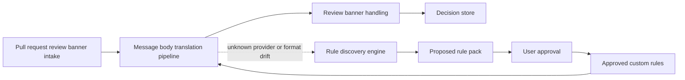

# Review banner translation design

## 1. Summary

Frankie needs a deterministic way to translate raw pull request review banners
from tools such as CodeRabbit and Sourcery into review artefacts that are
presentable, actionable, and suppressible inside Frankie. These banners often
arrive as top-level pull request review bodies rather than as inline GitHub
review comments, so the design must add a review-body intake path before
translation can occur.

This design separates the problem into three composable concerns:

- pull request review banner intake and handling,
- a deterministic message body translation pipeline, and
- an approval-gated rule discovery engine.

That separation allows Frankie to ingest review banners without translating
them, translate known banners without invoking a Large Language Model (LLM),
and use discovery only when the existing deterministic rules do not match or
drift.

## 2. Problem statement

GitHub review bots can emit a single pull request review whose body contains
multiple actionable findings, duplicate ranges, suggested patches, and agent
prompt blocks. The raw body is useful as evidence, but it is not directly
presentable in Frankie because:

- the useful findings are nested inside a large Markdown and HTML document,
- a single review can contain many findings without one GitHub discussion
  comment per finding,
- provider-specific structures drift over time, and
- users need to persist a decision to action or suppress each extracted
  finding.

Frankie already models inline `ReviewComment` data, but it does not yet model
top-level pull request review bodies as first-class library data. The feature
therefore needs both a new intake path and a translation layer.

## 3. Goals and non-goals

### 3.1. Goals

- Provide a stable library API for pull request review banner intake,
  translation, decision persistence, and rule discovery.
- Keep the message body translation path deterministic for known providers.
- Translate known provider banners into structured Frankie review artefacts
  without fabricating inline GitHub comment identifiers.
- Let users mark individual findings as actioned or suppressed, with those
  decisions persisting across refreshes.
- Expose the capability through library, Terminal User Interface (TUI), and
  Command Line Interface (CLI) surfaces where applicable.
- Allow approval-gated LLM discovery of new or drifted rule packs without
  auto-activating unvalidated output.

### 3.2. Non-goals

- Reconstructing missing GitHub discussion threads or mutating GitHub review
  state directly from translated banner findings.
- Treating translated banner findings as ordinary `ReviewComment` values.
- Allowing LLM-generated rules to bypass deterministic local validation.
- Building a generic plug-in marketplace for third-party rule packs in the
  first iteration.

## 4. Proposed architecture

For screen readers: The following flowchart shows the three composable
concerns. Pull request review banner intake feeds deterministic translation.
Review banner handling presents translated findings and persists user
decisions. When translation fails to classify or validate a banner, the rule
discovery engine proposes a new rule pack, which must be approved before it is
loaded by the translation pipeline.

_Figure 1: Composable review banner intake, translation, handling, and rule
discovery flow._

### 4.1. Pull request review banner intake

Frankie should add a new public intake type for top-level pull request review
bodies, distinct from inline review comments and issue comments.

The shared model should include:

- `PullRequestReviewBanner`
  - `review_id`
  - `author_login`
  - `submitted_at`
  - `commit_sha`
  - `body_markdown`
  - `source_url`
- `PullRequestReviewBannerBatch`
  - pull request metadata,
  - a list of raw review banners, and
  - existing decision state relevant to those banners.

The intake layer only fetches and normalizes raw data. It does not classify,
translate, or persist decisions. That keeps transport and provider concerns
outwith the GitHub access layer.

### 4.2. Message body translation pipeline

The translation pipeline is a pure library concern. It takes a raw banner and
returns either a structured translation, an explicit non-match, or a validation
failure.

The pipeline has five stages:

1. Parse the review body into a normalized Markdown Abstract Syntax Tree
   (AST), using an MDAST-style representation that preserves GitHub-flavoured
   Markdown and embedded HTML.
2. Run an HTML normalization pass that converts `
`, `
`, and
   `<blockquote>` blocks into semantic nodes the extractor can address
   deterministically.
3. Classify the banner against the provider rule registry using author-login
   aliases, required keywords, optional keywords, forbidden markers, and
   expected structure.
4. Apply the matched rule pack to extract banner findings, ignored sections,
   and any structured warnings.
5. Validate the extracted result against local invariants before returning it
   to callers.

The translation pipeline must remain deterministic. For a given banner body and
rule pack version, it should always produce the same findings, ordering,
ignored sections, and warnings.

### 4.3. Provider rule registry

The provider registry owns built-in and approved custom rule packs.

Each rule pack should be a versioned, serializable document containing:

- `provider_key`,
- `rule_pack_version`,
- `author_aliases`,
- `required_keywords`,
- `optional_keywords`,
- `forbidden_keywords`,
- `ignored_section_titles`,
- `section_extractors`,
- `severity_mappings`, and
- `validation_invariants`.

Rule packs should operate on normalized AST nodes and extracted text rather
than on raw byte offsets. Keywords and usernames remain part of the matching
contract, but they are applied against normalized content.

The first built-in rule packs should target:

- CodeRabbit banner extraction, and
- Sourcery banner extraction.

### 4.4. Review banner handling

Review banner handling is the orchestration and presentation layer that sits
after deterministic translation. It is responsible for:

- deciding whether a raw review banner should remain raw, surface translated
  findings, or surface a translation failure,
- presenting translated findings as Frankie review artefacts,
- attaching persisted user decisions,
- filtering suppressed items by default, and
- exposing adapter-friendly results to the TUI and CLI.

The central output model should be `BannerFinding`, not `ReviewComment`.

`BannerFinding` should contain:

- stable finding identity,
- provider metadata,
- headline and rationale,
- primary and secondary locations,
- optional suggested patch,
- optional agent prompt,
- raw source excerpt,
- source review reference, and
- persisted decision state.

The handling layer should also define a higher-level presentation enum, for
example `PresentedReviewItem`, so Frankie can present native review comments
and translated banner findings in one list without conflating their semantics.

### 4.5. Stable identity and persistence

User decisions must persist at the finding level. They should not be keyed by
the full raw body text because provider drift can change prose without changing
the underlying finding.

The stable finding key should be derived from:

- `provider_key`,
- `source_review_id`,
- canonicalized primary location,
- canonicalized headline, and
- an extractor-specific item key where available.

The persistent decision state should live in `SQLite` and include:

- `source_review_id`,
- `provider_key`,
- `finding_key`,
- `decision_state`,
- `created_at`, and
- `updated_at`.

The first decision states should be:

- `pending`,
- `actioned`, and
- `suppressed`.

If the stable finding key still matches after a provider changes wording, the
existing decision remains attached. If the location and canonical headline
change materially, Frankie should treat the result as a new finding.

### 4.6. Rule discovery engine

The rule discovery engine is separate from deterministic translation. It should
only run when:

- no existing rule pack matches a banner, or
- a matched rule pack fails extraction validation due to format drift.

The discovery engine takes one or more raw banners and returns a
`ProposedRulePack`, not a direct translation result. The proposal should
include:

- the provider guess,
- proposed author aliases and keyword matchers,
- proposed ignored sections,
- proposed extractor structure,
- a preview of extracted findings on the sample banner, and
- self-reported confidence and caveats.

Frankie must validate the proposed rule pack locally before surfacing it to the
user. Validation should include:

- schema validation,
- successful replay on the sample banner,
- non-overlapping extraction regions,
- required fields present for each finding, and
- expected count checks when the banner provides a header count.

No discovered rule pack should become active until the user approves it.

### 4.7. Approved custom rules

Approved custom rule packs should be stored separately from user decision
state. The recommended storage is an inspectable versioned file in Frankie’s
configuration area so the rule pack can be reviewed, diffed, and exported.

At runtime, Frankie should load rule packs in this order:

1. built-in rules shipped with Frankie,
2. approved custom rules, and
3. temporary in-memory proposals under active review.

Custom rules may override a built-in rule pack only when their `provider_key`
matches and their version is higher, and they must still pass the same local
validation as built-in rules.

### 4.8. Public library, CLI, and TUI surfaces

The public library API should expose at least:

- raw pull request review banner intake,
- deterministic banner translation,
- decision mutation and lookup,
- rule discovery proposal generation, and
- approval and loading of custom rule packs.

The CLI should expose:

- a non-interactive translation mode or output option for known banners,
- a way to list translated findings and their decisions, and
- a proposal preview and approval flow for discovered rules.

The TUI should expose:

- translated banner findings in review lists or a dedicated banner view,
- per-finding `actioned` and `suppressed` controls, and
- a review screen for proposed rule packs before approval.

### 4.9. Validation and drift detection

Every deterministic translation should emit structured validation metadata.
This metadata should record:

- matched rule pack,
- banner classification evidence,
- extracted finding count,
- ignored section count,
- warnings, and
- whether the result is complete, partial, or failed.

For providers that publish a count such as “Actionable comments posted: 4”, the
pipeline should validate the extracted finding count against that header. A
mismatch should mark the result as drifted and offer rule discovery.

## 5. Proposed module boundaries

_Table: Proposed module boundaries and responsibilities._

| Module                                  | Responsibility                                                         |
| --------------------------------------- | ---------------------------------------------------------------------- |
| `src/review_banner/intake.rs`           | Public pull request review banner models and intake helpers            |
| `src/review_banner/translation.rs`      | Deterministic translation pipeline orchestration                       |
| `src/review_banner/ast.rs`              | Markdown AST parsing and HTML normalization                            |
| `src/review_banner/rules.rs`            | Built-in rule pack registry, rule matching, and extractors             |
| `src/review_banner/model.rs`            | Shared banner findings, translation outcomes, and decision DTOs        |
| `src/review_banner/decision_store.rs`   | Persistence contract for `pending`, `actioned`, and `suppressed` state |
| `src/ai/review_banner_rule_discovery/*` | Approval-gated rule proposal generation and validation helpers         |
| `src/cli/*` and `src/tui/*`             | Thin adapters over the shared library APIs                             |

## 6. Data contracts

_Table: Core shared data contracts._

| Type                       | Purpose                                                     |
| -------------------------- | ----------------------------------------------------------- |
| `PullRequestReviewBanner`  | Raw top-level GitHub review body plus metadata              |
| `BannerTranslationRequest` | Input to deterministic translation                          |
| `BannerTranslationOutcome` | Matched provider, findings, ignored sections, and warnings  |
| `BannerFinding`            | Presentable, actionable translated review artefact          |
| `BannerFindingLocation`    | File, line span, outside-diff, and secondary range metadata |
| `BannerDecision`           | Persisted user action or suppression state                  |
| `ProposedRulePack`         | Approval-gated discovery output for user review             |

## 7. Testing strategy

The implementation should use five layers of validation:

- unit tests for AST normalization, classifier scoring, extractor logic, and
  stable key generation,
- fixture-based golden tests that translate sample CodeRabbit and Sourcery
  banners into structured JSON,
- behavioural tests for TUI and CLI decision handling,
- persistence tests for `actioned` and `suppressed` state round-tripping
  through `SQLite`, and
- local LLM-adapter tests that prove malformed proposals are rejected before
  activation.

Discovery tests should also cover the “unknown banner” and “count mismatch”
paths so the approval gate is exercised rather than assumed.

## 8. Outstanding risks

- Provider formatting drift can still invalidate a built-in rule pack before a
  new proposal is approved.
- A single sample banner can produce an overfitted discovered rule pack; the
  approval view should surface that limitation clearly.
- Presenting translated findings beside native review comments will require
  careful capability checks so unsupported operations are disabled rather than
  failing at runtime.

## 9. Rollout plan

1. Add raw pull request review banner intake and shared data contracts.
2. Implement deterministic translation for CodeRabbit with golden fixtures.
3. Add banner handling, decision persistence, and cross-surface adapters.
4. Add Sourcery support and drift-detection metrics.
5. Add approval-gated rule discovery and custom rule loading.
